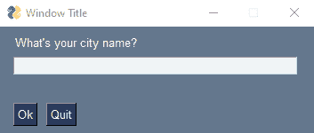
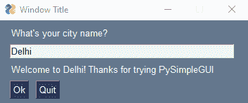

# PySimpleGUI:用 Python 创建 GUI 的简单方法

> 原文：<https://www.askpython.com/python-modules/pysimplegui>

每当我们谈论 Python 编程时，我们经常会讨论围绕它的大型社区，这些社区将这种语言用于如此多的有用目的，以及我们可以用它解决的各种各样的问题。大多数 python 程序在其核心使用“[命令行](https://www.askpython.com/python-modules/getopt-module)。对于在日常编程场景中经常看到终端的人来说，这在大多数情况下不是问题。

这不是一个仍然想使用 Python 程序的正常人的情况，而是存在一个可能被视为“ **GUI 鸿沟**”的数字鸿沟。

那么，我们谈论的这个图形用户界面是什么呢？

GUI 或图形用户界面提供了一个图形工具，可以交互地使用它来执行某些操作，这使得程序更容易被各种各样的观众所接受。GUI 需要解决的另一个障碍是它们不容易自己编程。这个问题的解决方案是什么？

嗯， **PySimpleGUI** 非常方便，它为我们提供了几个*选项来轻松地编写 GUI，并使用更少的代码行。*

***也读: [Tkinter 教程——用 Tkinter 画布画一条线](https://www.askpython.com/python-modules/tkinter/drawing-a-line-tkinter-canvas)***

## PySimpleGUI 简介

***PySimpleGUI*** *是一个 Python 包，它为我们提供了各种选项，为所有级别的 Python 程序员创建 GUI。*这个包实现了大部分的“样板代码”(在多个地方重复的代码段，几乎没有变化)。根据所使用的程序和框架，PySimpleGUI 程序可能需要 1/2 到 1/10 的代码量来直接使用其中一个框架创建一个相同的窗口。

为了编写一个简单的 GUI，我们需要使用一个“**t”来指定什么叫做我们的“**窗口**，它包含小部件或者“**元素**”(在 PySimpleGUI 中调用)。我们指定的这个布局用于创建一个窗口，并使用 **4 支持的框架**来完成我们的应用程序的所有繁重工作，以显示我们的窗口并与之交互。**

**支持的框架有 **[Tkinter](https://www.askpython.com/python-modules/tkinter/drawing-a-line-tkinter-canvas) ，Qt，WxPython，Remi。这些包装有时被称为**“包装纸”。******

## **使用 PySimpleGUI 理解核心概念**

*   **安装 PySimpleGUI 库并将其作为 sg 导入**

```py
!pip install library 
```

*   **导入**

```py
import PySimpleGUI as sg 
```

*   **定义窗口的内容:这里我们为 GUI 定义了**布局**。**

****布局的第一部分**是 GUI 的顶行文本，即**“你的城市名是什么？”**。**

****第二部分**是**输入**语句，其中 **key='-INPUT-'** 。语法的关键部分将把我们的输入连接到值，该值将在显示输出时被使用。**

**假设布局的**第三部分**是**输出层**，给它一个**特定尺寸**，同样提供**键= "-输出-"** 。**

**布局的第四部分**是**图形按钮**，文本**【确定】**和**【退出】**并排排列。****

**这总结了我们的布局定义。**

```py
#Define the window's contents
layout = [[sg.Text("What's your city name?")],
          [sg.Input(key='-INPUT-')],
          [sg.Text(size=(40,1), key='-OUTPUT-')],
          [sg.Button('Ok'), sg.Button('Quit')]] 
```

*   **现在，我们已经定义了我们的布局，我们正在为我们的布局提供一个“标题”，同时创建我们的 GUI 窗口。我们使用 PySimple GUI 包提供的 [**窗口**方法](https://www.askpython.com/python-modules/tkinter/tkinter-padding-tutorial)将**标题**和**布局**变量作为参数传递**

```py
#Create the window
window = sg.Window('Window Title', layout) 
```

*   **代码的下一部分是定义一个条件。 **window.read** 方法读取**"事件"**，在本例中是在我们的窗口中的" X "(关闭)按钮上的**点击事件**，以关闭它，这是由 PySimple GUI 提供的" **WINDOW_CLOSED** "函数或同样触发事件的 **"Quit"** 按钮处理的。在这两种情况下，我们都在处理这些事件，从循环中脱离，并关闭我们的 GUI。**

*   **条件的最后部分是我们使用**键**"**-输出-** "的地方，它已经链接到我们窗口的输出层，我们正在用字符串'**更新输出层'+ values['-INPUT-'] +"！感谢尝试 PySimpleGUI** ，它再次与**键** " **-INPUT-** "链接，并且 **window.read** 函数捕获值并在我们预定义的布局中显示它。**

```py
#Display and interact with the Window using an Event Loop
while True:
    event, values = window.read()
    # See if user wants to quit or window was closed
    if event == sg.WINDOW_CLOSED or event == 'Quit':
        break
    # Output a message to the window
    window['-OUTPUT-'].update('Welcome to ' + values['-INPUT-'] + "! Thanks for trying PySimpleGUI")

# Finish up by removing from the screen
window.close() 
```

## **带有输出的完整 PySimpleGUI 代码**

```py
#install PySimpleGUI library
!pip install library

import PySimpleGUI as sg

#Define the window's contents
layout = [[sg.Text("What's your city name?")],
          [sg.Input(key='-INPUT-')],
          [sg.Text(size=(40,1), key='-OUTPUT-')],
          [sg.Button('Ok'), sg.Button('Quit')]]

#Create the window
window = sg.Window('Window Title', layout)

#Display and interact with the Window using an Event Loop
while True:
    event, values = window.read()
    # See if user wants to quit or window was closed
    if event == sg.WINDOW_CLOSED or event == 'Quit':
        break
    # Output a message to the window
    window['-OUTPUT-'].update('Welcome to ' + values['-INPUT-'] + "! Thanks for trying PySimpleGUI")

# Finish up by removing from the screen
window.close() 
```

**输出**

**

Pop up window asking for the city name** **

pop up window after the input** 

## **结论**

**在本文中，我们使用 PySimple GUI 库创建了一个非常简单的窗口。这个包背后的整个思想是在底层代码实现上提供一个易于使用和人类可读的抽象，用几行代码创建一个 GUI。因此，对于几乎所有级别的 python 开发人员来说，它都是一个非常棒的库，可以简单直观地创建 GUI。**

## **参考**

**[PySimple GUI 文档](https://www.pysimplegui.org/en/latest/)**