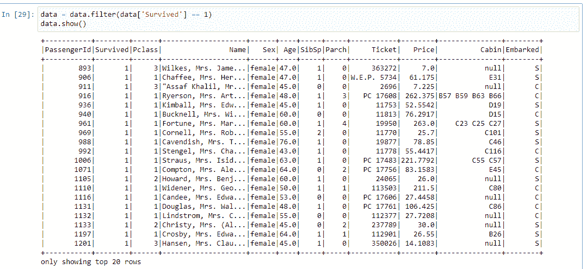

# Pyspark 教程-初学者参考[有 5 个简单的例子]

> 原文：<https://www.askpython.com/python-modules/pyspark-tutorial>

这篇文章是关于最著名的框架库 **Pyspark** 的全部内容。对于大数据和数据分析， **Apache Spark** 是用户的选择。这是由于它的一些很酷的功能，我们将讨论。但在此之前，让我们先了解 PySpark 的不同部分，从大数据开始，然后是 Apache Spark。

***也看: [PyGame 教程:Python 中的图形化 Hi-Lo 游戏](https://www.askpython.com/python/examples/pygame-graphical-hi-lo-game)***

## 什么是大数据？

在这个网络时代，每一条信息都可以在社交媒体、新闻和其他大型远程媒体上获得。就在几年前，这还是不可能的。一切都保存在文件或纸质记录中。但是今天这变得容易多了。为此，我们都有意或无意地生成大量数据，这些数据需要大量的实时处理和分析。

因此，从技术的巢穴中，出现了一个新的领域—**大数据。**

这个术语通过名称本身定义了定义- ***数据大量可用*** 。但是，为什么它需要发生呢？因为通过对现有资源的深入研究，未来的预测是可能的。许多大公司和科技巨头都在投资大数据工程师。他们可以每天管理和维护重要而庞大的信息。但是，我们都知道，要做到这一点，我们需要一些工具和技术。

* * *

## 什么是阿帕奇火花？

Apache spark 是一个来自**数据砖的 web 框架。**它是专为**数据管理而开发的。**这是与**大数据最相关的引擎之一。**其特点如下:

1.  **免费开源:**免费使用，开发者 300 多家公司为其开发做出贡献。
2.  **更快更稳定:**考虑到它的速度比 Hadoop 等任何其他引擎都快 100 倍。
3.  **简单而强大:**对我们来说很简单，实现各种数据分析技术。
4.  **跨平台:**适合所有操作系统。
5.  **多语言支持:**我们可以使用 Java、Python、R、Scala、SQL 进行专有使用。
6.  **复杂数据操作处理:**能够分析最复杂的数据。
7.  巨大的社区支持:它拥有全球开发者的支持。

除此之外，还有四套主要的库和其他第三方库:

1.  SQL 和数据框架。
2.  **火花四溅。**
3.  **MLib(机器学习)**
4.  **GraphX**

主要的第三方库包括来自 C#/的额外支持。NET、Groovy、Kotlin、Julia 和 Clojure。云支持包括 IBM、亚马逊 AWS 和其他公司。更多信息请阅读此 [**链接**](https://spark.apache.org/docs/) 的文档。

## Pyspark 是什么？

Pyspark 是 Apache Spark 对 Python 的著名扩展。它是一个开源库，主要关注:

1.  机器学习
2.  专有数据分析。
3.  数据科学
4.  使用 Python 和支持库的大数据。

由于广泛的贡献和开发者的支持，它已经成为最稳定和最合适的特殊模型构建包。在此框架下开发的模型往往会给出更准确、更快速的结果。

这更有用，因为它总是得到 **API 的支持。**想了解更多请访问此 [**链接**](https://spark.apache.org/docs/latest/api/python/) 。在将它们添加到系统之前，我们必须考虑依赖性。

**系统要求:**

1.  **Python 版本** : **Python 3.6 及以上**。
2.  **操作系统:** Windows 7 及以上。
3.  **其他库支持:** Numpy，熊猫等。
4.  稳定的互联网连接是必不可少的。

### 如何在 Windows 中设置 PySpark？

按照以下步骤将 Pyspark 安装到您的系统中:

1.  去[https://pypi.org/project/pyspark/](https://pypi.org/project/pyspark/)，在那里你会找到这个项目的文档。
2.  这里也给出了通过 pip 命令进行安装的链接。
3.  转到命令提示符处，键入以下命令:

```py
pip install pyspark

```


Installation of Pyspark in the Anaconda environment through the pip command.

**注意:默认环境是 [Anaconda](https://www.askpython.com/python-modules/python-anaconda-tutorial) ，所以所有通过 pip 的库也被添加到 Anaconda only。**

最重要的是确认它已经成功添加到我们的系统中，打开任何 Python IDE 并尝试导入它。如果它没有任何错误，那么我们都将踏上更远的旅程。


Configuring Pyspark Through IDLE

## 从 PySpark 开始

我们需要一个样本数据集来处理和使用 Pyspark。这是快速入门指南，我们将介绍基本知识。

**环境**:蟒蛇

IDE : Jupyter 笔记本

**使用的数据集:** titanic.csv

在 Pyspark 中首先创建的最重要的东西是一个**会话**。会话是我们的 spark 应用程序所在的参考框架。我们创建的会话封装了我们从开始到最后一个检查点的进度。我们通过 **spark 的 SQL 模块创建它。**

### 1.创建会话

让我们从使用 PySpark 的最基本部分开始——创建会话。以下代码可用于设置您的第一个会话。

**代码:**

```py
import pyspark # importing the module

from pyspark.sql import SparkSession # importing the SparkSession module
session = SparkSession.builder.appName('First App').getOrCreate() # creating a session

session # calling the session variable

```


Creating A Session In Pyspark In Jupyter Notebooks

### 2.在 Spark 中读取数据集

当我们谈论数据集时，它是以**行列**格式的大量数据和记录的集合。它们可以是成千上万或更多。

具体来说，它们是我们称之为数据预处理的过程的一个重要方面。为了预测一些输出或结果，我们需要预处理数据，执行额外操作和情感分析。为此，Python 提供了特定的模块或库。

通常，我们使用**[熊猫库](https://www.askpython.com/python-modules/pandas/python-pandas-module-tutorial)** 来实现这个目的。但是，PySpark 的子模块减少了我们导入其他库的工作量。这样，它就有了 **read()方法**。这个方法有许多子方法，用于不同的文件扩展名和格式。这些是:

1.  战斗支援车
2.  格式
3.  jdbc
4.  负荷
5.  选择权
6.  选择
7.  妖魔
8.  门球
9.  (计划或理论的)纲要
10.  桌子
11.  文本

我们正在使用泰坦尼克号的数据集。csv 扩展名，所以我们将使用第一种方法。

**代码:**

```py
data = session.read.csv('Datasets/titanic.csv') # reading the dataset through the given path
data # calling the variable for column created

```


Reading The [titanic.csv dataset.](https://github.com/datasciencedojo/datasets/blob/master/titanic.csv)

我们创建的会话是这段代码的主要方法。然后，read 方法和 extension 方法使用点操作符。

若要检查数据集中的所有列和行，请使用 show()方法。如果太大，这将检索前 20 行。

```py
data.show()

```


Retrieving The Dataset

现在我们可以看到这个数据集的呈现是不恰当的。列名没有整齐地出现。所以，我们需要对它做一些改变。read.option()方法使我们的工作变得容易。这将帮助我们检索带有标题的数据集。

**代码:**

```py
data = session.read.option.('header', 'true').csv('Datasets/titanic.csv') 
data

```

**输出:**


Retrieving The Headers From The Dataset

现在，如果我们检查数据集，它看起来像这样:


Getting The New Formatted Dataset

现在我们已经准备好了数据集，让我们获得一些关于它的列的信息。在 pandas 中，我们简单地使用了 **info()** 方法。在 Pyspark 中， **printSchema()** 是读取和给出关于每一列的信息值的方法。

**代码:**

```py
data.printSchema()

```


Information Of The Dataset

默认情况下，Pyspark 以字符串的形式读取所有数据集。因此，为了处理这个问题，我们需要激活一个参数，即**推断模式**。它将读取所有主要列及其各自的数据类型，并相应地返回信息。

```py
data = session.readoption('header', 'true').csv('Datasets/titanic.csv', inferSchema = True)

data.printSchema() 

```


Exact Data Types

### 3.数据预处理

**Pyspark** 中的数据预处理相当简单。该库为我们提供了执行此类任务的特定功能。以下活动涉及。

1.  **选择一个特定的列**
2.  **选择多列**
3.  **添加一列**
4.  **删除一列**
5.  **重命名列**
6.  **删除空值**

要选择一列或多列，select()函数可以很好地工作。语法是:

```py
dataframe.select(column_name) # selecting one column
dataframe.select(column_1, column_2, .., column_N) # selecting many columns

```

**输出:**


Selecting One Column


Selecting Multiple Columns

在 dataframe.withColumn()函数中添加一列。它需要两个参数

1.  要添加的新列名
2.  用于的现有列名(如果新列与现有列无关，则不需要)

**代码:**

```py
# adding columns in dataframe
data = data.withColumn('Age_after_3_y', data['Age']+3)

```

我们在数据框中增加了一栏三年后的年龄。所用的年龄列是一个现有列。通过它，我们会计算出三年后乘客的年龄。

**输出:**


Adding A New Column In The Dataset

正如我们可以看到的，一个新的列被添加到了末尾。它的名字是: **Age_after_3_y** 。

### 4.从数据集中删除列和空值

Pyspark 中的删除是我们可以执行的最简单的任务。因为它给了我们那么多的灵活性和适应性。drop()函数执行删除列的任务。这种方法的语法很简单。

```py
# dropping the columns
dataframe = dataframe.drop('column_name in strings')
dataframe.show()

```

我们将删除之前添加到数据集中的 Age_after_3_y 列。

**代码:**

```py
# dropping the columns
data = data.drop('Age_after_3_y')
data.show()

```


Deleting A Column In The Dataset

重命名该列是一项比较简单的任务。withColunRenamed()函数同样可以帮助我们。它需要两个参数

1.  列的新名称。
2.  列的现有名称

举个例子，我们将把数据集中的**票价**列的名称改为**价格**。

**代码:**

```py
# renaming the columns
data = data.withColumnRenamed('Fare', 'Price')
data.show()

```


Changing The Column Name

为了删除空值，我们使用带有 drop()属性的 **[na 函数](https://www.askpython.com/python-modules/pandas/python-isna-notna-functions)。**通常，它会删除所有具有空值的行。但是，函数中有两个参数可以用来以新的方式下降:

1.  **如何:**确保根据分配给的值删除值。值为**任意**和**全部**。当 **how = "any"** 时，只有具有空值的单元格被删除，但是当 **how = "all"** 时，整行被删除。
2.  **阈值:**取整数形式的值。例如:**如果我们设置 thresh = 2** ，只有两个空值被丢弃。
3.  **subset:** 这有助于我们选择需要删除空值的特定列。

**代码:**

```py
data = data.na.drop(how = 'any', thresh = 2)
data.show()

```


Dropping The Null Values

因此，我们删除了两个空值。

### 5.使用 Pyspark 进行过滤操作

过滤掉一些东西只是从我们的数据框架中检索我们需要的东西。例如，如果我们需要泰坦尼克号数据集中的幸存者。过滤是这里的最佳选择。

**代码:**

```py
data = data.filter(data['Survived'] == 1)
data.show()

```

**输出:**



Filtering Out Columns

所以，所有事件幸存者的数据就摆在我们面前。

## 结论

于是，就这样，Pyspark 的话题结束了。我们讨论了向系统添加火花、数据读取、预处理和过滤技术等主题。这是关于 **Pyspark** 的基本介绍。