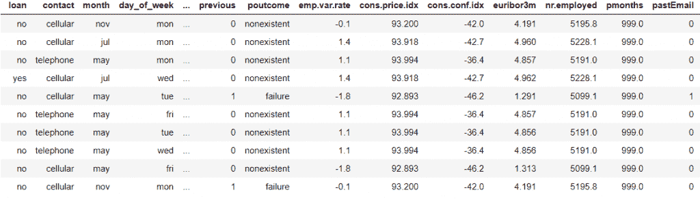

# Python abs()函数

> 原文：<https://www.askpython.com/python/built-in-methods/python-abs-function>

嘿，伙计们！在这篇文章中，我们将推出带有不同模块的 **Python abs()函数**，例如 NumPy 和 Pandas。

* * *

## Python abs()函数入门

[Python](https://www.askpython.com/) 有大量的内置函数来处理数学和统计运算。一个这样的函数是 **Python abs()函数**。

`abs() function`返回作为参数传递给它的输入的绝对幅度或值。它返回输入的实际值，不考虑符号。

abs()函数只接受一个必须是数字的参数，并返回该数字的绝对值。

*   如果输入类型为`integer`或`float` –ABS()函数返回绝对幅度/值
*   如果输入是一个`complex number`，abs()函数只返回数字的幅度部分

**语法:**

```py
abs(number)

```

*   该数字可以是整数类型、浮点类型或复数。

**举例:**

```py
num = -25.78
print("Absolute value:",abs(num))

```

**输出:**

```py
Absolute value: 25.78

```

* * *

## Pandas DataFrame.abs()函数

[Python Pandas 模块](https://www.askpython.com/python-modules/pandas/python-pandas-module-tutorial)内置了`DataFrame.abs() function`来计算数据集数据帧的特定数据变量/列中出现的所有数据值的绝对值。

**语法:**

```py
DataFrame['column_name'].abs()

```

**输入数据集:**



**Input Dataset**

**举例:**

```py
import pandas as pd
import numpy as np
data = pd.read_csv("C:/marketing_tr.csv")
data.head(10)
data['cons.conf.idx'].abs()

```

在上面的代码片段中，我们使用了`pandas.read_csv() function`将数据集导入并加载到环境中。`DataFrame.head(n) function`实际上代表数据集的前“n”个值。

此外，我们已经使用 abs()函数找出了列' **cons.conf.idx** '的绝对值。

**输出:**

```py
0       42.0
1       42.7
2       36.4
3       42.7
4       46.2
        ... 
7409    36.4
7410    42.7
7411    46.2
7412    42.0
7413    36.4
Name: cons.conf.idx, Length: 7414, dtype: float64

```

* * *

## Python numpy.absolute()函数

[Python NumPy 模块](https://www.askpython.com/python-modules/numpy/python-numpy-arrays)有`numpy.absolute() function`来获取传递给它的数组元素的绝对值。

**语法:**

```py
numpy.absolute(array)

```

**举例:**

```py
import numpy as np
arr = [10, -20, 30, -40]
abs_res = np.absolute(arr)
print("The absolute values of the array elements:",abs_res)

```

**输出:**

```py
The absolute values of the array elements: [10 20 30 40]

```

* * *

## 结论

因此，在本文中，我们已经理解了用 NumPy 和 Pandas 模块实现 Python abs()函数。

* * *

## 参考

*   [Python abs()函数—官方文档](https://docs.python.org/3/library/functions.html#abs)
*   Python abs()函数— JournalDev