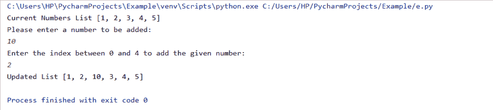
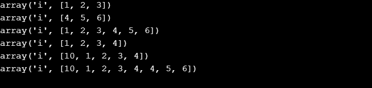

# Python 向数组中添加元素

> 原文：<https://www.askpython.com/python/array/python-add-elements-to-an-array>

Python 没有特定的数据类型来表示数组。

以下内容可用于表示 Python 中的数组:

*   通过使用列表
*   通过使用[阵列模块](https://www.askpython.com/python/array/python-array-examples)
*   通过使用 [NumPy 模块](https://www.askpython.com/python-modules/numpy/python-numpy-arrays)

* * *

## **1。使用列表添加到数组**

如果我们使用[列表](https://www.askpython.com/python/list/python-list)作为一个数组，下面的方法可以用来给它添加元素:

*   `By using append() function`:将元素添加到数组的末尾。
*   `By using insert() function`:在给定的索引处插入元素。
*   `By using extend() function`:它通过追加两个列表中的元素来延长列表。

**示例 1:使用 append()函数**向数组 **添加元素**

```py
my_input = ['Engineering', 'Medical'] 
my_input.append('Science') 
print(my_input) 

```

**输出:**

`['Engineering', 'Medical', 'Science']`

**示例 2:使用 extend()函数向数组添加元素**

```py
my_input = ['Engineering', 'Medical'] 
input1 = [40, 30, 20, 10] 
my_input.extend(input1) 
print(my_input)

```

**输出:**

`['Engineering', 'Medical', 40, 30, 20, 10]`

**示例 3:使用 insert()函数向数组添加元素**

```py
my_input = [1, 2, 3, 4, 5]

print(f'Current Numbers List {my_input}')

number = int(input("Please enter a number to be added:\n"))

index = int(input(f'Enter the index between 0 and {len(my_input) - 1} to add the given number:\n'))

my_input.insert(index, number)

print(f'Updated List {my_input}')

```

**输出:**



*Output-Insert Function*

* * *

## 2.使用阵列模块添加到阵列

如果我们正在使用数组模块，可以使用以下方法向它添加元素:

*   `By using + operator`:结果数组是两个数组中元素的组合。
*   `By using append() function`:将元素添加到数组的末尾。
*   `By using insert() function`:在给定的索引处插入元素。
*   `By using extend() function`:它通过追加两个列表中的元素来延长列表。

**举例:**

```py
import array

s1 = array.array('i', [1, 2, 3])
s2 = array.array('i', [4, 5, 6])

print(s1)  
print(s2)  

s3 = s1 + s2
print(s3)  

s1.append(4)
print(s1)  

s1.insert(0, 10)
print(s1) 

s1.extend(s2)
print(s1) 

```

**输出:**



Output Array Module

* * *

## 3.向 NumPy 数组添加元素

我们可以使用以下方法向 NumPy 数组添加元素:

*   `By using append() function`:将元素添加到数组的末尾。
*   `By using insert() function`:将数组中给定索引处的元素相加。

**举例:**

```py
import numpy
 # insert function
arr1_insert = numpy.array([1, 23, 33])

arr2_insert = numpy.insert(arr1_insert, 1, 91)

print(arr2_insert)
# append function
arr1_append = numpy.array([4, 2, 1])

arr2_append = numpy.append (arr1_append, [12, 13, 14])

print(arr2_append)

```

**输出:**

`[ 1 91 23 33]
[ 4 2 1 12 13 14]`

* * *

## 结论

因此，在本文中，我们实现了向数组添加元素的可能方法。

* * *

## 参考

*   Python 添加到数组
*   [Python 数组文档](https://docs.python.org/3/library/array.html)
*   [Python NumPy 文档](https://numpy.org/)