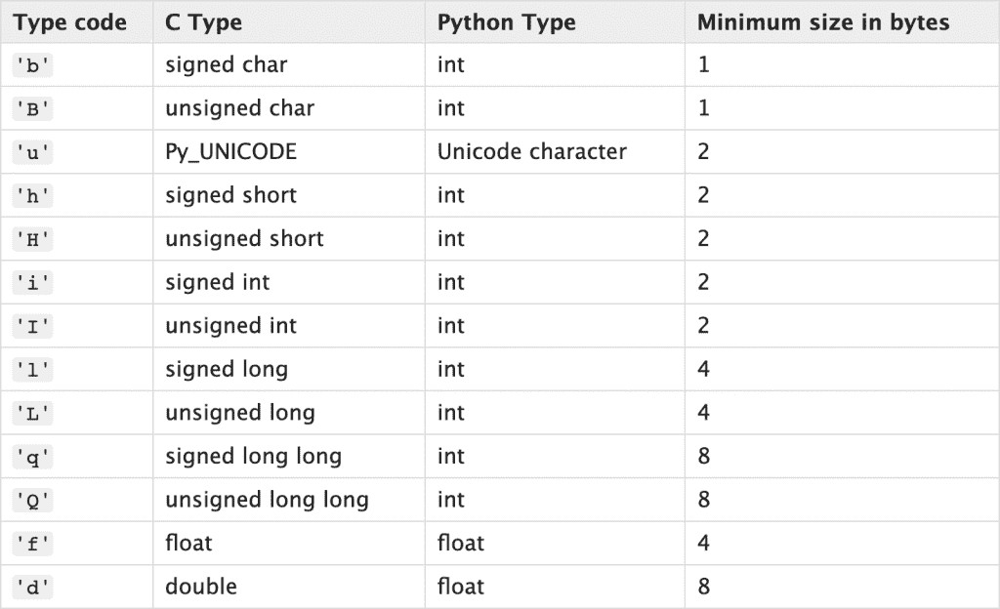
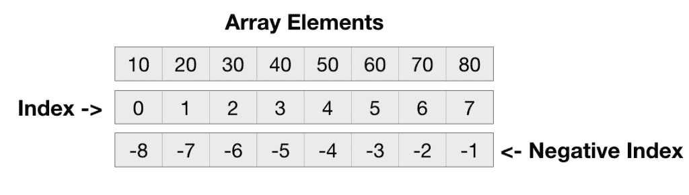

# Python 数组–13 个示例

> 原文：<https://www.askpython.com/python/array/python-array-examples>

Python 没有显式的数组数据结构。这是因为我们可以用[列表](https://www.askpython.com/python/list/python-list)做同样的事情。

该列表包含一组项目，并支持添加/更新/删除/搜索操作。这就是为什么 Python 中很少使用单独的数据结构来支持数组。

数组包含相同类型的项，但是 Python list 允许不同类型的元素。这是数组和列表之间唯一的特性差异。但是它不是交易破坏者，也不保证 Python 中有新的数据结构支持。

然而，Python 数组模块可用于为整数、浮点和 Unicode 字符创建类似数组的对象。

* * *

## Python 数组模块

Python 数组模块允许我们创建一个对数据类型有约束的数组。这个模块只支持几种数据类型。



Python Array Supported Type Code

Unicode 类型代码在 Python 3.3 中已被弃用，并将在 Python 4.0 版本中被移除。

因此，我们可以创建一个整数数组，并使用数组模块进行浮点运算。让我们从数组模块开始，看看它提供的所有操作。

* * *

### 1.创建数组

创建数组的语法是 *`array.array(typecode, values_list)`* 。

```py
import array

# creating array
int_array = array.array('i', [1, 2, 3, 4])

float_array = array.array('f', [1.1, 2.2, 3.3, 4.4])

# unicode array support is deprecated and will be deleted in Python 4
unicode_array = array.array('u', ['\u0394', '\u2167', '\u007B'])

```

* * *

### 2.打印阵列及其类型

如果我们打印数组对象，它会给我们关于类型码及其元素的信息。让我们打印上面创建的数组，并使用 type()内置函数打印对象类型。

```py
# printing array
print(int_array)
print(float_array)
print(unicode_array)
print(type(int_array))

```

**输出:**

```py
array('i', [1, 2, 3, 4])
array('f', [1.100000023841858, 2.200000047683716, 3.299999952316284, 4.400000095367432])
array('u', 'ΔⅧ{')
<class 'array.array'>

```

* * *

### 3.打印数组元素

我们可以使用循环的[来打印数组元素。](https://www.askpython.com/python/python-for-loop)

```py
import array

int_array = array.array('i', [1, 2, 3, 4])

for a in int_array:
    print(a)

```

我们还可以使用元素的索引来访问元素。我们可以使用索引来打印数组元素。

```py
for b in range(0, len(int_array)):
    print(f'int_array[{b}] = {int_array[b]}')

```

**输出:**

```py
int_array[0] = 1
int_array[1] = 2
int_array[2] = 3
int_array[3] = 4

```

* * *

### 4.插入和追加元素

我们可以使用 insert()函数在指定的索引处插入一个元素。指定索引中的元素向右移动一个位置。

```py
int_array = array.array('i', [1, 2, 3, 4])
int_array.insert(0, -1)  # -1,1,2,3,4
int_array.insert(2, -2)  # -1,1,-2,2,3,4
print(int_array)

```

**输出** : `array('i', [-1, 1, -2, 2, 3, 4])`

如果必须在数组末尾添加元素，请使用 append()函数。

```py
int_array = array.array('i', [1, 2, 3, 4])
int_array.append(-3)
print(int_array)  # array('i', [1, 2, 3, 4, -3])

```

* * *

### 5.Python 数组支持负索引

我们也可以通过负索引来访问 python 数组元素。



Python Array Index

```py
int_array = array.array('i', [10, 20, 30, 40, 50, 60, 70, 80])
print(int_array[-2])  # 70
print(int_array[-5])  # 40

```

* * *

### 6.移除数组元素

我们可以使用 remove()方法删除一个数组元素。

```py
int_array = array.array('i', [1, 2, 3, 4])
int_array.remove(2)
print(int_array)  # array('i', [1, 3, 4])

```

如果数组中不存在该元素，则引发 *ValueError* 。

```py
int_array = array.array('i', [1, 2, 3, 4])
try:
    int_array.remove(20)
except ValueError as ve:
    print(ve)

```

**输出** : `array.remove(x): x not in array`

我们还可以使用 pop()函数删除给定索引处的元素。这个函数返回从数组中删除的元素。如果我们不指定索引，最后一个元素将被移除并返回。

```py
int_array = array.array('i', [1, 2, 3, 4])
last_element = int_array.pop()
print(last_element)  # 4
print(int_array)  # array('i', [1, 2, 3])

second_element = int_array.pop(1)
print(second_element)  # 2
print(int_array)  # array('i', [1, 3])

```

* * *

### 7.分割数组

Python array 支持切片，并返回一个包含子元素的新数组。原始数组保持不变。切片也支持负索引。

```py
int_array = array.array('i', [0, 1, 2, 3, 4, 5])
print(int_array[3:])  # array('i', [3, 4, 5])
print(int_array[:2])  # array('i', [0, 1])
print(int_array[1:3])  # array('i', [1, 2])

# negative index slicing
print(int_array[-2:])  # array('i', [4, 5])
print(int_array[:-2])  # array('i', [0, 1, 2, 3])

```

* * *

### 8.搜索数组中的元素

我们可以使用 index()函数来查找一个元素第一次出现的索引。如果数组中不存在该元素，将引发 ValueError。

```py
int_array = array.array('i', [0, 1, 2, 3, 1, 2])

print(f'1 is found at index {int_array.index(1)}')
try:
    print(int_array.index(20))
except ValueError as ve:
    print(ve)

```

**输出:**

```py
1 is found at index 1
array.index(x): x not in array

```

* * *

### 9.更新指定索引处的值

我们可以使用数组索引和赋值操作符来更新索引处的值。如果索引无效，将引发 IndexError。

```py
int_array = array.array('i', [0, 1, 2, 3, 1, 2])

int_array[0] = -1
int_array[1] = -2
print(int_array)

try:
    int_array[10] = -10
except IndexError as ie:
    print(ie)

```

**输出:**

```py
array('i', [-1, -2, 2, 3, 1, 2])
array assignment index out of range

```

* * *

### 10.反转数组

我们可以使用 reverse()函数来反转数组元素。

```py
int_array = array.array('i', [0, 1, 2, 3])
int_array.reverse()
print(int_array)  # array('i', [3, 2, 1, 0])

```

* * *

### 11.元素出现的次数

我们可以使用 count()函数来获取数组中某个值出现的次数。

```py
int_array = array.array('i', [0, 1, 1, 0])
print(int_array.count(1))  # 2
print(int_array.count(10))  # 0

```

* * *

### 12.通过追加 Iterable 来扩展数组

我们可以使用 extend()函数将值从 iterable 追加到数组的末尾。

```py
array1 = array.array('i', [0, 1])
array2 = array.array('i', [2, 3, 4])

array1.extend(array2)
print(array1)  # array('i', [0, 1, 2, 3, 4])

print(array2)  # array('i', [2, 3, 4])
array2.extend([1, 2])
print(array2)  # array('i', [2, 3, 4, 1, 2])

array1 = array.array('i', [1])
array1.extend(set([0,0,0,2]))
print(array1)  # array('i', [1, 0, 2])

```

* * *

### 13.将数组转换为列表

我们可以使用 tolist()函数将数组转换成列表。

```py
int_array = array.array('i', [0, 1, 2, 3])
print(int_array.tolist())  # [0, 1, 2, 3]

```

* * *

## 结论

Python 数组模块帮助我们为整数和浮点数创建数组。但是，我们可以对列表执行相同的操作。因此，只有当您希望将数据约束为给定类型时，才应该使用数组模块。

* * *

## 参考资料:

*   [阵列模块](https://docs.python.org/3.7/library/array.html)