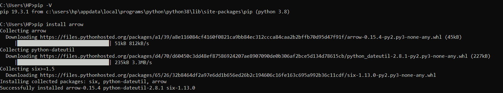

# Python 箭头模块

> 原文：<https://www.askpython.com/python-modules/python-arrow-module>

Python `**arrow**`模块支持日期时间操作。它有助于创建实例并相应地操作时间戳。

它展示了一种用户友好的方法来处理日期时间转换。

**特性:**

*   Python 2.7 及更高版本支持箭头模块。
*   时区感知
*   自动解析字符串
*   全面实施

**安装箭头模块:**

`**pip install arrow**`



*pip-arrow Install Command*

* * *

## 访问特定时区的当前时间

**示例:**打印 UTC、IST 和本地时区的当前时间。

```py
import arrow
utc = arrow.utcnow()
print('UTC Time =', utc)

ist = arrow.now('Asia/Calcutta')
print('IST Time =', ist)
print('tzinfo =', ist.tzinfo)

local_time = arrow.now()
print('Local Time =', local_time)

```

**输出:**


*Output- Timezone Conversion*

* * *

## 时区转换

Python arrow 模块提供了`**to()**`函数来转换时区。

```py
import arrow

ist = arrow.now('Asia/Calcutta')
print('IST Time =', ist)

pst = ist.to('US/Pacific')
print('PST Time =', pst)

```

**输出:**


*Output-Timezone Conversion*

* * *

## 如何从时间戳中获取日期？

```py
import arrow
local = arrow.now()
print('Current Local Time =', local)
print('Current Local Timestamp =', local.timestamp)
date = arrow.get(local.timestamp)
print('Date from Timestamp =', date)

```

**输出:**


*Output-Date From Timezone*

* * *

## 使用箭头模块格式化日期

**`format`** 方法用于根据用户的选择操作和格式化给定的日期。

**例 1:将日期格式化为 YYYY-MM-DD 格式**

```py
import arrow
local = arrow.now()

result = local.format('YYYY-MM-DD')
print(result)

```

**输出:**

`**2020-01-02**`

**例 2:将日期格式化为** **YYYY-MM-DD HH:mm:ss 格式**

```py
import arrow
local = arrow.now()

result = local.format('YYYY-MM-DD HH:mm:ss')
print(result)

```

**输出:**

`**2020-01-02 14:12:11**`

* * *

## 将日期解析为字符串

```py
import arrow
date = arrow.get('2013-05-05 12:30:45', 'YYYY-MM-DD HH:mm:ss')
print(date)

```

**输出:**

`**2013-05-05T12:30:45+00:00**`

* * *

## 如何从传递的参数中实例化日期？

```py
import arrow

date = arrow.get(2020, 1, 2)
print(date)

```

**输出:**

`**2020-01-02T00:00:00+00:00**`

* * *

## 对日期和时间执行操作

`replace()`和`shift()`方法用于根据当前日期获得未来和过去的日期。

**举例:**

```py
import arrow
utc = arrow.utcnow()
print('Current UTC= ', utc)
utc_updated1 = utc.replace(year=2017, month=9)
print('Updated UTC= ', utc_updated1)
utc_updated2 = utc.shift(years=-4, weeks=3)
print('Updated UTC= ', utc_updated2)

```

**输出:**


*Output-Manipulation On Date Time*

* * *

## 以人类友好的格式表示日期时间

**`humanize()`** 方法使我们能够根据当前日期/时间提供一种对人类友好的日期/时间表示。

`**humanize()**`方法使用户能够知道从给定时间起经过的时间量。

**举例:**

```py
import arrow
local = arrow.now()
print(local)
result = local.humanize()
print("Time elapsed: ")
print(result)

```

**输出:**

`**2020-01-02T14:34:40.447432+05:30
Time elapsed:
just now**`

* * *

## 结论

因此，在本文中，我们已经理解了 arrow 模块提供的功能。这是一个简单的模块，可以处理支持时区的日期和时间。

* * *

## 参考

*   Python 箭头模块
*   [Python 箭头模块文档](https://pypi.org/project/arrow/)