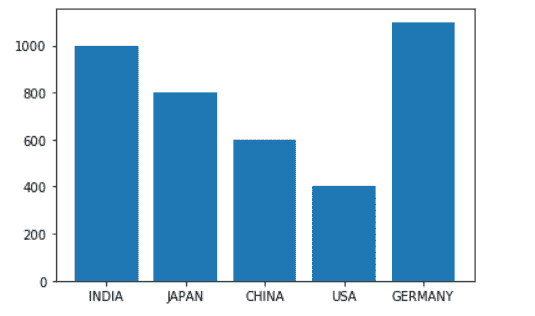
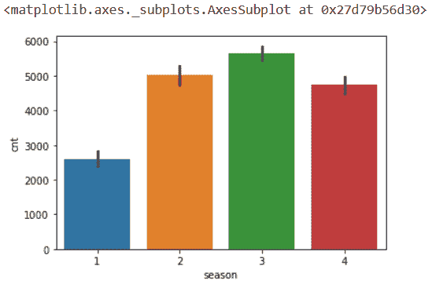

# Python 条形图-可视化 Python 中的分类数据

> 原文：<https://www.askpython.com/python/python-bar-plot>

嘿，读者们。在本文中，我们将关注于**创建一个 Python 条形图**。

**[数据可视化](https://www.askpython.com/python-modules/data-visualization-using-python-bokeh)** 使我们能够理解数据，帮助我们以图形化的方式分析数据的分布。

`BarPlot`使我们能够可视化分类数据变量的**分布。它们代表离散值的分布。因此，它表示分类值的比较。**

x 轴代表离散值，而 y 轴代表比较的数值，反之亦然。

现在，让我们在接下来的部分中重点关注条形图的构造。

* * *

## 使用 Matplotlib 创建 Python 条形图

[Python matplotlib 模块](https://www.askpython.com/python-modules/matplotlib/python-matplotlib)为我们提供了各种绘制数据和了解数据值分布的函数。

`matplotlib.pyplot.bar() function` 用于使用 matplotlib 模块创建条形图。

**语法:**

```py
matplotlib.pyplot.bar(x, height, width, bottom, align)

```

*   x:条形图的标量 x 坐标
*   height:要绘制的条形的高度
*   底部:垂直基线
*   width:要绘制的条形的宽度(可选)
*   align:条形图的对齐类型(可选)。

此外，我们需要确保并理解只有分类数据值可以提供给柱状图。

现在让我们尝试使用 matplotlib 模块实现一个柱状图。

**举例:**

```py
import matplotlib.pyplot as plt
country = ['INDIA', 'JAPAN', 'CHINA', 'USA', 'GERMANY']
population = [1000,800,600,400,1100]
plt.bar(country,population)
plt.show()

```

**输出:**



**BARPLOT Using Matplotlib**

* * *

## 使用 Seaborn 模块的条形图

[Python Seaborn 模块](https://www.askpython.com/python-modules/python-seaborn-tutorial)构建于 Matplotlib 模块之上，为我们提供了一些高级功能来更好地可视化数据值。

**语法:**

```py
seaborn.barplot(x,y)

```

**举例:**

```py
import seaborn as sn
import matplotlib.pyplot as plt
import pandas as pd
BIKE = pd.read_csv("BIKE.csv")
sn.barplot(x="season",y="cnt",data=BIKE)
plt.show()

```

**输出:**



**BARPLOT Using Seaborn**

* * *

## 结论

因此，在本文中，我们已经了解了构建 Python 条形图的各种技术。

如果你遇到任何问题，欢迎在下面评论。

更多与 Python 相关的帖子，敬请关注，在此之前，祝你学习愉快！！

* * *

## 参考

*   [使用 Python matplotlib 模块的条形图—文档](https://matplotlib.org/3.1.1/api/_as_gen/matplotlib.pyplot.bar.html)
*   [带 Seaborn 模块的条形图—文档](https://seaborn.pydata.org/generated/seaborn.barplot.html)