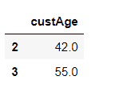

# Python bin()函数是什么？

> 原文：<https://www.askpython.com/python/built-in-methods/python-bin-function>

嘿，伙计们！在本文中，我们将关注使用 Python bin()函数的数据值的**二进制表示。**

* * *

## Python bin()函数入门

Python 有各种内置函数来处理和执行对数字数据的操作。

Python `bin() function`用于将十进制数字数据值转换成二进制格式。

**语法:**

```py
bin(number)

```

`bin() function`返回作为参数传递给它的整数的二进制表示值，并附加前缀‘0b’。

**示例 1:** 将正数值转换为二进制形式

```py
num = 3
res_bin = bin(num)
print(res_bin)

```

**输出:**

```py
0b11

```

**示例 2:** 将负数值转换为二进制格式

```py
num = -3
res_bin = bin(num)
print(res_bin)

```

**输出:**

```py
-0b11

```

* * *

## NumPy 中元素的二进制表示

Python `numpy.binary_repr() function`用于在 [NumPy](https://www.askpython.com/python-modules/numpy/python-numpy-arrays) 中以元素方式将数组的数据值转换为二进制形式。

**语法:**

```py
numpy.binary_repr(array[value],width)

```

*   `width`:该参数定义返回的代表二进制格式的字符串的长度。
*   如果传递给函数的是负值，并且未指定宽度，则在结果前会添加一个减号(“-”)。在指定宽度的情况下，数字的二进制补码表示为绝对值。

**例 1:**

```py
import numpy as N
arr = [3,5,6,2]
res_arr = N.binary_repr(arr[1])
print(res_arr)

```

**输出:**

```py
101

```

**例 2:**

```py
import numpy as N
arr = [3,5,6,2]
res_arr = N.binary_repr(arr[1],width=5)
print(res_arr)

```

**输出:**

```py
00101

```

* * *

## 熊猫中数据元素的二进制表示

我们有可能以二进制格式表示 [Pandas](https://www.askpython.com/python-modules/pandas/python-pandas-module-tutorial) 中数据集的元素。 [format()函数](https://www.askpython.com/python/string/python-format-function)可用于将数据集中的整数值表示为等效的二进制格式。

我们可以简单地使用`apply() function`并创建一个匿名函数来暗示使用 [Python lambda](https://www.askpython.com/python/python-lambda-anonymous-function) 和 format()函数对每个数据值的操作。

**语法:**

```py
data['column'].apply(lambda element: format(int(element), 'b'))

```

**虚拟数据集:**



**Dataset**

**举例:**

```py
import pandas as PD
data = PD.read_csv("C:/marketing_tr.csv")
data_few = PD.DataFrame(data['custAge'].iloc[2:4])
data_few['custAge'].apply(lambda i: format(int(i), '05b'))

```

在上面这段代码中，我们使用了 format(value，' b ')函数将数据值转换为二进制形式。此外，我们使用 lambda 表达式创建了一个函数来实现相同的功能。“05b”表示返回字符串的长度，即长度= 5。

**输出:**

```py
2    101010
3    110111
Name: custAge, dtype: object

```

* * *

## 结论

因此，在本文中，我们已经了解了使用 Python bin()函数将整数值表示为二进制形式的方法。

* * *

## 参考

*   Python bin()函数— JournalDev