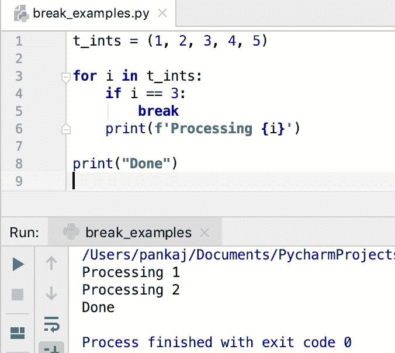

# Python break 语句

> 原文：<https://www.askpython.com/python/python-break-statement>

*   Python 中的 break 语句用于退出当前循环。
*   我们不能在循环外使用 break 语句，它会抛出一个错误，如" **SyntaxError:在循环外使用' break '**"。
*   我们可以使用带[的 break 语句来循环](https://www.askpython.com/python/python-for-loop)和[，而循环](https://www.askpython.com/python/python-while-loop)。
*   如果 break 语句出现在**嵌套循环**中，它将终止内部循环。
*   “break”是 Python 中的一个 [**保留关键字。**](https://www.askpython.com/python/python-keywords)

* * *

## 中断语句流程图


Break Statement Flow Diagram

* * *

## Python break 语句语法

break 语句的语法是:

```py
break

```

我们不能在 break 语句中使用任何选项、标签或条件。

* * *

## Python break 语句示例

让我们看一些在 Python 中使用 break 语句的例子。

### 1.用 for 循环中断语句

假设我们有一个整数序列。我们必须一个接一个地处理序列元素。如果我们遇到“3 ”,那么处理必须停止。我们可以使用 for 循环和带有 if 条件的 break 语句来实现这一点。

```py
t_ints = (1, 2, 3, 4, 5)

for i in t_ints:
    if i == 3:
        break
    print(f'Processing {i}')

print("Done")

```

**输出:**



Python break Statement with for Loop

* * *

### 2.用 while 循环中断语句

```py
count = 10

while count > 0:
    print(count)
    if count == 5:
        break
    count -= 1

```

**输出:**


Python break Statement with while Loop

* * *

### 3.带有嵌套循环的 break 语句

下面是嵌套循环中 break 语句的一个示例。

```py
list_of_tuples = [(1, 2), (3, 4), (5, 6)]

for t in list_of_tuples:
    for i in t:
        if i == 3:
            break
        print(f'Processing {i}')

```

**输出:**


Python break Statement Nested Loop

* * *

## Python 为什么不支持带标签的 break 语句？

许多流行的编程语言都支持带标签的 break 语句。它主要用于在嵌套循环的情况下脱离外部循环。但是，Python 不支持带标签的 break 语句。

[PEP 3136](https://peps.python.org/pep-3136/) 被引发，为 break 语句添加标签支持。但是，它被拒绝了，因为它会给语言增加不必要的复杂性。对于这个场景，有一个更好的替代方案——将代码移动到一个函数中，并添加[返回语句](https://www.askpython.com/python/python-return-statement)。