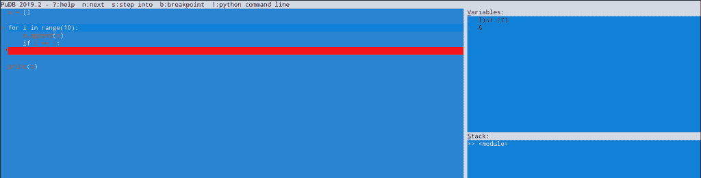
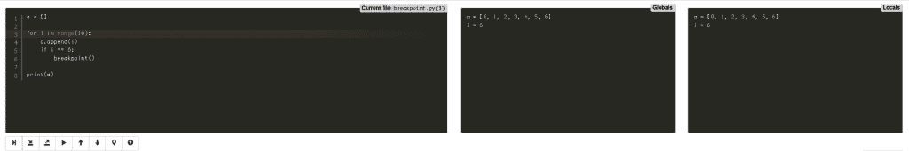

# Python 断点()函数

> 原文：<https://www.askpython.com/python/built-in-methods/python-breakpoint-function>

对于开发人员来说，Python 中的调试有相当多的问题。常见的调试器是 ***pdb*** 调试器。但是，为了分析会话，我们需要做一些事情，比如:

```py
import pdb

a = None
for i in range(10):
    if i == 4:
        a = 'Hi'
        print('a is set to', a)
    elif i == 5:
        pdb.set_trace()

```

输出

```py
a is set to Hi
> d:\user\pdb-tut.py(4)<module>()
-> for i in range(10):
(Pdb) p a
'Hi'
(Pdb)

```

虽然您可以使用`pdb.set_trace()`获得环境的内容和所有相关的变量，但是每次需要进行调试时插入这些内容通常会非常耗时。

此外，对于所有开发人员来说，每次需要进行调试时导入一个模块似乎并不直观。

考虑到这些问题，Python 3.7 引入了**断点()**方法，它完成导入`pdb`和调用`pdb.set_trace()`的工作。

因此，对`breakpoint()`的调用将产生一个 pdb 会话。

* * *

## 关于断点()

`breakpoint()`函数调用`sys`模块中另一个名为`sys.breakpointhook()`的方法，该方法进入`pdb`会话。

该方法的签名是:`breakpoint(*args, **kwargs)`

位置和关键字参数被传递给`sys.breakpointhook()`，如果签名不匹配，这可能会引发一个`TypeError`。

下面的例子显示了如何使用`breakpoint()`。

```py
a = []

for i in range(10):
    a.append(i)
    if i == 6:
        # Start pdb instance when i = 6
        breakpoint()

print(a)

```

输出

```py
> user/askpython/breakpoint_example.py(3)<module>()
-> for i in range(10):
(Pdb) p a
[0, 1, 2, 3, 4, 5, 6]
(Pdb) n
> user/askpython/breakpoint_example.py(4)<module>()
-> a.append(i)
(Pdb) p a
[0, 1, 2, 3, 4, 5, 6]
(Pdb) n
> user/askpython/breakpoint_example.py(5)<module>()
-> if i == 6:
(Pdb) n
> user/askpython/breakpoint_example.py(3)<module>()
-> for i in range(10):
(Pdb) n
> user/askpython/breakpoint_example.py(4)<module>()
-> a.append(i)
(Pdb) n
> user/askpython/breakpoint_example.py(5)<module>()
-> if i == 6:
(Pdb) 
> user/askpython/breakpoint_example.py(3)<module>()
-> for i in range(10):
(Pdb) 
> user/askpython/breakpoint_example.py(4)<module>()
-> a.append(i)
(Pdb) 
> user/askpython/breakpoint_example.py(5)<module>()
-> if i == 6:
(Pdb) 
> user/askpython/breakpoint_example.py(3)<module>()
-> for i in range(10):
(Pdb) 
> user/askpython/breakpoint_example.py(8)<module>()
-> print(a)
(Pdb) 
[0, 1, 2, 3, 4, 5, 6, 7, 8, 9]
--Return--

```

* * *

## PYTHONBREAKPOINT 环境变量

`sys.pythonbreakpointhook()`使用环境变量`PYTHONBREAKPOINT`。如果该变量被设置为`0`或禁用，当`breakpoint()`被调用时`pdb`调试器不被使用，从而禁用调试器。

因此，我们可以使用这个环境变量在调试模式之间切换。

因此，如果代码中有断点，但您不想进入调试模式，只需在运行 Python 程序时取消设置该环境变量。

```py
[email protected] $ PYTHONBREAKPOINT=0 python breakpoint_example.py

```

输出

```py
[0, 1, 2, 3, 4, 5, 6, 7, 8, 9]

```

* * *

## 更改调试会话

除了`pdb`之外，`PYTHONBREAKPOINT`环境变量可用于使用各种第三方调试器进行调试。

我们可以使用变量来设置一个可调用的名称，这将启动一个第三方调试会话，比如`web-pdb`和`pudb`。

如果您想使用它们，您可以使用以下方式安装它们:

```py
pip3 install pudb
pip3 install web-pdb

```

下面的例子显示了使用`breakpoint()`调用与`pudb`调试会话的集成。

```py
[email protected] $ PYTHONBREAKPOINT=pudb.set_trace python3 breakpoint_example.py

```

输出



A Pudb Debugging Session

类似地，可以使用下面的命令启动一个`web-pdb`会话。(注意`web_pdb.set_trace`命令中的下划线而不是连字符)

```py
[email protected] $ PYTHONBREAKPOINT=web_pdb.set_trace python3 breakpoint_example.py
2019-12-28 14:52:55,398: root - web_console:108 - CRITICAL - Web-PDB: starting web-server on root-pc:5555...

```

输出(在`localhost:5555`上)



A Web Pdb Debugger Session

* * *

## 结论

我们了解了用于调试目的的 Python 的`breakpoint()`函数，以及`PYTHONBREAKPOINT`环境变量，该变量可用于使用其他第三方调试器启动各种调试会话。

## 参考

*   [Python 断点()文档](https://docs.python.org/3.7/library/functions.html#breakpoint)
*   断点()上的 JournalDev 文章