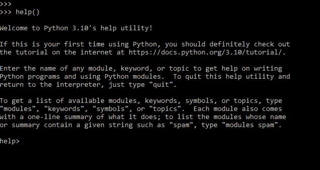
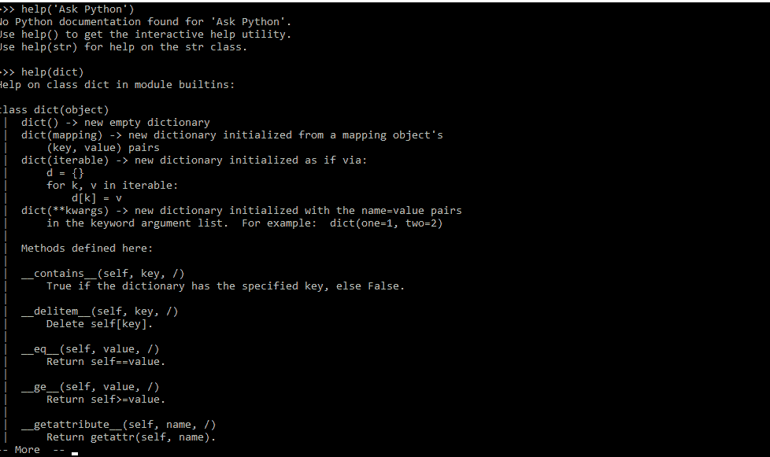

# Python 内置函数:简要概述

> 原文：<https://www.askpython.com/python/built-in-methods/python-built-in-functions-brief-overview>

内置函数是编程语言中已经存在的函数。在本文中，让我们通过例子来理解这些函数。

* * *

## [abs()](https://www.askpython.com/python/built-in-methods/python-abs-function)

```py
abs(number)

```

该函数返回一个*数*的绝对值。该参数可以是整数、浮点数或复数，如果是复数，则返回数字的大小。

```py
print(abs(10))
print(abs(-210))
print(abs(2 + 3j))  #complex number

```

**输出:**

10
210
3 . 56386 . 38638686667

## alter_)

```py
aiter(async iterable)

```

这个函数为[异步迭代](https://docs.python.org/3/glossary.html#term-asynchronous-iterable)返回一个[异步迭代器](https://docs.python.org/3/glossary.html#term-asynchronous-iterator)。这是 python 3.10 中的一个新函数。

此函数的示例实现。(更多示例请访问[此处](https://python.hotexamples.com/examples/coroutils.generator/-/aiter/python-aiter-function-examples.html))

```py
async def aitersync(iterable):
    results = []

    async for x in aiter(iterable):
        results.append(x)

    return iter(results)

```

## [all()](https://www.askpython.com/python/built-in-methods/all-method-in-python)

```py
all(iterable)

```

该函数采用 iterable(iterable 是可以迭代方式使用的对象，或者在*中用于*循环。例如:列表、字符串、字典、集合、元组等)作为参数，并在两种情况下返回真值。

1.  当 iterable 的所有元素都为真时
2.  当 iterable 为空时

```py
#Below list wil return false as all the elements are not true.
list1 = [10, 20, 30, 40, 50, false] 
print(all(list1)    

#Below set will return true as the set is empty
set1 = {}
print(all(set1))

#Below dictionary wil return true as all elements of the dictonary are true.
dict1 = {1: "Ask", 2: "Python"}
print(all(dict1))

```

## [any()](https://www.askpython.com/python/built-in-methods/any-method-in-python)

```py
any(iterable)

```

该函数也将 iterable 作为参数，如果 iterable 的任何元素为 true，则返回 true。如果 iterable 为空，则返回 false。

```py
#Below list wil return True even when some the elements are not true.
list1 = [10, 20, 30, 40, 50, false] 
print(all(list1)    

#Below set will return False as the set is empty
set1 = {}
print(all(set1))

```

## [ascii()](https://www.askpython.com/python/built-in-methods/python-ascii-function)

```py
ascii(object)

```

该函数返回对象的可打印版本。在非 ascii 字符的情况下，它用转义字符替换它们。

```py
x = ascii("åsk python")
print(x)

```

**输出:** '\xe5sk python '

字符被替换为转义字符。

## [bin()](https://www.askpython.com/python/built-in-methods/python-bin-function)

```py
bin(int)

```

该函数返回指定整数的二进制版本。返回字符串总是以前缀`0b`开头。

```py
num = bin(7)
print(num)

```

输出:0b111

## [bool()](https://www.askpython.com/python/built-in-methods/python-bool-method)

```py
bool(object)

```

该函数返回指定对象的布尔值(真或假)。如果对象为真，函数将返回真；如果对象为假，或无，或零(0)，或空，函数将返回假。

```py
#below object will return False, as it is empty
list1 = bool()
print(list1)

#below object will return False, as it is 0
list2 = bool(0)
print(list2)

#below object will return True, as it is non-empty
nums = bool({1,2,3,4,5})
orint(nums)

```

## [bytearray()](https://www.askpython.com/python/built-in-methods/python-bytearray-function)

```py
bytearray(x, encoding, error)

```

这个函数返回一个新的字节数组。它将对象转换为 bytearray 对象，或者创建特定所需大小的空 bytearray 对象。它有 3 个参数

1.  x:源参数
    *   如果它是一个*整数*，数组将具有该大小，并用空字节初始化。
    *   如果是一个*字符串*，还必须给出*编码*(以及可选的*错误*)参数
2.  编码:如果源是字符串，则为字符串的编码。
3.  错误:如果源是字符串，编码转换失败时要采取的操作。

```py
arr = bytearray(5)
print(arr)

str = "Ask Python"
arr1 = bytearray(str, 'utf-8')
print(arr1)

```

**输出:**

bytearray(b ' \ x00 \ x00 \ x00 \ x00 \ x00 ')

字节数组(b'Ask Python ')

## [字节()](https://www.askpython.com/python/built-in-methods/python-bytes)

```py
byte(x, encoding, error)

```

这个函数返回一个新的“字节”对象。它是 bytearray()的不可变版本，这意味着 bytes()返回一个不可修改的对象。参数也与 bytearray()的相同

1.  x:源参数
    *   如果它是一个*整数*，数组将具有该大小，并用空字节初始化。
    *   如果是一个*字符串*，还必须给出*编码*(以及可选的*错误*)参数
2.  编码:如果源是字符串，则为字符串的编码。
3.  错误:如果源是字符串，编码转换失败时要采取的操作。

```py
arr = bytes([1,2,3,4,5])
print(arr)

```

**输出:** b'\x01\x02\x03\x04\x05 '

## [callable()](https://www.askpython.com/python/built-in-methods/python-callable-method)

```py
callable(object)

```

如果对象参数是可调用的，该函数返回 true，否则返回 False。如果返回 True，调用仍然有可能失败，但是如果返回 False，调用对象将永远不会成功。

```py
def x():
  a = 100

print(callable(x))

```

**输出:**真

## [chr()](https://www.askpython.com/python/built-in-methods/python-chr-and-ord-methods)

```py
chr(int)

```

这个函数返回一个字符，这个字符的 Unicode 等于 integer int 的 Unicode。整数的范围是 0 到 1，114，111。如果整数超出定义的范围，该函数将返回 *ValueError* ，如果参数为非整数，则返回 *TypeError* 。

```py
num = chr(99)

print(num)

```

输出:c

## [classmethod()](https://www.askpython.com/python/oops/python-classmethod)

```py
#considered un-Pythonic 
classmethod(function)

#new version
@classmethod
def func(cls, args...)

```

这个函数将一个函数作为参数，并将其转换为一个类方法。(类方法绑定到类，而不是对象，所以它不需要类实例)@classsmethod 是 class method 的装饰形式。

创建 classmethod 示例:

```py
#defining class
class Employee:
    salary = 10000
    dept: 'HR'

    def printSalary(cls):
        print('The employee earns', cls.salary, 'per month.')

#creating classmethod
Employee.printSalary = classmethod(Employee.printSalary)
Employee.printSalary()

```

产出:员工月薪 10000

## [编译()](https://www.askpython.com/python/built-in-methods/what-is-python-compile-function)

```py
compile(source, filename, mode, flag, dont_inherit, optimize)

```

这个函数将源代码转换成代码或 AST 对象。如果编译的源代码无效，函数返回`*SyntaxError*`,如果源代码包含空字节，函数返回`*ValueError*`。传递参数有:

1.  source:(强制)要编译的源代码可以是任何东西，如 AST 对象、字符串等
2.  filename:(强制)读取源文件的文件名，如果不存在这样的文件，自己命名。
3.  mode:(强制)指定必须编译哪种代码
    *   eval–如果源包含单个表达式
    *   exec–如果源包含语句块
    *   single–如果源包含单个交互式语句
4.  flag 和 dont_inherit:(可选)控制应该激活哪些编译器选项，以及应该允许哪些未来功能。默认值分别为 0 和 false。
5.  optimize:(可选)指定编译器的优化级别；`-1`的默认值

## [复杂()](https://www.askpython.com/python/built-in-methods/python-complex-method)

```py
complex(real, imaginary)

```

该函数返回给定的实数值和虚数值。它将字符串或数字转换成复数。如果第一个参数是一个字符串，它将被解释为一个复数，并且必须在没有第二个参数的情况下调用函数。第二个参数不能是字符串。如果省略了任何一个参数——实数或虚数，那么缺省值仍然是 0，并且构造函数充当类似 int 和 float 的数字转换。如果两个参数都省略，则返回 0j。

```py
z0 = complex(9,-8)
print(z0)

z1 = complex()
print(z1)

z2 = complex(10)
print(z2)

z3 = complex('10-4j')
print(z3)

z4 = complex('5-7j','7')
print(z4)

```

**输出:**

(9-8j)
0j
(10+0j)
(10-4j)
类型错误:如果第一个参数是字符串，则 complex()不能接受第二个参数

## [delattr()](https://www.askpython.com/python/built-in-methods/python-delattr-function)

```py
delattr(object, attribute)

```

如果对象允许，这个函数会删除指定的属性。第一个参数指定从哪个对象中删除属性，第二个属性指定必须删除什么

```py
class Employee:
  Name= "Alex"
  Dept = "HR"
  Salary = 15000
  City = "Mumbai"

delattr(Employee, 'Salary')
#Salary attribute gets deleted from the Employee

```

## 字典()

```py
dict(keyword arguments)
class dict(**kwarg)
class dict(mapping, **kwarg)
class dict(iterable, **kwarg)

```

该功能

该功能

这个函数创建一个新的字典。dict 对象是 dictionary 类。class dict()返回一个新字典，它由一个可选的位置参数和一组可能为空的关键字参数初始化。

```py
d1 = dict(Name ="Alex", Salary =15000, City ="Mumbai")

print(d1)

```

**输出:**

{ '姓名':'亚历克斯'，'薪金':15000，'城市':'孟买' }

## [dir() ](https://www.askpython.com/python/built-in-methods/python-dir-method)

```py
dir(object)

```

当没有提供参数时，该函数返回当前局部范围内的名称列表。当参数存在时，它返回该对象的有效属性列表。

```py
s1 = {10, 20, 30, 40,}

print(dir(s1))

```

**输出:**

['__and__ '，' __class__ '，' __contains__ '，' __delattr__ '，' __dir__ '，' __doc__ '，' __format__ '，' __ge__ '，' __getattribute__ '，' __gt__ '，' __hash__ '，' __iand__ '，' __init__ '，' __init_subclass__ '，'，' __ior__ '，'，' __isub

## [时尚()](https://www.askpython.com/python/built-in-methods/python-divmod-function)

```py
divmod(dividend, divisor)

```

此函数返回由作为参数传递的数字的商和余数组成的数字对。它将为非数字参数返回 TypeError。

```py
dividend = 110
divisor = 4
nums = divmod(dividend, divisor)

print(nums)

```

**输出:** (27，2)

## [枚举()](https://www.askpython.com/python/built-in-methods/python-enumerate-method)

```py
enumerate(iterable, start)

```

此函数返回 iterable 的枚举对象( *iterable* 必须是序列 eg- tuple)。它向 iterable 添加一个计数器(从*开始*，默认为 0)。

```py
a = ('Monday', 'Tuesday', 'Wednesday','Thursday')
b = enumerate(a)

#notice the difference in output
print(list(a))
print(list(b))

```

**输出:**

['星期一'，'星期二'，'星期三'，'星期四']

[(0，'星期一')，(1，'星期二')，(2，'星期三')，(3，'星期四')]

## eval()

```py
eval(expression, globals, locals)

```

此函数计算作为参数传递的表达式，如果表达式是有效的 Python 语句，它将被执行。这些参数是:

1.  表达式:要计算的字符串/表达式
2.  globals(可选):必须是字典
3.  局部变量(可选):可以是任何映射对象。

```py
a = 10
b = 2
c = 'print(a * a + b)'

eval(c)

```

**输出:** 102

## [exec()](https://www.askpython.com/python/built-in-methods/python-exec-method)

```py
exec(object, globals, locals)

```

这个函数不返回任何值，它不返回任何值。这是一个支持 Python 代码动态执行的函数。对象必须是字符串或代码对象。如果它是一个代码对象，那么它只是被执行，但是在字符串的情况下，它首先被解析为一组 Python 语句，然后被执行。参数与 eval()相同，只是 eval()中的表达式被 exec()中的对象所更改

## [过滤器()](https://www.askpython.com/python/built-in-methods/python-filter-function)

```py
filter(function, iterable)

```

顾名思义，这个函数通过函数过滤 iterable，检查该项是否被接受。它返回经过筛选的 iterable。

```py
def Result(x):
  if x < 30:
    return False
  else:
    return True

marks = [60, 91, 12, 29, 30, 41]
pass_or_not = filter(Result, marks)

for x in pass_or_not:
  print(x)

```

输出: 60 91 30 41

## [float()](https://www.askpython.com/python/built-in-methods/python-float-method)

```py
float(value)

```

该函数返回由一个值构造的浮点数。值可以是数字或字符串。

```py
x_int = 25
y_float = float(x_int)

print(x_int)
print(y_float)

```

**输出:**

Twenty-five

Twenty-five

## [格式()](https://www.askpython.com/python/string/python-format-function)

```py
format(value, format)

```

该函数根据作为参数传递的指定格式返回格式化值。默认的*格式*是一个空字符串，但是，有一个大多数内置类型都使用的标准格式语法:[格式规范迷你语言](https://docs.python.org/3/library/string.html#formatspec)。

```py
# binary format  - b
x = 7
print(format(x, "b"))

```

**输出:** 111

## [frozenset()](https://www.askpython.com/python/built-in-methods/python-frozenset)

```py
frozenset(iterable)

```

该函数返回一个新的 set 或 frozenset 对象，其元素取自 *iterable* 。一个集合的元素必须是可散列的(如果它有一个在其生命周期中从不改变的散列值)。要表示集合的集合，内部集合必须是 frozenset 对象。如果没有指定 *iterable* ，则返回一个新的空集。

## [getattr()](https://www.askpython.com/python/built-in-methods/python-getattr-function)

```py
getattr(object, attribute, default)

```

这个函数返回指定的属性。第一个参数指定从哪个对象中找到属性，第二个属性指定必须找到什么(属性)。

```py
class Employee:
  name = 'Alex'
  city = 'Mumbai'

Engineer = Employee()
name = getattr(Engineer, 'name')
print(name)

```

**输出:**亚历克斯

## [globals()](https://www.askpython.com/python/built-in-methods/python-globals)

```py
globals()

```

这个函数返回实现当前模块名称空间的字典。global()的输出将显示当前程序的所有全局变量和其他符号。

## [hasattr()](https://www.askpython.com/python/built-in-methods/python-hasattr-method)

```py
hasattr(object, attribute)

```

如果指定的对象中存在指定的属性，则该函数返回 true，如果该属性不存在，则返回 false。

```py
class Employee:
  name = 'Alex'
  city = 'Mumbai'

Engineer = Employee()
x = hasattr(Engineer, 'name')
print(x)

y = hasattr(Engineer,'salary')
print(y)

```

**输出:**

真实的

错误的

## [哈希()](https://www.askpython.com/python/built-in-methods/python-hash-function)

```py
hash(object)

```

这个函数返回对象的哈希值(如果有的话)。哈希值是用于在字典查找过程中快速比较字典键的整数。

```py
x1 = 'Ask Python'
print('Ask Python: ', hash(x1))

x2 = 3.147
print('3.147: ',hash(x2))

x3 = 71
print('71:', hash(x3))

```

**输出:**

求 Python:-1041620088632976012
3.147:338958922354412547
71:71

## [帮助()](https://www.askpython.com/python/built-in-methods/python-help-method)

```py
help(object)

```

该函数调用内置的帮助系统。它旨在用于交互式使用。在 python shell 上尝试这个函数。

*   如果*没有给出参数*，交互式帮助系统在解释器控制台上启动。
*   如果参数是一个*字符串*，那么该字符串将被作为模块、函数、类、方法、关键字或文档主题的名称进行查找，并在控制台上打印一个帮助页面。
*   如果参数是*任何其他类型的对象*，则生成关于该对象的帮助页面。



help() with no arguments



Help() with arguments

## [十六进制()](https://www.askpython.com/python/built-in-methods/python-hex-function)

```py
hex(number)

```

这个函数将指定的数字转换成十六进制值。返回字符串总是以`0x`开头。

```py
x1 = hex(-44)
print(x1)

x2 = hex(321)
print(x2)

```

**输出:**

-0x2c

0x141

## [id()](https://www.askpython.com/python/id-function-in-python)

```py
id(object)

```

这个函数返回“身份”(唯一 id——这是一个整数，保证在对象的生命周期中是唯一的和恒定的。)的对象。

```py
x0 = 10
print(id(x0))

x1 = 11
print(id(x1))

x2 = x1
print(id(x2))

```

**输出:**

Nine million seven hundred and fifty-six thousand five hundred and twelve

Nine million seven hundred and fifty-six thousand five hundred and forty-four

Nine million seven hundred and fifty-six thousand five hundred and forty-four

## [输入()](https://www.askpython.com/python/built-in-methods/python-input-function)

```py
input(prompt)

```

该函数用于接收用户的输入。该函数从 input 中读取一行，将其转换为一个字符串(去掉尾随换行符)，然后返回该字符串。

```py
String1 = input('Input from the user: ')
print('The input:', String1)

```

**输出:**

来自用户的输入:询问 Python

## int()

```py
int(value)
int (value, base)

```

该函数返回一个整数对象，该对象由一个数字或字符串*值*构成。如果没有给定参数，那么函数将返回 0。*基*是可选的，表示*值*的数字系统。它可以是 0、2、8、10 或 16。

```py
#base 2 -> binary number
print(int('0b11101',2))

#base 16 -> hexadecimal number
x2 = 0xC1
print(int('0xC1',16))

```

**输出:**

Twenty-nine

One hundred and ninety-three

## [isinstance()](https://www.askpython.com/python/built-in-methods/python-isinstance)

```py
isinstance(object, classinfo)

```

该函数返回一个布尔值。如果*对象*参数是指定的 *classinfo* 参数或其子类的实例，则返回 true。否则返回 false。如果 *classinfo* 参数不是类型或类型元组，则该函数返回 TypeError。

```py
numset = {1, 2, 3}
print('Checking for set: ', isinstance(numset, set))
print('Checking for list: ', isinstance(numset, list))

```

**输出:**

检查集合:真
检查列表:假

## [issubclass()](https://www.askpython.com/python/built-in-methods/python-issubclass-method)

```py
issubclass(class, classinfo)

```

该函数返回一个布尔值，如果*类*参数是*类信息*参数的子类，则返回 true，否则返回 false

```py
class company:
  Office= 'AskPython'

class employee(company):
  name = 'Alex'
  Office = company

print(issubclass(employee, company))
print(issubclass(employee, employee))    #every class is its own subclass
print(issubclass(company, employee))

```

**输出:**

真实的

真实的

错误的

## [iter()](https://www.askpython.com/python/python-iter-function)

```py
iter(object, sentinel)

```

这个函数迭代器为给定的对象参数返回一个对象，直到取出*标记*为止。Sentinel 是可选的，它是用于表示序列结束的值。

```py
list1 = iter(["North", "East", "South", "West"])

print(next(list1))
print(next(list1))
print(next(list1))

```

**输出:**

北

东方

南方

## len()

```py
len(object)

```

该函数返回长度，即一个*对象*的项数。*对象*参数可以是字符串、字节、元组、列表或范围等序列，甚至可以是字典、集合等集合。

```py
l1 = len([10,20,30,40])
print(l1)

set1 = len({1,2,3,4,5,6,7})
print(set1)

sent = len("Ask Python")
print(sent)

```

**输出:**

four

seven

Ten

## 列表()

```py
list(iterable)

```

该函数创建一个作为参数传递的 iterable 列表。在没有参数的情况下，该函数将创建一个空列表。

```py
string1 = 'Ask Python'
string2 = list(string1)

print(string1)
print(string2)

```

**输出:**

求 Python
['A '，' s '，' k '，' '，' P '，' y '，' t '，' h '，' o '，' n']

## [本地人()](https://www.askpython.com/python/built-in-methods/python-locals-function)

```py
locals()

```

这个函数返回一个代表当前本地符号表的字典。它还在必要时更新局部符号表。这个函数没有任何参数。它在函数块中返回自由变量，但在类块中不返回。

```py
print(locals())

```

**输出:**

<samp>{'In': ["，' locals()']，' Out': {}，' _ '::，' __ ':，' __builtin__ ':，' _ _ builtin _ _ ':，' __name__': '__main__ '，' _dh': ['/home/repl']，' _i ':"，' _i1': 'locals()'，' _ih': ["，' locals()']，' _ii ':"，' _iii ':"，' _oh '::':':' '</samp>

## [地图()](https://www.askpython.com/python/built-in-methods/map-method-in-python)

```py
map(function, iterables)

```

该函数将指定为参数的函数应用于作为参数传递的 iterable 的每一项，并返回结果迭代器。

```py
def solve_nums(n,m,k):
    return n*m+k

numbers = (1, 2, 3, 4)
result = map(solve_nums,(1,2,3),(10,10,10),(1,2,3))
print(result)
print(list(result))

```

**输出:**

<map object="" at=""></map>

[11, 22, 33]

## [max()](https://www.askpython.com/python/built-in-methods/python-max-method)

```py
max(n1, n2, n3, ...)
max(iterable)

```

该函数返回一个*可迭代*参数中最大的项，或传递的两个或多个参数中最大的项(n1，n2…)。对于字符串参数，最大的项是按字母顺序排序的 iterable 的最后一项。

```py
str1 = max("India","China", "Dubai")
print(str1)

nums = max(-2, -9, -12)
print(nums)

```

**输出:**

印度

-2

## 内存视图()

```py
memoryview(object)

```

顾名思义，该函数返回对象的“memory view”；memoryview 允许您通过创建内存视图对象来访问对象的内部缓冲区。

```py
str = memoryview(b"Ask Python")

print(str)

#Unicode of the first character
print(str[0])

#Unicode of the second character
print(str[4])

```

**输出:**

Sixty-five

Eighty

## [min()](https://www.askpython.com/python/built-in-methods/python-min-method)

```py
min(n1, n2, n3, ...)
min(iterable)

```

该函数返回一个*可迭代*参数中的最小项，或者两个或多个传递参数中的最小项(n1，n2…)。对于字符串参数，最小的项是按字母顺序排序的 iterable 的第一项。

```py
str1 = min("India","China", "Dubai")
print(str1)

nums = min(-2, -9, -12)
print(nums)

```

**输出:**

中国

-12

## 下一个()

```py
next(iterable, default)

```

该函数检索指定的 *iterable* 的下一项。默认值是可选的，并且返回默认的*值*，直到 iterable 到达它的最终项。

```py
nums = iter([10,20,30])

#the next element -> 1st
nums_1 = next(nums)
print(nums_1)

#the next element -> 2nd
nums_2 = next(nums)
print(nums_2)

```

**输出:**

Ten

Twenty

## [object()](https://www.askpython.com/python/built-in-methods/python-object-method)

```py
x = object()

```

这个函数不接受任何参数。它返回一个新的无特征的对象。一个对象拥有所有 Python 类实例共有的方法。它是所有阶级的基础

```py
abc = object()

```

当创建输出“abc”对象时

## [oct()](https://www.askpython.com/python/built-in-methods/python-oct-function)

```py
oct(x)

```

此函数将指定的数字转换为十八进制值。返回字符串总是以`0` o 开始。

```py
x1 = oct(-44)
print(x1)

x2 = oct(321)
print(x2)

```

**输出:**

-0o54
0o501

## [打开()](https://www.askpython.com/python/built-in-methods/python-open-method)

```py
open(file, mode='r', buffering=- 1, encoding=None, errors=None, newline=None, closefd=True, opener=None)

```

这个函数打开文件并返回一个相应的 file 对象。如果找不到指定的文件，该函数将返回 OSError。这些参数是

*   文件–提供路径名，它是一个类似路径的对象
*   mode-这是一个可选字符串，指定文件打开的模式。以下是一些常用的模式

| `'r'` | 打开以供阅读(默认) |
| `'w'` | 打开进行写入，首先截断文件 |
| `'x'` | 以独占方式打开，如果文件已经存在，则失败 |
| `'a'` | 打开以供写入，追加到文件的末尾(如果存在) |
| `'b'` | 二进制 |
| `'t'` | 文本模式(默认) |
| `'+'` | 打开以进行更新(读取和写入) |

Modes and their description

*   缓冲–这是一个可选字符串，用于设置缓冲策略
*   encoding–这是一个可选字符串，用于说明编码格式
*   errors–这是一个可选字符串，用于解决编码/解码错误
*   newline–这是一个可选字符串，用于说明换行模式如何工作
*   closefd–这是一个可选字符串，默认情况下必须为 true 如果给定或否则，将发生异常。
*   opener–它是一个可选字符串，返回一个打开的文件描述符

## [ord()](https://www.askpython.com/python/built-in-methods/python-chr-and-ord-methods)

```py
ord(ch)

```

这个函数只是返回所传递参数的 Unicode 码位的整数表示。

```py
print(ord('T'))    
print(ord('1'))    
print(ord('@'))

```

**输出:**

84
49
64

## [pow()](https://www.askpython.com/python/built-in-methods/python-pow)

```py
pow(number, exponential, modulus)

```

该函数返回一个值，该值等于*数*的*指数*次方。modulus 参数是可选的，如果存在，则返回 mod of number。

```py
print(pow(2,0))  
print(pow(0, 2))       
print(pow(2,3,3))     #(2*2*2)/3

```

**输出:**

1
0
2

## [print()](https://www.askpython.com/python/built-in-methods/python-print-function)

```py
print(object(s), sep=separator, end=end, file=file, flush=flush)

```

顾名思义，这个函数将对象打印到文本流文件中，由 *sep* 分隔，后跟 *end* 。除了*对象*之外的所有其他参数都是可选的。

```py
nums = [1,2,3,4]

print("Numbers are: ", nums, sep='0', end='\n')
print("Ask Python")

```

**输出:**

数字是:0[1，2，3，4]
问 Python

## [属性()](https://www.askpython.com/python/built-in-methods/python-property-decorator)

```py
property(fget=None, fset=None, fdel=None, doc=None)

```

该函数采用四个可选参数，并返回 property 属性。

*   *fget* 用于获取一个属性值。
*   *偏移*用于设置属性值。
*   *fdel* 用于删除属性值。
*   *doc* 为属性创建一个 docstring。

## [范围()](https://www.askpython.com/python/built-in-methods/python-range-method)

```py
range(start, stop, step)

```

这个函数根据传递的参数返回一个不可变的数字序列。如果传递了一个参数，那么该函数会将其视为一个 *stop* 参数。

```py
nums = [1,2,3,4,5,6,7,8,9,10]

nums = range(5)   
print(list(nums))   

#2, and 10 are considered start and stop respectively
nums = range(2,10)    
print(list(nums))    

#increament step 2
nums = range(2,10,2) 
print(list(nums))

```

**输出:**

[0，1，2，3，4]
【2，3，4，5，6，7，8，9】
【2，4，6，8】

## repr()

```py
repr(object)

```

该函数返回一个字符串，该字符串包含一个对象的可打印表示。在大多数情况下，它返回相同的对象。

```py
string1 = 'Ask Python'
print(repr(string1))

nums1 = [1,2,3,4]
print(repr(nums1))

```

**输出:**

问 Python'
[1，2，3，4]

## [反转()](https://www.askpython.com/python/built-in-methods/python-reversed-function)

```py
reversed(sequence)

```

该函数返回指定*序列*参数的逆序。这里，序列可以是任何可索引的可迭代的，例如列表、元组、集合等。

```py
list1 = [1, 2, 4, 3, 5]
print(list(reversed(list1)))

tuple1 = ('A','S','K',' ','P','Y','T','H','O','N')
print(list(reversed(tuple1)))

```

**输出:**

[5，3，4，2，1]
['N '，' O '，' H '，' T '，' Y '，' P '，' '，' K '，' S '，' A']

## [回合()](https://www.askpython.com/python/built-in-methods/python-round)

```py
round(number, ndigits)

```

该函数返回一个四舍五入到小数点后*位数*的数字。 *ndigits 参数是可选的，如果不提供，函数将返回最接近的整数*。

```py
print('1.8 -> ',round(1.8))
print('1.2 -> ',round(1.2))
print('1.5678 (2 decimal points)-> ',round(1.5678,2))

```

**输出:**

1-> 1
1.8->2
1.2->1
1.5678(小数点后两位)- > 1.57

## 集合()

```py
set(iterable)

```

这个函数为指定的 iterable 参数构造一个集合。如果没有指定参数，那么函数将构造一个空集。

```py
print(set())   #empty set will be constructed
print(set(('A','S','K',' ','P','Y','T','H','O','N')))
print(set(('Ask Python')))

```

**输出:**

set()
{'S '，' O '，' K '，' A '，' H '，' N '，' P '，' Y '，' ' }
{'t '，' S '，' A '，' N '，' P '，' Y '，' O '，' K '，' '，' h'}

## [setattr()](https://www.askpython.com/python/python-setattr-function)

```py
setattr(object, name, value)

```

该函数用于设置或修改指定的*对象*参数中的名称及其值。

```py
class Employee:
    name = 'Atlas'

emp = Employee()
print('Before:', emp.name)

#modifying the name using setattr()
setattr(emp, 'name', 'Ryle')
print('After:', emp.name)

```

**输出:**

之前:阿特拉斯
之后:赖尔

## [切片()](https://www.askpython.com/python/built-in-methods/python-slice-function)

```py
slice(stop)
slice(start, stop, step)

```

该函数返回对象的一个切片，该切片是在*开始*和*停止*参数之间的一个对象的项目。这里*步*和*开始*是可选参数。如果未提及*开始*，则功能*从第 1 项开始*。步长参数用于指示增量，默认值设置为无。

```py
string1 = 'Ask Python'
slice_object1 = slice(6) 
print(string1[slice_object1])  

nums1 = [1,2,3,4,5,6,7,8,9,10,11]
slice_object2 = slice(1, 6, 2)
print(nums1[slice_object2])   #increament by 2

```

**输出:**

询问 Py
[2，4，6]

## [已排序()](https://www.askpython.com/python/built-in-methods/python-sorted-method)

```py
sorted(iterable, key=key, reverse=reverse)

```

该函数从 *iterable* 中的项目返回一个新的排序列表。*键是一个*可选参数，用于指定返回列表的顺序。*倒档也是一个*可选参数。它是一个布尔值，如果降序，则返回 true，如果升序，则返回 false。

```py
nums = [50,20,40,10,30]
print(sorted(nums))
print(sorted(nums,reverse = True))    

string1 = 'AskPython'
print(sorted(string1))

```

**输出:**

[10，20，30，40，50]
【50，40，30，20，10】
[' A '，' P '，' h '，' k '，' n '，' o '，' s '，' t '，' y']

## str()

```py
str(object=b'', encoding='utf-8', errors='strict')

```

这个函数返回一个 [`str`](https://docs.python.org/3/library/stdtypes.html#str) 对象的一个版本。*编码*参数指定编码格式，默认值设置为 utf-8。*错误*参数指定解码失败时如何响应。它可以是严格的，忽略的或替换的。

```py
s1 = bytes('AskPython', encoding='utf-8',errors='strict')
print(str(s1, encoding='ascii', errors='ignore'))

```

**输出:**

AskPython

## [sum()](https://www.askpython.com/python/built-in-methods/python-sum-method)

```py
sum(iterable, start=0)

```

该函数返回所有项目的总和加上*开始*参数。start 参数是可选的，默认情况下被认为是 0。iterable 的项目只能是数字。

```py
nums = [10,20,30,40,50]

print(sum(nums))
print(sum(nums,3))

```

**输出:**

150
153

## [超级()](https://www.askpython.com/python/built-in-methods/super-method-in-python)

```py
super(object)

```

这个函数返回对象的父类或兄弟类。这对于访问在类中被重写的继承方法很有用。

```py
class Employee(object):
  def __init__(self, emp):
    print(emp, 'works for AskPython')

class emp(Employee):
  def __init__(self):
    super().__init__('Alex')

emp1 = emp()

```

**输出:**

亚历克斯为 AskPython 工作

## 元组()

```py
tuple(iterable)

```

这个函数为指定的 *iterable* 参数构造一个元组。如果没有指定参数，那么函数将构造一个空元组。

```py
print(tuple())   #empty tuple will be constructed
print(tuple([10,20,30,40]))
print(tuple(('Ask Python')))

```

**输出:**

()
(10，20，30，40)
('A '，' s '，' k '，' '，' P '，' y '，' t '，' h '，' o '，' n ')

## [type()](https://www.askpython.com/python/built-in-methods/python-type-function)

```py
type(object)
type(name, bases, dict)

```

这个函数以两种不同的方式工作。

*   如果参数对象被传递，那么它将返回对象的类型。
*   如果传递了三个参数，那么它返回一个新类型的对象。*名称*字符串是类名。*基*元组包含基类。如果为空，则添加一个对象，即所有类的最终基。*字典*包含了类体的属性和方法定义。

```py
nums= {10,20,30,40}
print(type(nums))

class Employee:
    name: 'Atlas'
emp = Employee()
print(type(emp))

sample1 = type('AskPython',(Employee,) ,dict(x1='a', x2='b'))
print(type(sample1))

```

**输出**:

```py
<class 'main.employee'>
<class 'type'>
```

## [乌鸦()](https://www.askpython.com/python/built-in-methods/python-vars-method)

```py
vars(object)

```

这个函数返回指定对象参数的字典映射属性(__dict__)。如果没有提到参数，那么函数返回局部范围内的方法。

```py
print (vars())
print(vars(tuple))

```

**输出**:

{'name': 'main '，' doc': None，' package': None，' loader ':' spec ':None，' annotations': {，' builtins': }
{'repr ':，' hash ':，' getattribute ':，' lt ':，' le ':' eq ':，' ne ':，' gt ':，' ge ':' ITER ':，' len ':，' getitem ':，' add ':，' mul ':，' rmul ':' contains ':，' new ':，' getnewargs ':，' index ':，' count ':' doc ':"内置不可变\ n \ n 如果没有给定参数，构造函数将返回一个空元组。\ n 如果指定了 iterable，则从 iterable 的项初始化元组。\ n \ n 如果参数是元组，则返回值是同一个对象。}

## [zip()](https://www.askpython.com/python/built-in-methods/python-zip-function)

```py
zip(*iterables)

```

基于作为参数传递的 iterable 的元组的这个函数迭代器。

*   如果没有指定参数，函数将返回一个空迭代器。
*   如果指定了单个 iterable 参数，该函数将返回一个元组迭代器，每个元组只有一个元素。
*   如果指定了多个 iterables 参数，该函数将返回一个元组迭代器，每个元组包含所有 iterables 中的元素。

```py
nums = [1, 2, 3, 4]
string1 = ['North', 'East', 'West','South']

# Two iterables are passed
x = zip(nums, string1)
list1 = list(x)
print(list1)

```

**输出**:

[(1，'北')，(2，'东')，(3，'西')，(4，'南')]

## __ 导入 _ _()

```py
__import__(name, globals=None, locals=None, fromlist=(), level=0)

```

当语句调用此函数时，此函数用于更改导入语句的语义。反而用进口挂钩更好。该功能很少使用，我们不鼓励使用该功能。

## 结论

Python 是最好解释的语言之一。内置函数使得更容易有效地使用它。在本文中，我们介绍了 python 中所有可用的内置函数，以及它们的用法和示例。

如需更多参考资料，请点击[此处。](https://docs.python.org/3/library/functions.html)