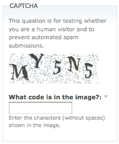

# Python 验证码生成器–用 Python 创建音频和图像验证码

> 原文：<https://www.askpython.com/python/examples/python-captcha-generator>

嘿程序员们！我很确定在一些网站上遇到过验证码，它可以验证你是人还是机器人。是的，你是对的，它们是当你完成一份长表格，甚至有时付款时出现的恼人的事情。看看下面的验证码样本。



Captcha Example

在本教程中，我们将尝试使用 Python 来生成我们自己的验证码！有趣吧？让我们直接进入代码吧！

## 安装验证码模块

所以就像任何其他程序一样，第一步是安装验证码库。为此，请打开命令提示符并运行以下命令:

```py
pip install captcha

```

## 用 Python 创建验证码生成器的步骤

在本教程中，我们将尝试生成图像和音频验证码。因此，当您完成安装库时，您需要分别从 captcha.image 和 captcha.audio 子库中导入 ImageCaptcha 和 AudioCaptcha 函数。

```py
from captcha.image import ImageCaptcha
from captcha.audio import AudioCaptcha

```

### 用 Python 生成图像验证码

让我们从创建一个图像验证码开始。我们将从用户那里获取关于需要在屏幕上显示的文本的输入，然后为数据生成图像验证码。

为了创建验证码，我们需要创建一个 Imagecaptcha 对象，然后使用 generate 函数为数据生成验证码。看看下面的代码。

```py
img = ImageCaptcha(width = 280, height = 90)
text = input("Enter the Text for Captcha: ")
Cap_data = img.generate(text)

```

图像已经生成，但是要保存图像，我们需要使用下面的代码来使用 write 函数。

```py
img.write(text, 'Sample_Cap_1.png')

```

在我们输入 AskPython 作为验证码的文本后，我们得到如下所示的验证码:


Sample Cap 1 1

看起来很酷，对吧？！

### 使用 Python 生成音频验证码

现在让我们试着生成一个音频验证码。对于音频验证码，我们将尝试为用户输入的数字生成一个数字验证码。看看下面的代码。音频验证码的工作方式与图像验证码类似。

```py
audio = AudioCaptcha()
text = input("Enter the Text for Captcha: ")
data = audio.generate(text)
audio.write(text,'Sample_Cap_2.wav')

```

当我们进入 3422 时，我们会听到类似下面的声音。

这听起来肯定很奇怪，但请仔细听！您将听到音频中所有噪音之间的数字。

## 结论

恭喜你！您刚刚学习了如何使用 Python 编程语言生成自己的验证码。你可以玩验证码，生成更多的验证码。尽情享受吧！

快乐学习！😁