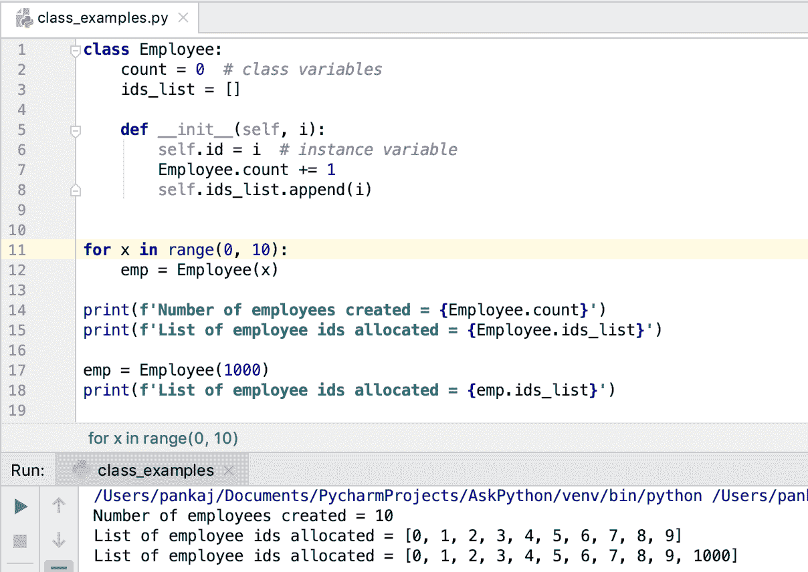

# Python 类和对象

> 原文：<https://www.askpython.com/python/oops/python-classes-objects>

Python 是一种面向对象的编程语言。类和对象是在 Python 中实现面向对象编程模型的核心

* * *

## 什么是 Python 类？

类是创建对象的蓝图。这些类可以有属性和函数。

例如，我们可以有一个类 Employee，其属性为`employee_id`，函数为`work()`。我们可以从这个类创建不同的 Employee 对象。

这些属性通常位于对象级别，因此对于不同的 employee 对象，employee_id 可以不同。

这些函数位于对象级或类级。这些函数主要处理对象属性并执行特定的任务。

* * *

## 如何用 Python 创建一个类

我们可以使用类[保留关键字](https://www.askpython.com/python/python-keywords)创建一个 Python 类。让我们看一个没有任何属性或函数的空类。

```py
class Employee:
    pass

```

有一个空班并没有给我们带来任何好处。所以，让我们给它添加一些类属性和函数。

```py
class Employee:
    employee_id = 0

    def work(self):
        print(f'{self.employee_id} is working')

```

* * *

## 如何用 Python 实例化一个类？

当我们创建一个 Python 类时，它会自动为它创建一个默认的无参数构造函数。我们可以调用这个构造函数来创建类的实例。这个实例被称为类的对象。

```py
emp = Employee()
print(type(emp))
emp.work()

```

输出:

```py
<class '__main__.Employee'>
0 is working

```

内置的 type()函数返回对象的类型。它用于获取对象的类信息。

* * *

## Python 中的基类是什么？

你想过 Employee 类是如何自动获得无参数构造函数的吗？

这是因为 Python 支持继承，Python 中的每个类都是从基类“object”自动继承的。当我们没有为类定义构造函数时,“object”类构造函数用于创建类的实例。

* * *

## 为类定义构造函数

如果您注意到 Employee 类的实现，就无法设置 employee_id 值。我们可以定义一个单独的方法来设置 employee_id 值。但是，它是 Employee 对象的强制属性。设置这些属性的最佳位置是通过构造函数。

Python 构造函数是一个特殊的函数，当我们创建类的实例时会调用它。这个函数名总是 __init__ 并且可以有任意数量的参数。第一个参数总是对象本身，通常命名为[自身变量](https://www.askpython.com/python/python-self-variable)。

让我们继续为 Employee 类创建一个构造函数。我们希望 caller 程序将 employee_id 值作为参数传递。

```py
class Employee:

    def __init__(self, i):
        self.employee_id = i

    def work(self):
        print(f'{self.employee_id} is working')

emp = Employee(100)
emp.work()

```

**输出** : `100 is working`

**注意**:创建 Employee 对象的早期代码现在不能工作了，因为 Employee 构造函数需要一个参数。如果我们调用`Employee()`，它将引发**类型错误:init()缺少 1 个必需的位置参数:“id”**。

* * *

## Python 中可以有多个构造函数吗？

与其他流行的面向对象编程语言不同，Python 不支持方法重载和构造函数重载。

但是，如果我们在类中定义多个构造函数，它不会抛出任何错误。最后一个构造函数将覆盖先前定义的构造函数定义。我们来看一个例子。

```py
class Employee:

    def __init__(self, id):
        self.employee_id = id

    # this will overwrite earlier defined constructor
    def __init__(self, id, n):  
        self.employee_id = id
        self.emp_name = n

    def work(self):
        print(f'{self.emp_name}[{self.employee_id}] is working')

emp = Employee(100, 'Pankaj')
emp.work()

emp = Employee(100)  # will raise Error
emp.work()

```

**输出:**

```py
Pankaj[100] is working
Traceback (most recent call last):
  File "/Users/pankaj/Documents/PycharmProjects/AskPython/hello-world/class_examples.py", line 19, in <module>
    emp = Employee(100)
TypeError: __init__() missing 1 required positional argument: 'n'

```

* * *

## 类变量与实例变量

当一个变量在类级别定义时，它被称为类变量。当变量在构造函数中定义时，它被称为实例变量。

类变量在类的所有实例之间共享，而实例变量是实例独有的。所以，理解什么时候使用类变量，什么时候使用实例变量是非常重要的。

在前面的例子中，employee_id 属性对于 employee 实例是唯一的，所以最好将其作为实例变量并在构造函数中定义。

假设我们想要跟踪创建的雇员实例的数量和分配的雇员 id。在这种情况下，我们可以使用类变量来存储这些数据并由实例进行更新。

```py
class Employee:
    count = 0
    ids_list = []

    def __init__(self, i):
        self.id = i
        Employee.count += 1
        self.ids_list.append(i)

for x in range(0, 10):
    emp = Employee(x)

print(f'Number of employees created = {Employee.count}')
print(f'List of employee ids allocated = {Employee.ids_list}')

emp = Employee(1000)
print(f'List of employee ids allocated = {emp.ids_list}')

```

**输出:**



Python Class Object Example

```py
Number of employees created = 10
List of employee ids allocated = [0, 1, 2, 3, 4, 5, 6, 7, 8, 9]
List of employee ids allocated = [0, 1, 2, 3, 4, 5, 6, 7, 8, 9, 1000]

```

**注意**:我们可以通过类名和实例变量来访问类变量。

* * *

## 参考资料:

*   [Python.org 文件](https://docs.python.org/3/tutorial/classes.html)