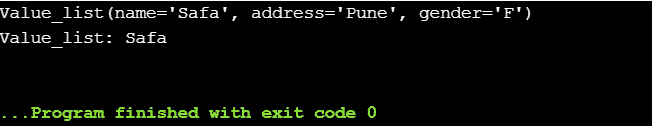

# Python 集合

> 原文：<https://www.askpython.com/python-modules/python-collections>

集合用于将一组相似的数据项表示为用于分组和管理相关对象的单个单元。

它们包含用于有效操作和存储数据的数据结构。 **Python 集合模块**提供了很多数据结构来实现不同类型的集合。

以下是我们将在本文中探讨的集合类型:

*   `OrderedDict`
*   `defaultdict`
*   `counter`
*   `namedtuple`
*   `deque`
*   `ChainMap`

* * *

## 1.1.有序直接

Python `OrderedDict`通过字典中的键值对来维护元素的插入顺序。如果用户再次尝试插入一个键，它会覆盖该键的上一个值。在 OrderedDict 中，严格保持项目的顺序，即作为输出的元素的顺序与元素的插入顺序相同。

**举例:**


*OrderedDict*

**输出**:


*Output-OrderedDict*

* * *

## 1.2 .DefaultDict(预设字典)

`DefaultDict`在 python 中是集合类中的容器。它类似于字典容器，唯一的区别是如果没有设置键，默认字典将有一个默认值。因此，我们可以对属于同一个键的项目进行分组。

**举例**:


*DefaultDict*

**输出**:


*Output DefaultDict*

键–**Safa**被使用了两次，与它相关的值在打印时被收集在一起。

* * *

## 1.3.计数器

`Counter`集合记录了插入到集合中的所有元素以及键。它是 Dictionary 的子类，用于跟踪项目。

**举例**:


*Counter*

**输出**:


*Output Counter*

* * *

## 1.4.命名元组

`Namedtuple`允许用户为元素提供名称/标签。因此，可以通过索引值或名称来访问元素。

因此，它增强了代码的可读性，并且是不可变的。

**举例**:

让我们用 Python 创建一个[元组。](https://www.askpython.com/python/tuple/python-tuple)


*Tuple*

**输出**:


*Output-Tuple*

为了更好的可读性和理解，我们可以通过为元组中的条目指定名称来创建命名元组。

**举例**:


*NamedTuple*

**输出**:



*Output-NamedTuple*

* * *

## 1.5.双端队列

`Deque`是一个双端队列，允许用户从两端添加和删除元素。它增加和增强了堆栈或队列的能力和功能。

**举例**:


*Deque*

**输出**:


*Output Deque*

* * *

## 1.6.链式地图

`ChainMap`返回字典链/列表，并将其表示为单个视图映射。当不同的字典中有几个键值对时，ChainMap 工作得很好，在这种情况下，ChainMap 将它们表示为所有字典的单个列表/结构。

**举例:**

```py
from collections import ChainMap
x = { 1: 'Engineering' , 2: 'Medical'}
y = {3: 'Analytics' , 4: 'Python'}
z = ChainMap(x,y)
print(z)

```

**输出**:


*Output-ChainMap*

* * *

## 参考

*   Python 集合
*   [Python 集合文档](https://docs.python.org/3/library/collections.html)