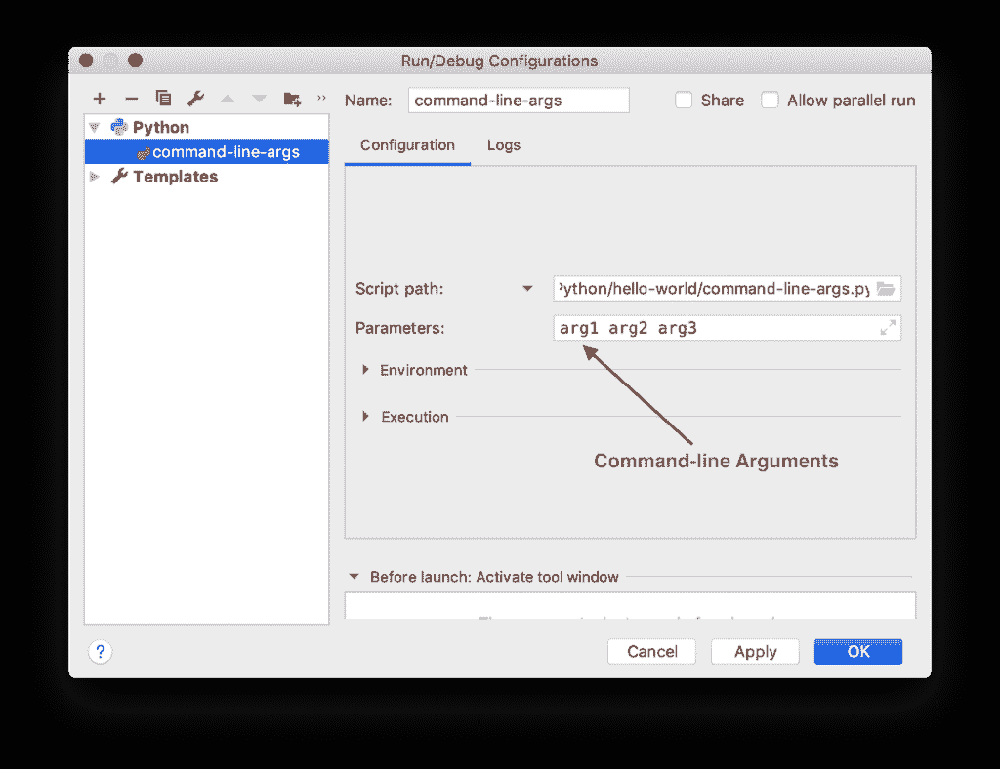

# Python 命令行参数–3 种读取/解析方法

> 原文：<https://www.askpython.com/python/python-command-line-arguments>

Python 命令行参数是在执行脚本时提供给脚本的参数。命令行参数用于向程序提供特定的输入。

* * *

## Python 命令行参数的好处是什么？

Python 命令行参数有助于我们保持程序的通用性。例如，我们可以编写一个程序来处理 CSV 文件。如果我们从命令行传递 CSV 文件名，那么我们的程序将适用于任何 CSV 文件。这将使我们的程序松散耦合，易于维护。

命令行参数的另一个好处是随之而来的额外的安全性。假设我们有一个程序将数据保存到数据库中。如果我们将数据库凭证存储在脚本或某个配置文件中，任何有权访问这些文件的人都可以访问和执行它。但是，如果用户名/密码是作为命令行参数提供的，那么它就不会出现在文件系统中，我们的程序就更加安全。

* * *

## 如何在 Python 中传递命令行参数？

如果从终端运行 python 脚本，只需在脚本名称后传递参数。参数用空白字符分隔。

```py
$ python script.py arg1 arg2 ... argN

```

* * *

## 在 PyCharm 中传递命令行参数

PyCharm 是 Python 编程最流行的 IDE。如果您想将命令行参数传递给 python 程序，请转到“运行>编辑配置”,设置参数值并保存。



Python Command Line Arguments PyCharm

* * *

## 如何在 Python 脚本中读取命令行参数？

Python 脚本中有三个流行的模块来读取和解析命令行参数。

1.  sys.argv
2.  停了
3.  抱怨吗

* * *

## 1.使用 sys 模块读取 Python 命令行参数

命令行参数存储在 sys 模块`argv`变量中，该变量是字符串的[列表](https://www.askpython.com/python/list/python-list)。我们可以从这个列表中读取命令行参数，并在我们的程序中使用它。

注意，脚本名也是`sys.argv`变量中命令行参数的一部分。

```py
import sys

if len(sys.argv) != 2:
    raise ValueError('Please provide email-id to send the email.')

print(f'Script Name is {sys.argv[0]}')

email = sys.argv[1]

print(f'Sending test email to {email}')

```

**输出:**

```py
$ python3.7 command-line-args.py [email protected]
Script Name is command-line-args.py
Sending test email to [email protected]
$ python3.7 command-line-args.py                   
Traceback (most recent call last):
  File "command-line-args.py", line 4, in <module>
    raise ValueError('Please provide email-id to send the email.')
ValueError: Please provide email-id to send the email.
$

```

* * *

## 2.使用 getopt 模块解析命令行参数

Python getopt 模块的工作方式与 Unix getopt()函数类似。当您希望脚本接受选项及其值时，该模块很有帮助，类似于许多 Unix 命令。

该模块与 sys.argv 协同工作，解析命令行参数，并提取一列[元组](https://www.askpython.com/python/tuple/python-tuple)中的选项值。

```py
import getopt
import sys

argv = sys.argv[1:]

opts, args = getopt.getopt(argv, 'x:y:')

# list of options tuple (opt, value)
print(f'Options Tuple is {opts}')

# list of remaining command-line arguments
print(f'Additional Command-line arguments list is {args}')

```

**输出:**

```py
$ python3.7 command-line-args.py -x 1 -y 2 A B            
Options Tuple is [('-x', '1'), ('-y', '2')]
Additional Command-line arguments list is ['A', 'B']
$ 

```

* * *

## 3.使用 argparse 模块解析命令行参数

我们还可以使用 Python argparse 模块来解析命令行参数。argparse 模块有很多选项。

*   位置参数
*   帮助消息
*   参数的默认值
*   指定参数的数据类型等等。

```py
import argparse

# create parser
parser = argparse.ArgumentParser()

# add arguments to the parser
parser.add_argument("language")
parser.add_argument("name")

# parse the arguments
args = parser.parse_args()

# get the arguments value
if args.language == 'Python':
	print("I love Python too")
else:
	print("Learn Python, you will like it")

print(f'Hello {args.name}, this was a simple introduction to argparse module')

```

**输出:**

```py
$ python3.7 command-line-args.py Python David
I love Python too
Hello David, this was a simple introduction to argparse module
$
$ python3.7 command-line-args.py Java Lisa   
Learn Python, you will like it
Hello Lisa, this was a simple introduction to argparse module
$
$ python3.7 command-line-args.py -h       
usage: command-line-args.py [-h] language name

positional arguments:
  language
  name

optional arguments:
  -h, --help  show this help message and exit
$

```

注意，帮助消息是由 argparse 模块自动生成的。

* * *

## 结论

如果您的脚本需要简单的命令行参数，您可以使用 sys.argv。但是，如果您的程序接受大量的位置参数、默认参数值、帮助消息等，那么您应该使用 argparse 模块。getopt 模块也可以工作，但是它很混乱，很难理解。

* * *

## 参考资料:

*   【T0 缝合. argv】t1
*   [getopt 模块](https://docs.python.org/3.7/library/getopt.html?highlight=getopt#getopt.getopt)
*   [argparse 模块](https://docs.python.org/3.7/library/argparse.html)