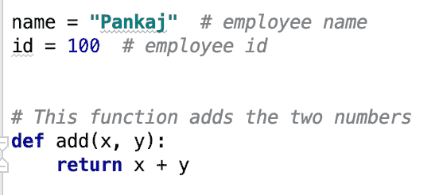
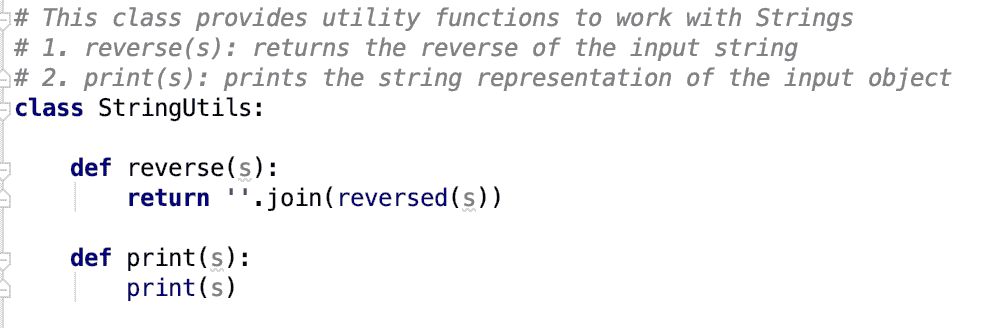
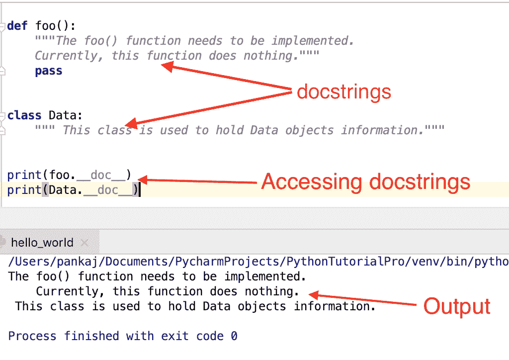

# Python 注释–多行注释，最佳实践

> 原文：<https://www.askpython.com/python/python-comments>

注释是任何程序不可或缺的一部分。每种编程语言都提供了添加注释的方法。Python 评论系统非常简单。在本指南中，我们将学习 Python 中的注释。它们为开发人员提供了关于代码的有用信息。

* * *

## 如何用 Python 写注释？

*   Python 注释以#字符开始，延伸到行尾。
*   我们可以从行首开始注释，在一些空格或代码之后。
*   如果散列字符出现在字符串中，它就是字符串的一部分。

* * *

## Python 注释示例

我们可以为变量、函数和类添加注释。它们用于提供代码部分的预期用途。让我们看一些 Python 中注释的例子。

### 1.[变量](https://www.askpython.com/python/python-variables)的注释

```py
name = "Pankaj"  # employee name
id = 100  # employee id

data = "#123"  # this is comment, data contains # and that is not part of the comment.

```

### 2.函数的注释

```py
# This function adds the two numbers
def add(x, y):
    return x+y

```



Python Comments

### 3.课程注释

```py
# This class provides utility functions to work with Strings
class StringUtils:

    def reverse(s):
        return ''.join(reversed(s))

```

* * *

## Python 注释块或多行注释

有时在一行中包含注释是不可行的。在这种情况下，我们可以创建一个注释块，或者将注释分成多行。我们必须在每一行前面加上#来写多行注释。

```py
# This class provides utility functions to work with Strings
# 1\. reverse(s): returns the reverse of the input string
# 2\. print(s): prints the string representation of the input object
class StringUtils:

    def reverse(s):
        return ''.join(reversed(s))

    def print(s):
        print(s)

```



Python Multiline Comment

* * *

## 使用 Python Docstring 作为多行注释

Python 文档字符串(Docstring)用于为函数、类和模块提供文档。它们被定义在一对三重双引号(" ")之间。它们必须定义在函数或类声明的正下方。

让我们快速看一下 Python 文档字符串的一些例子。

```py
def foo():
    """The foo() function needs to be implemented.
    Currently, this function does nothing."""
    pass

class Data:
    """ This class is used to hold Data objects information."""

```

我们可以使用`__doc__`属性访问实体的 docstring。

```py
print(foo.__doc__)
print(Data.__doc__)

```



Python Docstrings

* * *

### 使用 Docstring 指定长的多行注释是个好主意吗？

Python docstrings 的目的是提供文档。有时你会注意到它被误用来提供长评论。但是，这不是推荐的方法。如果您希望注释扩展到多行，只需在每一行前面加上散列字符。

* * *

## Python 多行字符串作为多行注释

我们也可以使用多行字符串作为多行注释。根据这个 [**圭多的推文**](https://twitter.com/gvanrossum/status/112670605505077248) ，他们没有生成代码。

```py
'''
This function read employees data from the database
emp_id: employee id, should be int
returns employee object.
'''
def read_emp_from_db(emp_id):
    i = int(emp_id)
    '''code to read emp data
    using the employee unique id number'''
    pass

```

但是，这可能会导致缩进的问题。同样令人困惑的是，为什么一个字符串出现在代码中却没有任何用处。因此，最好坚持使用散列字符的常规多行注释。

* * *

## Python 注释最佳实践

*   总是提供有意义的注释来指定实体的用途。
*   最好把长评论拆成多行。
*   评论里不要无礼。
*   保持评论的重点。没人愿意在代码评论里看小说。
*   避免不提供任何有用信息的无用评论。下面是一些无用评论的例子。

```py
# count variable
count = 10

# foo() function
def foo():
    pass

```

*   有时候评论是不必要的。实体本身有合适的名称就足够了。让我们看一个这个场景的例子。

```py
# This function add two numbers
def foo(x, y):
    return x + y

# Better to have function defined as below. There is no use of comments.

def add_two_numbers(x, y):
    return x + y

```

*   建立一个评论系统总是一个好主意。当在一个组织中与许多团队成员和多个项目一起工作时，建议使用注释策略。例如，您可以像这样定义注释策略:

```py
# {Object Type} - {Usage}
# Data Object - stores the Data fetched from the database
data_obj = Data()

# {Function Short Description}
# {Input Arguments and their types}
# {Return object details}
# {Exception Details}

# This function adds all the elements in the sequence or iterable
# numbers: sequence or iterable, all the elements must be numbers
# Returns the sum of all the numbers in the sequence or iterable
# Throws ArithmeticError if any of the element is not a number

def add_numbers(numbers):
    sum_numbers = 0
    for num in numbers:
        sum_numbers += num
    return sum_numbers

```

* * *

## 注释掉块的 Python 注释快捷方式

如果您正在使用 Python IDE 或 Jupyter Notebook，您可以使用快捷方式注释掉代码块。

*   **macOS 评论快捷键**——选择你想要评论的行，按 **Command+/** ，它会自动在每行的开头加上#变成评论块。如果是空行，它会在行首加#你可以写注释。
*   **Windows 和 Linux 注释快捷键**——使用 **Ctrl+/** 作为将代码块变成注释的快捷键。

* * *

## 摘要

*   Python 评论系统很简单，总是从#开始。
*   Python docstring 用于文档。您不应该将它误用为多行注释。
*   对于多行注释，每一行都以散列字符开始。
*   遵循向计划添加注释的最佳实践。
*   当与许多团队成员一起工作时，有一个合适的评论策略总是一个好主意。

## 下一步是什么？

我们在本教程中引用了很多主题，你应该阅读下面的教程来进一步了解它们。

*   [Python 函数](https://www.askpython.com/python/python-functions)
*   [Python 类](https://www.askpython.com/python/oops/python-classes-objects)
*   [Python 中的 Docstring](https://www.askpython.com/python/python-docstring)
*   [Python 数据类型](https://www.askpython.com/python/python-data-types)
*   [Python 中的缩进](https://www.askpython.com/python/python-indentation)

## 参考资料:

*   [Python.org 文件](https://docs.python.org/3.7/tutorial/introduction.html#an-informal-introduction-to-python)