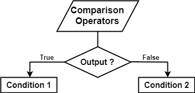
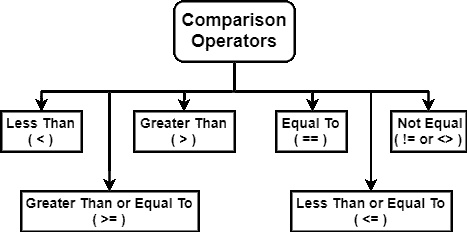

# Python 比较运算符

> 原文：<https://www.askpython.com/python/python-comparison-operators>

Python 中的运算符用于执行或操作某些任务。Python 比较运算符也称为关系运算符，分别用于比较两个值和应用条件。

这里可以有两种可能的输出，或者是`True`或者是`False`。



Python Comparison Operators Flowchart

* * *

## Python 中比较运算符的类型

有 6 种类型的比较运算符:

1.  **小于(< )**
2.  **大于(> )**
3.  **等于(== )**
4.  **不等于(！= )**
5.  **小于或等于(< = )**
6.  **大于或等于(> = )**



Python Comparison Operators

* * *

### 1.小于( < )

它用于检查与其他数字或变量相比较小的值或包含较小值的变量。如果提供的数字或变量小于给定的数字或变量。然后，小于运算符将返回 True。否则，它将返回 false。

```py
a = 10
if (a < 10)
 print("Yes")
 else
  print("No")

```

**输出**:否

* * *

### 2.大于( > )

它用于检查与其他数字或变量相比更大的值或包含更大值的变量。如果提供的数字或变量大于给定的数字或变量。然后，大于运算符将返回 True。否则，它将返回 false。

```py
a = 10
if (a > 10)
 print("True")
else
  print("False")

```

**输出**:假

* * *

### 3.等于(==)

该运算符检查值是否相等。如果输入的值和给定的值相等，那么它将返回 True，否则返回 False。

```py
a = 10
b = 20
if (a == b)
 print("True")
else
 print("False")

```

**输出**:假

* * *

### 4.不等于(！=或<>

它用 **`!=`** 表示，这与等于运算符正好相反。如果运算符两边的值不相等，则返回 True。

```py
print(3!=3.0)

```

**输出**:假

* * *

### 5.小于或等于(< =)

仅当左边的值小于或等于右边的值时，该运算符的计算结果为`True`。

```py
a = 15
b = 5
if(b <= a)
 print("b is either less than or equal to a")

```

**输出** : b 小于或等于 a

* * *

### 6.大于或等于(> =)

仅当左边的值大于或等于右边的值时，该运算符的计算结果为`True`。

```py
a = 5
b = 15
if(b >= a)
 print("b is either greater than or equal to a")

```

**输出** : b 大于或等于 a

* * *

## Python 比较运算符示例

```py
a = 10
b = 5
c = 0

if ( a == b ):
   print "a is equal to b"
else:
   print "a is not equal to b"

if ( a != b ):
   print "a is not equal to b"
else:
   print "a is equal to b"

if ( a <> b ):
   print "a is not equal to b"
else:
   print "a is equal to b"

if ( a < b ):
   print "a is less than b" 
else:
   print "a is not less than b"

if ( a > b ):
   print "a is greater than b"
else:
   print "a is not greater than b"

a = 6;
b = 15;
if ( a <= b ):
   print "a is either less than or equal to  b"
else:
   print "a is neither less than nor equal to  b"

if ( b >= a ):
   print "b is either greater than  or equal to b"
else:
   print "b is neither greater than  nor equal to b"

```

**输出**:

```py
a is not equal to b
a is not equal to b
a is not equal to b
a is not less than b
a is greater than b
a is either less than or equal to b
b is either greater than or equal to b
```

* * *

## 参考

*   [Python if else elif 语句](https://www.askpython.com/python/python-if-else-elif-statement)
*   [Python 运算符](https://www.askpython.com/python/python-operators)