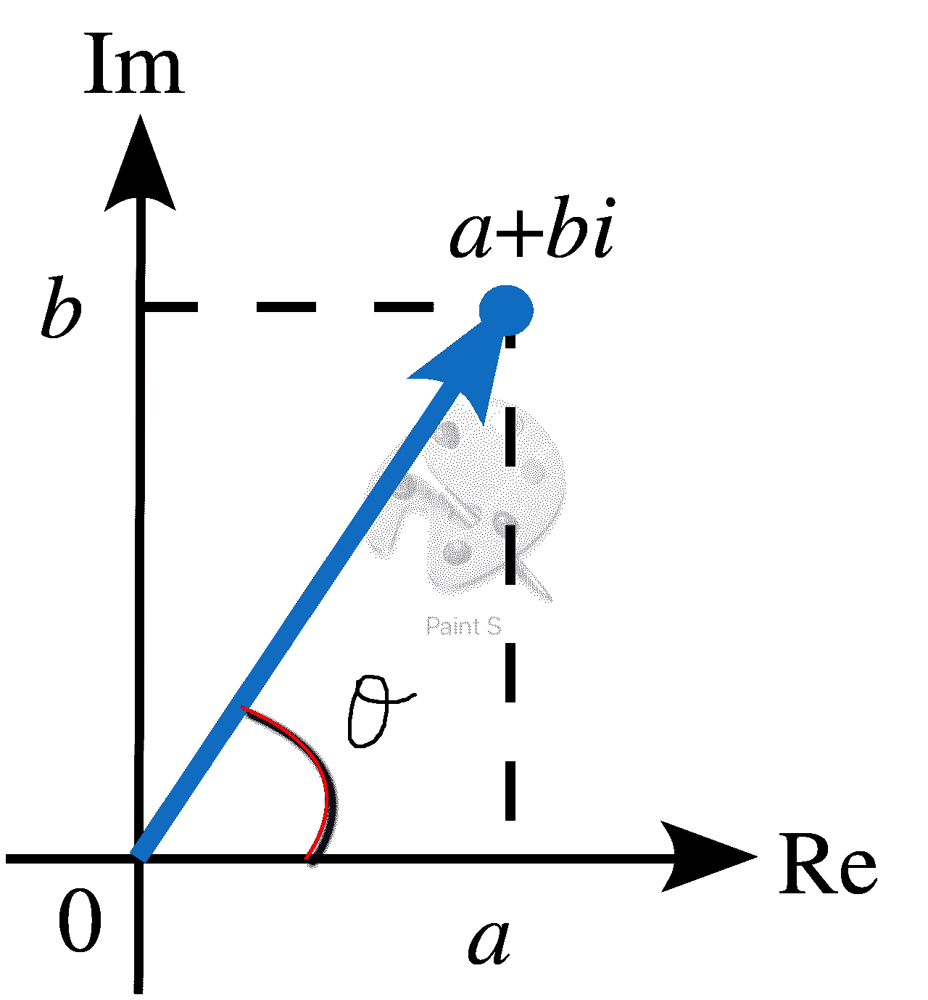

# Python 复数

> 原文：<https://www.askpython.com/python/python-complex-numbers>

复数是任何形式的数字`a + bj`，其中`a`和`b`是实数，`j*j` = -1。

在 Python 中，有多种方法可以创建这样一个复数。

* * *

## 在 Python 中创建复数

*   我们可以直接使用语法`a + bj`来创建一个复数。

```py
>>> a = 4 + 3j
>>> print(a)
(4+3j)
>>> print(type(a))
<class 'complex'>

```

*   我们也可以使用`complex`类来创建一个复数

```py
>>> a = complex(4, 3)
>>> print(type(a))
<class 'complex'>
>>> print(a)
(4+3j)

```

### 复数中的实部和虚部

每个复数(`a + bj`)都有一个实部(`a`)，和一个虚部(`b`)。

要得到实部，用`number.real`，要得到虚部，用`number.imag`。

```py
>>> a
(4+3j)
>>> a.real
4.0
>>> a.imag
3.0

```

### 复数的共轭

复数`a + bj`的共轭定义为`a - bj`。我们也可以用`number.conjugate()`方法得到共轭。

```py
>>> a
(4 + 3j)
>>> a.conjugate()
(4-3j)

```

## 复数上的算术运算

与实数类似，复数也可以加、减、乘、除。让我们看看如何用 Python 来做这件事。

```py
a = 1 + 2j
b = 2 + 4j
print('Addition =', a + b)
print('Subtraction =', a - b)
print('Multiplication =', a * b)
print('Division =', a / b)

```

**输出**:

```py
Addition = (3+6j)
Subtraction = (-1-2j)
Multiplication = (-6+8j)
Division = (2+0j)

```

**注**:与实数不同，我们不能比较两个复数。我们只能分别比较它们的实部和虚部，因为它们是实数。下面的片段证明了这一点。

```py
>>> a
(4+3j)
>>> b
(4+6j)
>>> a < b
Traceback (most recent call last):
  File "<stdin>", line 1, in <module>
TypeError: '<' not supported between instances of 'complex' and 'complex'

```

* * *

## 复数的相位(自变量)

我们可以将一个复数表示为由两个分量组成的向量，这两个分量位于由轴`real`和轴`imaginary`组成的平面上。因此，向量的两个分量是它的实部和虚部。



Complex Number Vector

向量与实轴之间的角度定义为复数的`argument`或`phase`。

它的正式定义是:

***【相位(数字)=反正切(虚部/实部)***

其中反正切函数是反正切数学函数。

在 Python 中，我们可以使用复数的`cmath`模块来获得复数的相位。我们也可以使用`math.arctan`函数，从它的数学定义中得到相位。

```py
import cmath
import math

num = 4 + 3j

# Using cmath module
p = cmath.phase(num)
print('cmath Module:', p)

# Using math module
p = math.atan(num.imag/num.real)
print('Math Module:', p)

```

**输出**:

```py
cmath Module: 0.6435011087932844
Math Module: 0.6435011087932844

```

注意，这个函数返回的是`radians`中的相角，所以如果我们需要转换到`degrees`，可以使用另一个类似`numpy`的库。

```py
import cmath
import numpy as np

num = 4 + 3j

# Using cmath module
p = cmath.phase(num)
print('cmath Module in Radians:', p)
print('Phase in Degrees:', np.degrees(p))

```

**输出**:

```py
cmath Module in Radians: 0.6435011087932844
Phase in Degrees: 36.86989764584402

```

* * *

## 直角坐标和极坐标

使用`cmath.rect()`和`cmath.polar()`功能可以将复数写成直角坐标或极坐标格式。

```py
>>> import cmath
>>> a = 3 + 4j
>>> polar_coordinates = cmath.polar(a)
>>> print(polar_coordinates)
(5.0, 0.9272952180016122)

>>> modulus = abs(a)
>>> phase = cmath.phase(a)
>>> rect_coordinates = cmath.rect(modulus, phase)
>>> print(rect_coordinates)
(3.0000000000000004+3.9999999999999996j)

```

* * *

## cmath 模块中的常数

cmath 模块中有一些特殊的常量。下面列出了其中的一些。

```py
print('π =', cmath.pi)
print('e =', cmath.e)
print('tau =', cmath.tau)
print('Positive infinity =', cmath.inf)
print('Positive Complex infinity =', cmath.infj)
print('NaN =', cmath.nan)
print('NaN Complex =', cmath.nanj)

```

**输出**:

```py
π = 3.141592653589793
e = 2.718281828459045
tau = 6.283185307179586
Positive infinity = inf
Positive Complex infinity = infj
NaN = nan
NaN Complex = nanj

```

* * *

## 三角函数

在`cmath`模块中也可以使用复数的三角函数。

```py
import cmath

a = 3 + 4j

print('Sine:', cmath.sin(a))
print('Cosine:', cmath.cos(a))
print('Tangent:', cmath.tan(a))

print('ArcSin:', cmath.asin(a))
print('ArcCosine:', cmath.acos(a))
print('ArcTan:', cmath.atan(a))

```

**输出**:

```py
Sine: (3.853738037919377-27.016813258003936j)
Cosine: (-27.034945603074224-3.8511533348117775j)
Tangent: (-0.0001873462046294784+0.999355987381473j)
ArcSin: (0.6339838656391766+2.305509031243477j)
ArcCosine: (0.9368124611557198-2.305509031243477j)
ArcTan: (1.4483069952314644+0.15899719167999918j)

```

## 双曲函数

与三角函数类似，复数的双曲函数也可在`cmath`模块中使用。

```py
import cmath

a = 3 + 4j

print('Hyperbolic Sine:', cmath.sinh(a))
print('Hyperbolic Cosine:', cmath.cosh(a))
print('Hyperbolic Tangent:', cmath.tanh(a))

print('Inverse Hyperbolic Sine:', cmath.asinh(a))
print('Inverse Hyperbolic Cosine:', cmath.acosh(a))
print('Inverse Hyperbolic Tangent:', cmath.atanh(a))

```

**输出**:

```py
Hyperbolic Sine: (-6.5481200409110025-7.61923172032141j)
Hyperbolic Cosine: (-6.580663040551157-7.581552742746545j)
Hyperbolic Tangent: (1.000709536067233+0.00490825806749606j)
Inverse Hyperbolic Sine: (2.2999140408792695+0.9176168533514787j)
Inverse Hyperbolic Cosine: (2.305509031243477+0.9368124611557198j)
Inverse Hyperbolic Tangent: (0.11750090731143388+1.4099210495965755j)

```

## 指数和对数函数

```py
import cmath
a = 3 + 4j
print('e^c =', cmath.exp(a))
print('log2(c) =', cmath.log(a, 2))
print('log10(c) =', cmath.log10(a))
print('sqrt(c) =', cmath.sqrt(a))

```

**输出**:

```py
e^c = (-13.128783081462158-15.200784463067954j)
log2(c) = (2.321928094887362+1.3378042124509761j)
log10(c) = (0.6989700043360187+0.4027191962733731j)
sqrt(c) = (2+1j)

```

* * *

## 杂项功能

有一些杂七杂八的函数来检查一个复数是有限的，无限的还是`nan`。还有一个函数检查两个复数是否接近。

```py
>>> print(cmath.isfinite(2 + 2j))
True

>>> print(cmath.isfinite(cmath.inf + 2j))
False

>>> print(cmath.isinf(2 + 2j))
False

>>> print(cmath.isinf(cmath.inf + 2j))
True

>>> print(cmath.isinf(cmath.nan + 2j))
False

>>> print(cmath.isnan(2 + 2j))
False

>>> print(cmath.isnan(cmath.inf + 2j))
False

>>> print(cmath.isnan(cmath.nan + 2j))
True

>>> print(cmath.isclose(2+2j, 2.01+1.9j, rel_tol=0.05))
True

>>> print(cmath.isclose(2+2j, 2.01+1.9j, abs_tol=0.005))
False

```

* * *

## 结论

我们学习了复数模块，以及与`cmath`模块相关的各种函数。

## 参考

*   关于 cmath 模块的 JournaDev 文章
*   [维基百科关于复数的文章](https://en.wikipedia.org/wiki/Complex_number)

* * *