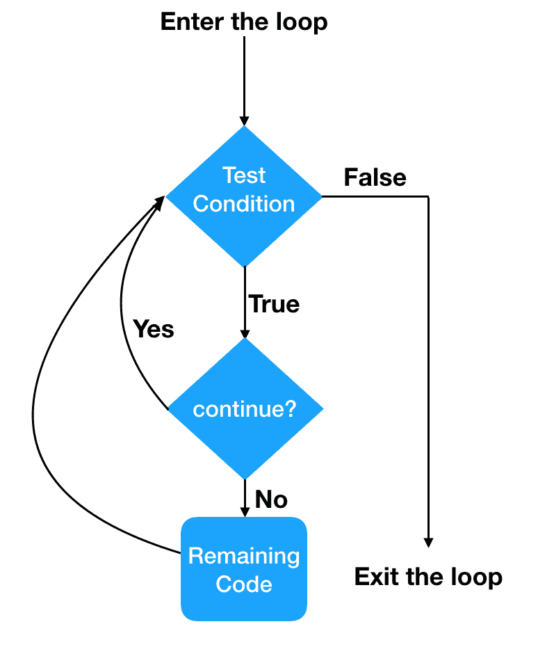
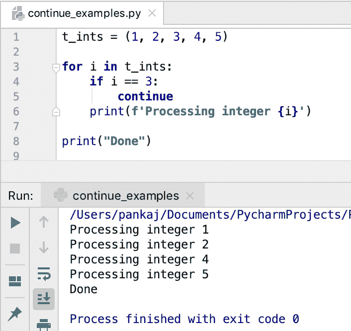
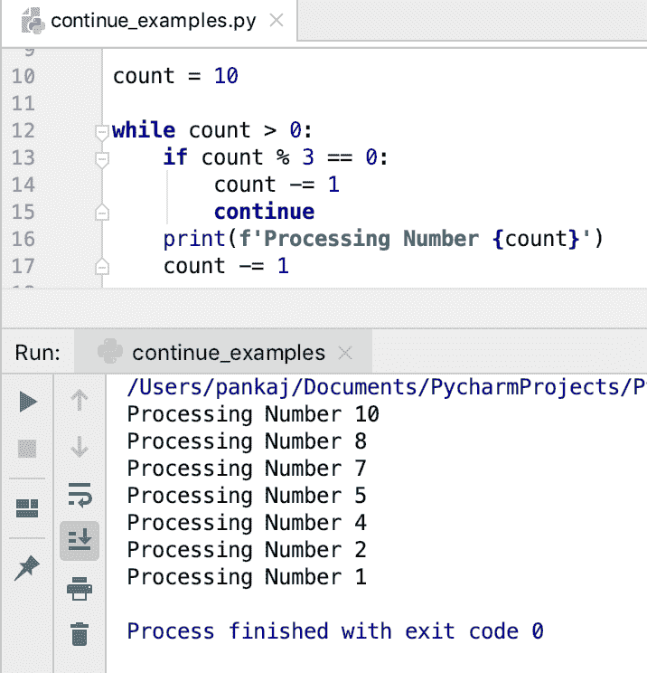
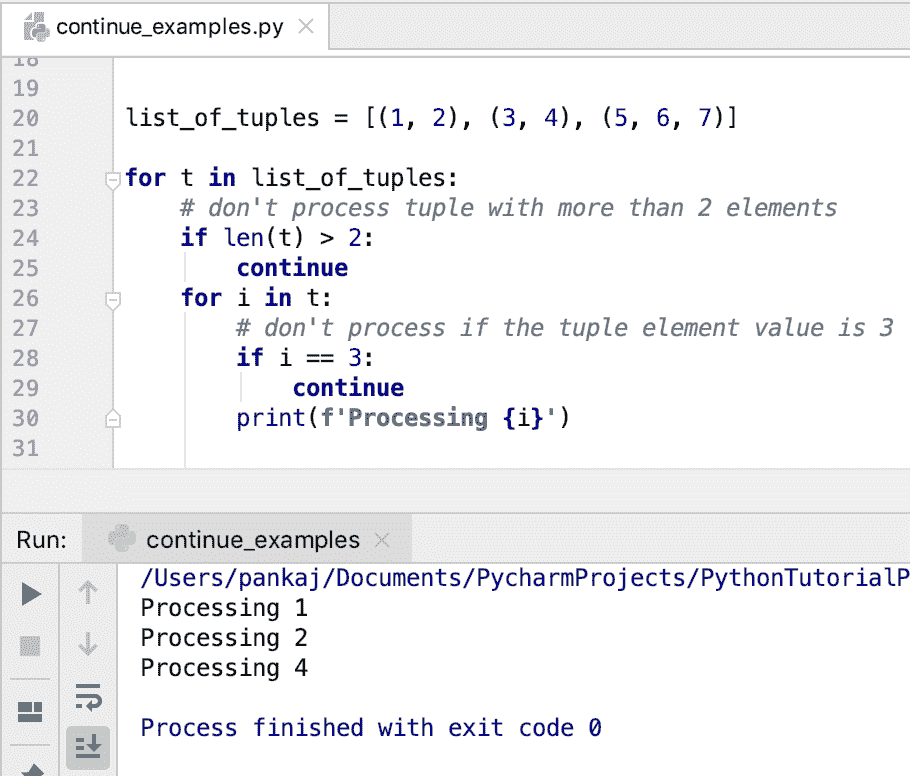

# Python continue 语句

> 原文：<https://www.askpython.com/python/python-continue-statement>

*   Python continue 语句用于跳过循环当前迭代的执行。
*   我们不能在循环外使用 continue 语句，它将抛出一个错误，如"**syntax error:" continue " outside loop**"。
*   我们可以使用带有[的 continue 语句来循环](https://www.askpython.com/python/python-for-loop)和[，而循环](https://www.askpython.com/python/python-while-loop)。
*   如果 continue 语句出现在**嵌套循环**中，它只跳过内部循环的执行。
*   “继续”是 Python 中的一个 [**保留关键字。**](https://www.askpython.com/python/python-keywords)
*   一般来说，continue 语句与 [**if 语句**](https://www.askpython.com/python/python-if-else-elif-statement) 一起使用，确定跳过当前循环执行的条件。

* * *

## 继续语句的流程图



Python continue Statement Flow Diagram

* * *

## Python continue 语句语法

continue 语句的语法是:

```py
continue

```

我们不能在 continue 语句中使用任何选项、标签或条件。

* * *

## Python continue 语句示例

让我们看一些在 Python 中使用 continue 语句的例子。

### 1.继续 for 循环

假设我们有一个整数序列。如果值为 3，我们必须跳过处理。我们可以使用 for 循环和 continue 语句来实现这个场景。

```py
t_ints = (1, 2, 3, 4, 5)

for i in t_ints:
    if i == 3:
        continue
    print(f'Processing integer {i}')

print("Done")

```

**输出:**



Python continue Statement with for Loop

* * *

### 2.使用 while 循环继续语句

下面是一个在 while 循环中使用 continue 语句的简单示例。

```py
count = 10

while count > 0:
    if count % 3 == 0:
        count -= 1
        continue
    print(f'Processing Number {count}')
    count -= 1

```

**输出:**



Python continue Statement with while Loop

* * *

### 3.带有嵌套循环的 continue 语句

假设我们有一个元组列表要处理。元组包含整数。对于以下情况，应跳过处理。

*   如果元组的大小大于 2，则跳过元组的处理。
*   如果整数为 3，则跳过执行。

我们可以用嵌套的 for 循环来实现这个逻辑。我们将不得不使用两个 continue 语句来实现上述条件。

```py
list_of_tuples = [(1, 2), (3, 4), (5, 6, 7)]

for t in list_of_tuples:
    # don't process tuple with more than 2 elements
    if len(t) > 2:
        continue
    for i in t:
        # don't process if the tuple element value is 3
        if i == 3:
            continue
        print(f'Processing {i}')

```

**输出:**



Python continue Statement with Nested Loop

* * *

## Python 为什么不支持带标签的 continue 语句？

许多流行的编程语言都支持带标签的 continue 语句。它主要用于在嵌套循环的情况下跳过外部循环的迭代。但是，Python 不支持带标签的 continue 语句。

[PEP 3136](https://peps.python.org/pep-3136/) 被引发，以添加对 continue 语句的标签支持。但是，它被拒绝了，因为这是一个非常罕见的场景，它会给语言增加不必要的复杂性。我们总是可以在外部循环中编写条件来跳过当前的执行。

* * *

## Python 继续 vs 中断 vs 通过

| 继续 | 破裂 | 及格 |
| continue 语句只跳过循环的当前迭代。 | break 语句终止循环。 | pass 语句用于写入空代码块。 |
| 我们只能在循环中使用 continue 语句。 | 我们只能在循环中使用 break 语句。 | 我们可以在 Python 代码的任何地方使用 pass 语句。 |