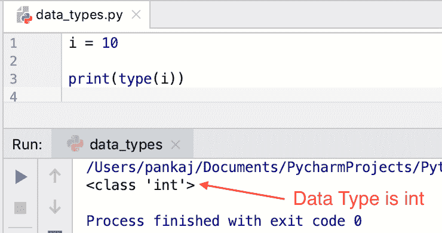
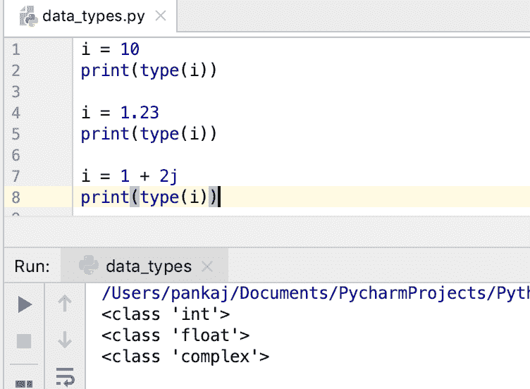
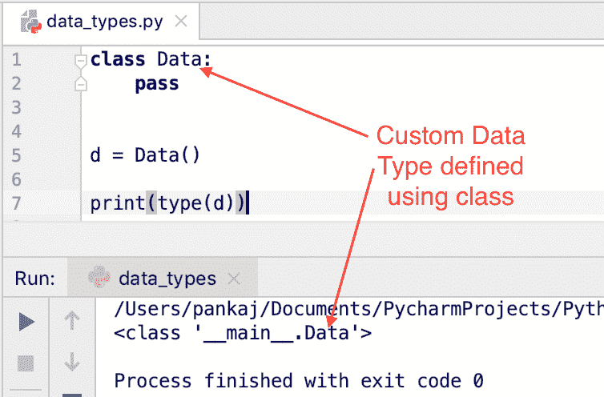

# Python 数据类型

> 原文：<https://www.askpython.com/python/python-data-types>

Python 是一种面向对象的编程语言。Python 中的每个变量都是某个类的实例。有许多预定义的 Python 数据类型。我们可以创建自己的类来定义 Python 中的自定义数据类型。

* * *

## Python 中流行的数据类型有哪些？

Python 中一些流行的数据类型有:

*   数字–整数、浮点数、复数
*   序列–字符串、列表、元组、集合
*   地图-字典

* * *

## Python 数据类型检查

我们可以使用`type()`函数来检查变量的数据类型。

```py
i = 10

print(type(i))

```



Python Data Types

让我们看一些 Python 中数据类型的例子。

* * *

### Python 字符串数据类型

Python 字符串是类' **str** 的实例。该字符串是 Unicode 字符序列。Python 字符串是不可变的。我们可以用单引号(')或双引号(")来定义字符串。

字符串是 Python 中最流行的数据类型。字符串对象支持各种操作——长度、格式、分割、连接、[切片](https://www.askpython.com/python/string/slice-strings-in-python)等。

```py
s = "abc"
print(type(s))

s1 = 'hello'
print(type(s1))

print(s[1:2])
print(len(s))
print(s.split('b'))

```

**输出:**

```py
<class 'str'>
<class 'str'>
b
3
['a', 'c']

```

* * *

### Python 数字数据类型

数字类别中有三种数据类型——int、float 和 complex。Python 2 中有另一种数据类型“long ”,但在 Python 3 中被弃用了。

```py
i = 10
print(type(i))

i = 1.23
print(type(i))

i = 1 + 2j
print(type(i))

```



Python Numbers Data Types

* * *

### Python 元组数据类型

Python 中的[元组是有序的项目序列。元组是不可变的，即一旦定义，我们就不能改变它的值。](https://www.askpython.com/python/tuple/python-tuple)

我们可以使用圆括号定义一个元组，其中项目用逗号分隔。元组可以包含任意数量的元素，并且元素可以是任意类型。

```py
t = (1, 2, 3)
print(type(t))

t = ('a', 1, [1, 2])
print(type(t))

```

**输出:**

```py
<class 'tuple'>
<class 'tuple'>

```

* * *

### Python 列表数据类型

该列表与 Tuple 几乎相同，只是它是可变的。元素的顺序保持不变。

[Python 列表](https://www.askpython.com/python/list/python-list)用括号定义，元素用逗号分隔。

```py
my_list = [1, 2, 3]
print(type(my_list))

my_list = ['a', 1, [1, 2]]
print(type(my_list))

```

**输出:**

```py
<class 'list'>
<class 'list'>

```

* * *

### Python 集合数据类型

Python 集合是一个无序的项目集合。集合不能有重复值。元素的顺序不在集合中保持。

集合是用大括号定义的，其中元素用逗号分隔。Python Set 使用哈希来存储元素。所以元素必须是可散列的，即`hash()`函数应该对它们起作用。因为列表是不可共享的，我们不能在集合中存储列表对象。

```py
my_set = {1, 2, 3, 1}
print(type(my_set))
print(my_set)

my_set = {'a', 1, 'a'}
print(type(my_set))
print(my_set)

```

**输出:**

```py
<class 'set'>
{1, 2, 3}
<class 'set'>
{1, 'a'}

```

让我们看看当我们试图将一个列表作为集合元素时会发生什么。

```py
>>> my_set = {1, [1]}
Traceback (most recent call last):
  File "<stdin>", line 1, in <module>
TypeError: unhashable type: 'list'
>>>

```

* * *

### Python 字典数据类型

Python 字典是一个无序的键值对集合。它是用大括号定义的，元素用逗号分隔。键和值可以是任何类型。键-值对是使用冒号(key: value)定义的。

Python 字典对象属于“dict”类型。在需要快速检索的地方，它们适合存储大量的值。

```py
my_dict = {"1": "Apple", "2": "Banana"}
print(type(my_dict))

my_dict = {1: 1, 2: 'b', 3: [1, 2]}
print(type(my_dict))

```

Python 字典在键上使用散列来存储和检索元素，因此键对象必须支持 hash()函数。这就是为什么我们不能使用列表作为字典元素的键。

```py
>>> my_dict = {[1]: "a"}
Traceback (most recent call last):
  File "<stdin>", line 1, in <module>
TypeError: unhashable type: 'list'
>>> 

```

* * *

## 在 Python 中定义自定义数据类型

我们可以通过在 Python 中创建一个类来定义自定义数据类型。

```py
class Data:
    pass

d = Data()

print(type(d))

```



Python Custom Data Type

* * *

## Python 函数有数据类型吗？

到目前为止，我们已经看到数据类型与 Python 变量相关联。但是， [python 函数](https://www.askpython.com/python/python-functions)也有数据类型吗？

让我们用一个简单的程序来检查一下。

```py
def foo():
    pass

print(type(foo))

```

**输出:**

```py
<class 'function'>

```

所以 Python 函数也有一个数据类型——函数。它们是类函数的实例。

* * *

## Python 类方法有数据类型吗？

让我们看看 [python 类](https://www.askpython.com/python/oops/python-classes-objects)方法是否也有数据类型。

```py
class Data:

    def foo(self):
        pass

d = Data()
print(type(d.foo))

```

**输出:**

```py
<class 'method'>

```

因此 Python 类方法的数据类型是“方法”。它们是类“method”的实例。

* * *

## 摘要

Python 是一种面向对象的编程语言。Python 中的一切都是某个类的对象，甚至是函数和类方法。我们可以使用 Python 中内置的 type()函数来确定一个实体的数据类型。

## 下一步是什么？

*   [Python 字符串](https://www.askpython.com/python/string/strings-in-python)
*   [Python 列表](https://www.askpython.com/python/list/python-list)
*   [Python 字典](https://www.askpython.com/python/dictionary/python-dictionary-dict-tutorial)
*   [在 Python 中设置](https://www.askpython.com/python/set/python-set)
*   [Python 中的元组](https://www.askpython.com/python/tuple/python-tuple)

## 参考

*   [Python.org 文件](https://docs.python.org/3/library/datatypes.html)
*   [Python type()函数](https://docs.python.org/3/library/functions.html#type)