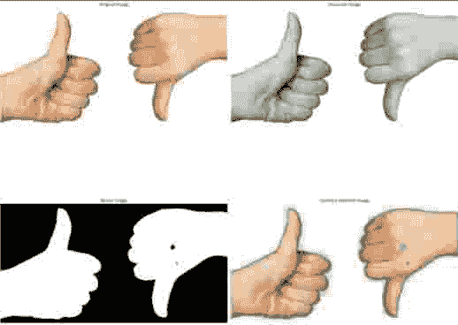
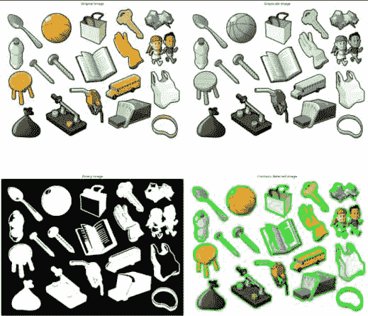

# Python:检测轮廓

> 原文：<https://www.askpython.com/python/examples/python-detecting-contours>

你好，学习伙伴！今天我们将学习如何检测图像中的轮廓。轮廓被定义为对象的精确边界，在检测对象时非常有用。

***推荐阅读:[如何在 Python 中检测边缘？](https://www.askpython.com/python/examples/edge-detection-in-images)***

## 使用 Python 检测轮廓

因此，让我们开始使用 Python 中的 OpenCV 库来检测图像的轮廓。

### 1.导入模块

首先，我们导入必要的模块，包括 [OpenCV](https://www.askpython.com/python-modules/read-images-in-python-opencv) 和 [matplotlib](https://www.askpython.com/python-modules/matplotlib/python-matplotlib) 来在屏幕上绘制图像。

```py
import cv2
import matplotlib.pyplot as plt

```

### 2.将图像载入程序

下一步包括使用`imread`函数将图像从文件目录加载到我们的程序，然后将图像转换成`RGB`格式。

我们将以`subplot`的形式绘制图像，其中第一个图像是原始加载的图像。相同的代码如下所示。

```py
loaded_img = cv2.imread("image.jpg")
loaded_img = cv2.cvtColor(loaded_img, cv2.COLOR_BGR2RGB)

plt.figure(figsize=(20,20))

plt.subplot(2,2,1)
plt.title("Original Image")
plt.imshow(loaded_img)
plt.axis("off")

```

### 3.将图像转换为灰度

为了更好地检测轮廓，我们使用`cvtColor`功能将图像转换为灰度图像。将图像转换成灰度后，我们将它绘制在主图上的第二个子图上。

```py
gray_image = cv2.cvtColor(loaded_img, cv2.COLOR_RGB2GRAY)
plt.subplot(2,2,2)
plt.title("Grayscale Image")
plt.imshow(gray_image,cmap="gray")
plt.axis("off")

```

### 4.获取二进制图像

接下来，我们将图像转换为二进制图像，因为它从图像中移除了不必要的项目，并且只关注重要的对象，从而使图像处理更加容易。

相同的代码如下所示。我们将在主图上的第三个位置绘制二进制图像。

```py
_, binary_img = cv2.threshold(gray_image, 225, 255, cv2.THRESH_BINARY_INV)
plt.subplot(2,2,3)
plt.title("Binary Image")
plt.imshow(binary_img,cmap="gray")
plt.axis("off")

```

### 5.检测轮廓

最后一步是使用 openCV 库的`findContours`方法检测轮廓，然后我们在图像上绘制轮廓。

然后我们绘制子情节中的所有图像，代码如下所示。

```py
contours, hierarchy = cv2.findContours(binary_img, cv2.RETR_TREE, cv2.CHAIN_APPROX_SIMPLE)
final_image = cv2.drawContours(loaded_img, contours, -1, (0, 255, 0), 2)
plt.subplot(2,2,4)
plt.title("Contours detected Image")
plt.imshow(final_image,cmap="gray")
plt.axis("off")

```

## 输出图

上面解释的整个过程的最终输出如下所示。你可以看到结果非常准确。



Contour Detection Output 1

## 检测轮廓的最终代码

```py
import cv2
import matplotlib.pyplot as plt

loaded_img = cv2.imread("image1.png")
loaded_img = cv2.cvtColor(loaded_img, cv2.COLOR_BGR2RGB)

plt.figure(figsize=(20,20))

plt.subplot(2,2,1)
plt.title("Original Image")
plt.imshow(loaded_img)
plt.axis("off")

gray_image = cv2.cvtColor(loaded_img, cv2.COLOR_RGB2GRAY)
plt.subplot(2,2,2)
plt.title("Grayscale Image")
plt.imshow(gray_image,cmap="gray")
plt.axis("off")

_, binary_img = cv2.threshold(gray_image, 225, 255, cv2.THRESH_BINARY_INV)
plt.subplot(2,2,3)
plt.title("Binary Image")
plt.imshow(binary_img,cmap="gray")
plt.axis("off")

contours, hierarchy = cv2.findContours(binary_img, cv2.RETR_TREE, cv2.CHAIN_APPROX_SIMPLE)
final_image = cv2.drawContours(loaded_img, contours, -1, (0, 255, 0), 2)
plt.subplot(2,2,4)
plt.title("Contours detected Image")
plt.imshow(final_image,cmap="gray")
plt.axis("off")

plt.savefig('Contour_Detection_output_2.png', dpi = 1000,bbox_inches = 'tight')
plt.tight_layout()
plt.show()

```

我还为不同的图像尝试了相同的代码。结果显示如下。



Contour Detection Output 2

## 结论

恭喜你！现在你离从图像中检测物体又近了一步。我们今天学习了探测物体的适当边界！

继续学习！编码快乐！

感谢您的阅读！