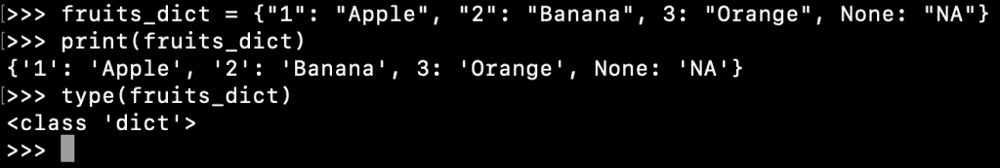
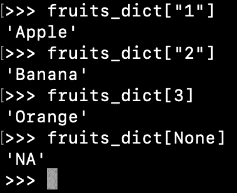
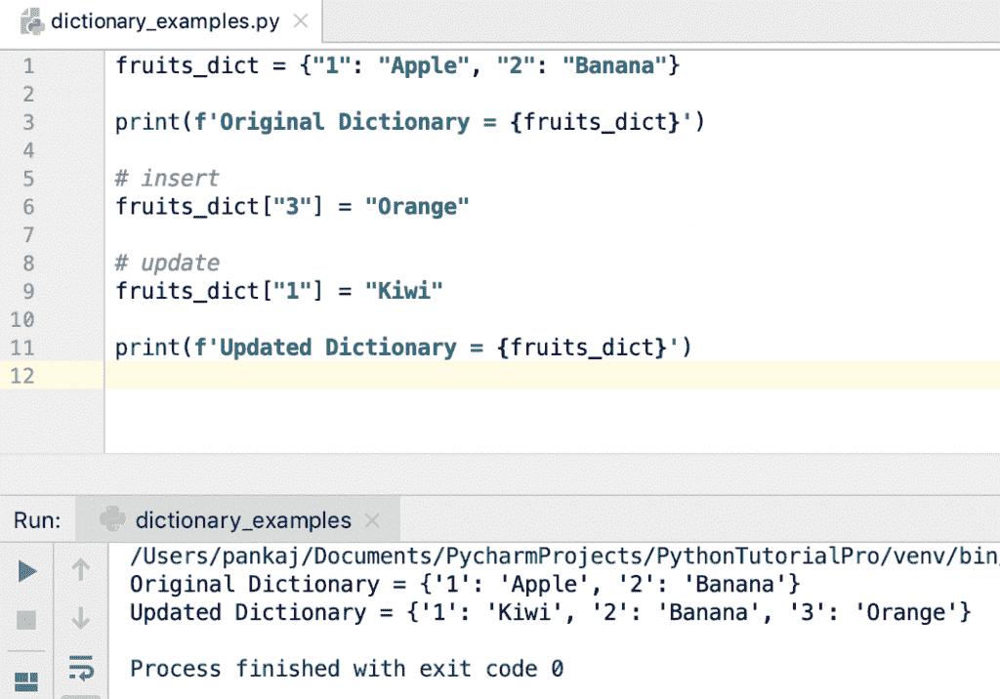
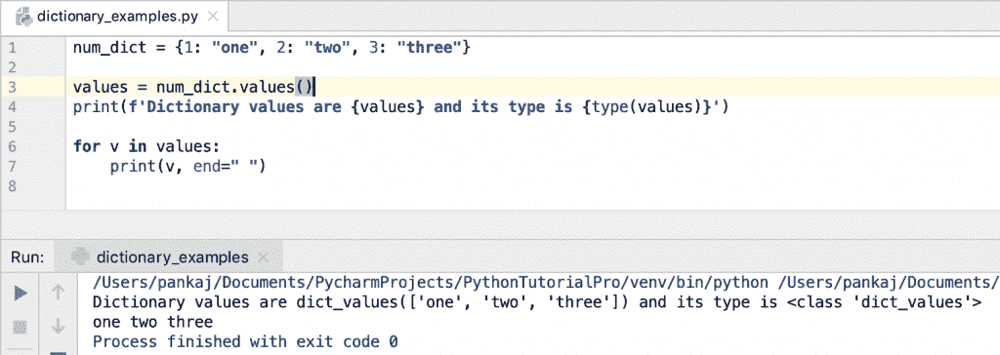

# Python 字典(Dict)教程

> 原文：<https://www.askpython.com/python/dictionary/python-dictionary-dict-tutorial>

Python 字典是一组键值对。字典是类别**字典**的对象。这是一个无序的集合，意味着在迭代时，检索的顺序是不确定的。字典键和值可以是任何类型。他们也可以是`None`。键及其值用冒号分隔。字典记录使用关键字进行索引。

## Python 字典项目

键值对也称为字典的项目或元素。我们可以使用 dict.items()方法让 iterable 循环遍历字典项。对字典条目的值没有限制。

## Python 字典键

关键字在字典中是唯一的。它用于从字典中检索记录。使用一对大括号创建字典。键值对用逗号分隔。

字典键必须是不可变的。所以我们可以使用字符串、[数字](https://www.askpython.com/python/python-numbers)和[元组](https://www.askpython.com/python/tuple/python-tuple)作为字典键。如果元组包含任何可变对象，我们就不能把它用作字典键。

## 我们可以使用列表作为字典键吗？

我们不能使用一个[列表](https://www.askpython.com/python/list/python-list)作为字典键，因为它可以被修改。如果我们尝试使用列表作为键，它将抛出“type error:unhable type:list”。

* * *

## 创建字典

字典条目用逗号分隔，键值对用冒号分隔。花括号用于定义包含所有条目的字典。让我们看一个简单的例子来创建一个字典并打印它。

```py
>>> fruits_dict = {"1": "Apple", "2": "Banana", 3: "Orange", None: "NA"}
>>> print(fruits_dict)
{'1': 'Apple', '2': 'Banana', 3: 'Orange', None: 'NA'}
>>> type(fruits_dict)
<class 'dict'>

```

注意字典类的类型是`dict`，键值也是不同的类型。



Creating a Dictionary

* * *

## 访问字典值

我们可以使用方括号中的键名来访问字典值。

```py
>>> fruits_dict["1"]
'Apple'
>>> fruits_dict["2"]
'Banana'
>>> fruits_dict[3]
'Orange'
>>> fruits_dict[None]
'NA'

```



Accessing Dictionary Values

如果键不存在，这种访问 dictionary 元素的方式将会引发 KeyError。如果键不存在，最好使用返回`None`的`get()`方法。

* * *

## 添加/更新字典值

我们可以使用[赋值操作符](https://www.askpython.com/python/python-operators)来添加或更新字典元素。如果字典中不存在该键，则键-值对被添加到字典中。否则，将使用新值更新该值。

```py
fruits_dict = {"1": "Apple", "2": "Banana"}

print(f'Original Dictionary = {fruits_dict}')

# insert
fruits_dict["3"] = "Orange"

# update
fruits_dict["1"] = "Kiwi"

print(f'Updated Dictionary = {fruits_dict}')

```



Adding Updating Dictionary Items

* * *

## 删除字典项目

我们可以使用 **del** 关键字删除一个字典键值对。如果我们将 del 关键字与字典一起使用，那么完整的字典将被删除，这不同于删除字典的所有元素。

```py
>>> my_dict = {1:"1", 2:"2"}
>>> del my_dict[1]
>>> print(my_dict)
{2: '2'}
>>> del my_dict
>>> print(my_dict)
Traceback (most recent call last):
  File "<stdin>", line 1, in <module>
NameError: name 'my_dict' is not defined
>>> 

```

* * *

## 使用 for 循环迭代字典

我们可以使用循环的[来迭代字典。有许多方法可以将 for 循环与字典一起使用。](https://www.askpython.com/python/python-for-loop)

* * *

### 1.Dictionary items()函数

items()函数返回一个 **dict_items** 的对象，该对象是可迭代的。我们可以在 for 循环中使用它，并将它的元素解包为 key 和值，然后在 for 循环中使用它们。

```py
fruits_dict = {"1": "Apple", "2": "Banana", "3": "Orange"}

print(fruits_dict.items())

for key, value in fruits_dict.items():
    print(f'{key}={value}')

```

**输出:**

```py
dict_items([('1', 'Apple'), ('2', 'Banana'), ('3', 'Orange')])
1=Apple
2=Banana
3=Orange

```

* * *

### 2.遍历字典键

如果我们在 for 循环中使用 dictionary 对象，它会逐个返回键。因为字典是无序的，所以返回的键可以是任意顺序的。

```py
fruits_dict = {"1": "Apple", "2": "Banana", "3": "Orange"}

for key in fruits_dict:
    print(key)

```

**输出:**

```py
1
2
3

```

* * *

### 3.Python 字典值()

我们可以使用 values() [函数](https://www.askpython.com/python/python-functions)来获取字典值，然后对它们进行迭代。values()函数返回一个 **dict_values** 的对象，它是 dict 中的值列表。

```py
fruits_dict = {"1": "Apple", "2": "Banana", "3": "Orange"}

print(fruits_dict.values())

for value in fruits_dict.values():
    print(value)

```

**输出:**

```py
dict_values(['Apple', 'Banana', 'Orange'])
Apple
Banana
Orange

```

* * *

## 检查字典中是否存在该关键字

我们可以使用“in”关键字来检查字典中是否存在该键。同样，我们可以使用“not in”关键字来检查该键是否丢失。

```py
fruits_dict = {"1": "Apple", "2": "Banana", "3": "Orange"}

if "3" in fruits_dict:
    print(f'Key "3" is present in the dictionary and its value is {fruits_dict["3"]}')

if "10" not in fruits_dict:
    print("Key '10' doesn't exists in the dictionary")

```

* * *

## 字典长度

我们可以使用 len()函数来找出字典的长度或大小。

```py
>>> fruits_dict = {"1": "Apple", "2": "Banana", "3": "Orange"}
>>> print(f'Dictionary length is {len(fruits_dict)}')
Dictionary length is 3
>>> 

```

* * *

## Python dict()构造函数

我们可以使用内置的 dict()构造函数创建一个 dictionary 对象。

```py
>>> empty_dict = dict()
>>> 
>>> empty_dict
{}
>>> my_dict = dict(id=1, name="Pankaj", skill="Python")
>>> 
>>> my_dict
{'id': 1, 'name': 'Pankaj', 'skill': 'Python'}
>>> 

```

* * *

## Python 字典方法

Python dict 类有很多方法。让我们来看看 dict 类的一些重要方法。

* * *

### 1.值()

此方法返回一个包含字典中的值的对象。返回对象的类型是‘dict _ values ’,我们可以迭代它来对字典值执行一些操作。

```py
num_dict = {1: "one", 2: "two", 3: "three"}

values = num_dict.values()
print(f'Dictionary values are {values} and its type is {type(values)}')

for v in values:
    print(v, end=" ")

```



* * *

### 2.项目()

这个方法提供了一个类似集合的字典条目视图。它主要用于将字典键值对解包为不同的值，然后对它们进行迭代。

```py
num_dict = {1: "one", 2: "two", 3: "three"}

items = num_dict.items()

print(items)
print(type(items))

for k, v in items:  # unpacking
    print(k, v)

```

**输出:**

```py
dict_items([(1, 'one'), (2, 'two'), (3, 'three')])
<class 'dict_items'>
1 one
2 two
3 three

```

* * *

### 3.pop(键[，默认])

此方法从字典中移除指定的键，并返回相应的值。如果找不到该键，则返回可选的默认值。如果没有找到键，并且没有给出默认值，则引发 *KeyError* 。

```py
num_dict = {1: "one", 2: "two", 3: "three"}

value = num_dict.pop(1)

print(f'Updated Dictionary = {num_dict} and the removed value = {value}')

value = num_dict.pop(1, "NA")
print(f'Updated Dictionary = {num_dict} and the removed value = {value}')

try:
    value = num_dict.pop(1)
except KeyError as ke:
    print("Key Not Found: 1")

```

我们使用一个 [try-except](https://www.askpython.com/python/python-exception-handling) 块来捕获 KeyError 并打印错误消息。

* * *

### 4.复制()

这个函数返回字典的浅层副本。如果底层对象是可变的和变化的，那么这种变化也会反映在使用 copy()方法返回的 dict 中。

```py
num_dict = {1: "one", 2: "two", 3: "three"}

num_dict_copy = num_dict.copy()

print(num_dict)
print(num_dict_copy)

num_dict[4] = "four"
num_dict_copy[5] = "five"

print(num_dict)
print(num_dict_copy)

```

**输出:**

```py
{1: 'one', 2: 'two', 3: 'three'}
{1: 'one', 2: 'two', 3: 'three'}
{1: 'one', 2: 'two', 3: 'three', 4: 'four'}
{1: 'one', 2: 'two', 3: 'three', 5: 'five'}

```

* * *

### 5.清除()

这个方法从字典中删除所有的条目。这类似于将变量赋给一个空字典。

```py
num_dict = {1: "one", 2: "two", 3: "three"}

num_dict.clear()  # same as num_dict = {}

print(num_dict)

```

* * *

### 6.fromKeys(iterable，value)

这个[静态方法](https://www.askpython.com/python/python-static-method)使用 iterable 中的键和设置为所提供值的值创建一个新字典。如果未给出该值，则这些值将被设置为 None。

```py
seq = (1, 3)
sub_dict = dict.fromkeys(seq)
print(sub_dict)

sub_dict = dict.fromkeys([1, 2], "NA")
print(sub_dict)

sub_dict = dict.fromkeys("15", "Hello")
print(sub_dict)

```

**输出:**

```py
{1: None, 3: None}
{1: 'NA', 2: 'NA'}
{'1': 'Hello', '5': 'Hello'}

```

* * *

### 7.get(键[，默认值])

此方法返回键的值。如果找不到该键，则返回可选的默认值。如果找不到该键并且没有提供默认值，则不返回任何值。

```py
>>> num_dict = {1: "one", 2: "two", 3: "three"}
>>> 
>>> num_dict.get(1)
'one'
>>> num_dict.get(10, "ten")
'ten'
>>> num_dict.get(10)
>>> print(num_dict.get(10))
None
>>> 

```

* * *

### 8.按键()

这个函数返回 dict_keys 对象中的键列表。我们可以遍历这个列表来处理字典值。

```py
num_dict = {1: "one", 2: "two", 3: "three"}

keys = num_dict.keys()

print(keys)
print(type(keys))

for k in keys:
    print(k, num_dict[k])

```

**输出:**

```py
dict_keys([1, 2, 3])
<class 'dict_keys'>
1 one
2 two
3 three

```

* * *

### 9.popitem()

该方法以键值元组的形式移除并返回一些字典项。如果字典为空，将引发 KeyError。我们可以使用这个函数和一个 while 循环来随机处理字典条目。

```py
num_dict = {1: "one", 2: "two", 3: "three", 0: "zero"}

while len(num_dict) != 0:
    item = num_dict.popitem()
    print(item)

```

**输出:**

```py
(0, 'zero')
(3, 'three')
(2, 'two')
(1, 'one')

```

* * *

### 10\. setdefault(key[,default])

当且仅当一个键不在字典中时，该方法用于将该键添加到字典中。此方法将键值设置为所提供的默认值，否则为 None。

如果字典中有键值，则该方法返回键值，否则返回默认值。

```py
num_dict = {1: "one", 2: "two", 3: "three"}

# new key
value = num_dict.setdefault(4, "NA")
print(f'Updated Dictionary = {num_dict} and the returned value = {value}')

# new key with no default
value = num_dict.setdefault(5)
print(f'Updated Dictionary = {num_dict} and the returned value = {value}')

# existing key, no effect on the dict
value = num_dict.setdefault(1, "ONE")
print(f'Updated Dictionary = {num_dict} and the returned value = {value}')

```

**输出:**

```py
Updated Dictionary = {1: 'one', 2: 'two', 3: 'three', 4: 'NA'} and the returned value = NA
Updated Dictionary = {1: 'one', 2: 'two', 3: 'three', 4: 'NA', 5: None} and the returned value = None
Updated Dictionary = {1: 'one', 2: 'two', 3: 'three', 4: 'NA', 5: None} and the returned value = one

```

* * *

### 11.更新(字典)

此方法用于更新给定字典中的字典项。如果没有找到给定的字典键，它将被添加到字典中。如果找到了这个键，这个值就会被更新。

```py
num_dict = {1: "one", 2: "two", 3: "three"}
dict1 = {1: "ONE", 2: "TWO", 5: "FIVE"}

# update from another dict
num_dict.update(dict1)
print(num_dict)

```

**输出:** `{1: 'ONE', 2: 'TWO', 3: 'three', 5: 'FIVE'}`

* * *

## 摘要

Dictionary 是一个类似地图的集合，用于存储键值对。字典中的条目通过基于键的索引来访问。我们可以更新、添加和删除字典条目。有多种方法可以使用 for 循环来迭代字典键、值或项。

* * *

## 下一步是什么？

*   [Python OrderedDict](https://www.askpython.com/python-modules/python-ordereddict)
*   [Python 字典复制](https://www.askpython.com/python/dictionary/copy-a-dictionary-in-python)–深度复制
*   [用 Python 对字典排序](https://www.askpython.com/python/dictionary/sort-a-dictionary-in-python)
*   [Python 字典理解](https://www.askpython.com/python/dictionary/python-dictionary-comprehension)
*   [在 Python 中合并字典](https://www.askpython.com/python/dictionary/merge-dictionaries)

## 参考资料:

*   [字典数据结构 Python 文档](https://docs.python.org/3/tutorial/datastructures.html#dictionaries)
*   [dict()内置函数 API Doc](https://docs.python.org/3/library/stdtypes.html#dict)