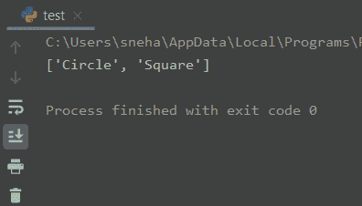

# Python dir()方法的快速概述

> 原文：<https://www.askpython.com/python/built-in-methods/python-dir-method>

今天我们将讨论 Python dir()方法。

所以让我们开始吧。

## Python dir()方法基础

Python 中的`dir()`方法被广泛用于以按字母顺序**排序的**方式获取被传递的`object`的属性名称列表。

```py
dir([object])

```

这里，`object`是可选参数。当任何 Python 对象被传递给`dir()`方法时，它返回一个包含该对象的所有**属性**的列表。当没有传递任何东西时，该方法返回所有**局部**属性的列表。

对于定义了`__dir__()`方法的对象，`dict()`会导致对它的调用，因此应该返回与对象相关的属性列表。

### Python dir()示例

现在我们对`dir()`方法有了一个基本的概念，让我们看一个例子来更好地理解。

```py
#empty dir()
print("dir() :", dir())

#list initialisation
list1 = ['name', 'class', 'roll']

#dictionary initialisation
dict1 = {0: 'bad', 5: 'fair', 10: 'good'}

print("\ndir(list1) :", dir(list1))
print("\ndir(dict1) :", dir(dict1))

```

**输出:**

```py
dir() : ['__annotations__', '__builtins__', '__cached__', '__doc__', '__file__', '__loader__', '__name__', '__package__', '__spec__']

dir(list1) : ['__add__', '__class__', '__contains__', '__delattr__', '__delitem__', '__dir__', '__doc__', '__eq__', '__format__', '__ge__', '__getattribute__', '__getitem__', '__gt__', '__hash__', '__iadd__', '__imul__', '__init__', '__init_subclass__', '__iter__', '__le__', '__len__', '__lt__', '__mul__', '__ne__', '__new__', '__reduce__', '__reduce_ex__', '__repr__', '__reversed__', '__rmul__', '__setattr__', '__setitem__', '__sizeof__', '__str__', '__subclasshook__', 'append', 'clear', 'copy', 'count', 'extend', 'index', 'insert', 'pop', 'remove', 'reverse', 'sort']

dir(dict1) : ['__class__', '__contains__', '__delattr__', '__delitem__', '__dir__', '__doc__', '__eq__', '__format__', '__ge__', '__getattribute__', '__getitem__', '__gt__', '__hash__', '__init__', '__init_subclass__', '__iter__', '__le__', '__len__', '__lt__', '__ne__', '__new__', '__reduce__', '__reduce_ex__', '__repr__', '__setattr__', '__setitem__', '__sizeof__', '__str__', '__subclasshook__', 'clear', 'copy', 'fromkeys', 'get', 'items', 'keys', 'pop', 'popitem', 'setdefault', 'update', 'values']

```

正如你所看到的，这里我们首先没有传递任何东西，然后是一个[列表](https://www.askpython.com/python/list/python-list)对象，最后是一个[字典](https://www.askpython.com/python/dictionary/python-dictionary-dict-tutorial)对象给`dir()`方法，并打印出返回的列表。

从上面的输出中，我们可以清楚地看到**列表**和**字典**对象的不同属性。对于什么都没有传递给函数的情况，我们得到了**局部作用域**中所有方法或属性的名称。

## 在 Python 中使用 dir()方法

现在让我们尝试更多的例子，在这些例子中，我们试着在用户定义的类的**对象上使用`dir()`函数，以及使用定义的`__dir__()`方法的对象。**

### 1.使用自定义对象

既然我们已经为列表和字典这样的内置类应用了`dir()`方法。让我们试着找出一个未定义`__dir__()`的**自定义**类的**自定义**对象的结果。

```py
#class
class shape:
    name = "rectangle"
    sides = 4

obj = shape()
print(dir(obj)) #dir for our custom object

```

**输出:**

```py
['__class__', '__delattr__', '__dict__', '__dir__', '__doc__', '__eq__', '__format__', '__ge__', '__getattribute__', '__gt__', '__hash__', '__init__', '__init_subclass__', '__le__', '__lt__', '__module__', '__ne__', '__new__', '__reduce__', '__reduce_ex__', '__repr__', '__setattr__', '__sizeof__', '__str__', '__subclasshook__', '__weakref__', 'name', 'sides']

```

这里，`obj`是一个名为**矩形、**边= 4** 的`shape`类的对象。将这个 obj 对象传递给`dir()`方法，我们得到了上面的属性集。**

注意，这个列表也包括了`name`和`sides`变量。

### 2.带有已定义的 __dir__()

正如本文前面提到的，对于定义了`__dir__()`方法的对象，`dir()`方法调用相应的`__dir__()`方法，该方法必须再次返回属性的**列表。**

让我们试着用一个例子来理解这一点。

```py
#class
class shape:
    name = "rectangle"
    sides = 4
    def __dir__(self):
        return ['Square','Circle']

obj = shape()
print(dir(obj)) #dir for our custom object

```

**输出:**



Python dir() method output

可以看到，对于 shape 类的对象`obj`，调用了`__dir__()`方法，上面的属性列表在`dir(obj)`调用的位置返回。

## 结论

所以在本教程中，我们学习了 Python dir()方法，它是如何工作的，以及我们如何在不同的情况下使用它。

关于这个话题的任何进一步的问题，请在下面随意评论。

## 参考

*   Python dir()函数–期刊开发文章，
*   [为什么 python 中的' dir()'被命名为' dir '？](https://stackoverflow.com/questions/1842414/why-is-dir-named-dir-in-python)–stack overflow 问题，
*   [Python dir()](https://docs.python.org/3/library/functions.html#dir)–官方文档。