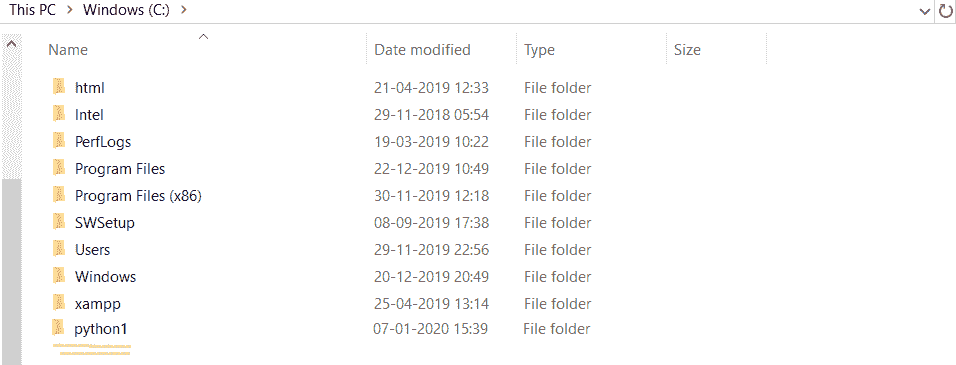

# Python 目录操作

> 原文：<https://www.askpython.com/python/python-directory-operations>

`**Directory**`基本上是一个包含所有相应文档、文件和文件夹的结构。

Python 的 [os 模块](https://www.askpython.com/python-modules/python-os-module-10-must-know-functions)包含多个用于目录管理的函数。

* * *

## Python 目录函数

| ***os.access(path，mode)***
它使用`uid`来检查路径的访问。 |
| ***【OS . chdir(path)***
它将 CWD 更改为用户指定的路径。 |
| ***os.chflags(path，flags)***
它用于将标志设置为数字标志。 |
| ***os.chmod(路径，模式)***
用于将路径的模式改为数值模式。 |
| ***os.chown(path，uid，gid)***
它将*路径*的组 id 和所有者更改为数字`uid`和`gid`。 |
| ***OS . ch root(path)***
用于将当前正在执行的进程的根目录更改为用户指定的路径。 |
| ***OS . fch dir(FD)***
用于将 CWD 更改为文件描述符`fd`中表示的目录。 |
| ***os.getcwd()***
它返回当前工作目录(cwd)。 |
| ***os.getcwdu()***
它返回 Unicode 对象作为输出，用 CWD 表示。 |
| ***os.lchmod(路径，模式)***
用于将路径的模式改为数值模式。 |
| ***OS . listdir(path)***
返回一个包含由 path 给定的目录中的条目名称的列表。 |
| ***os.lstat(路径)***
 |
| ***os.makedirs(path[，mode])***
用于以递归方式创建目录。 |
| ***os.mkdir( )***
它用来创建一个新的目录，并有一个命名的路径。 |
| *os.mkfifo(路径[、模式])*
 |
| ***os.readlink(路径)***
 |
| ***OS . remove dirs(path)***
它用于递归删除对应的目录。 |
| ***os.rename(src，dst)***
它用于将 src 目录重命名为 dst。 |
| ***os.renames(old，new)***
用于以递归方式用新目录重命名旧目录。 |
| ***【OS . rmdir(路径)***
它用于删除用户指定的目录。 |
| **操作系统状态(路径)**
 |

* * *

### 1.创建新目录

Python 的 os 模块提供了`**mkdir()**`函数来创建新的目录。

**语法:**

```py
os.mkdir('name')
```

```py
import os
os.mkdir('C:/python1') #create a direcotry abc in C:

```

**输出:**



Create Directory

* * *

### 2.获取当前工作目录

`**getcwd()**`函数用于获取 CWD 的位置。

```py
import os
os.getcwd() 

```

**输出:**

```py
wdir='C:/Users/HP/PycharmProjects/Hello'
```

* * *

### 3.重命名目录

`**rename()**`功能用于重命名 CWD。

**语法:**

```py
os.rename(old,new)
```

* * *

### 4.获取目录中的文件/目录列表

`**listdir()**`函数用于获取当前目录中所有目录和文件的列表。

```py
import os
os.listdir('C:\\Users\\HP')

```

**输出:**

```py
['.android', '.AndroidStudio3.5', '.crashlytics', '.eclipse', '.emulator_console_auth_token', '.gradle', '.idlerc', '.m2', '.nbi', '.netbeans-derby', '.p2', '.PyCharm2019.3', '.RapidMiner', '.tooling', '.vscode', '3D Objects', 'Anaconda3', 'Anaconda3_1', 'AndroidStudioProjects', 'AppData', 'Application Data', 'Contacts', 'Cookies', 'Desktop', 'Documents', 'Downloads', 'eclipse', 'eclipse-workspace', 'Favorites', 'get-pip.py', 'HP', 'IntelGraphicsProfiles', 'Links', 'Local Settings', 'MicrosoftEdgeBackups']
```

* * *

### 5.在 Python 中移除目录

`**rmdir()**`函数用于删除一个已经空了的目录。如果目录不为空，则不会被删除。

```py
import os
os.rmdir('C:\\Users\\HP\\Pictures\\Screenshots\\python')

```

* * *

### 6.检查 Python 目录是否存在

`**os.path.exists(path)**`函数用于检查特定目录是否存在。

```py
import os
os.path.exists('C:\\Users\\HP\\Pictures\\Screenshots')

```

**输出:**

```py
True
```

* * *

## 结论

Python os 模块提供了多种处理目录的函数。我们学习了如何在 Python 程序中创建和删除目录。

* * *

## 参考

*   Python 目录操作
*   [目录文档](https://docs.python.org/3/library/os.html)