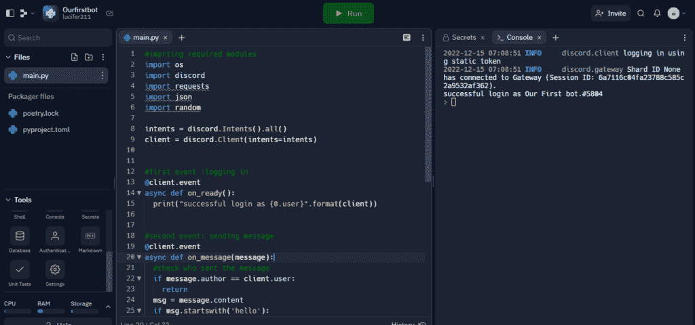

# 创建 Python Discord Bot——完整的分步指南

> 原文：<https://www.askpython.com/python/examples/python-discord-bot>

discord 是 21 世纪最受欢迎的社交媒体平台之一，制作 Discord 机器人可能是最酷的 python 项目之一。

使用 [python 的 discord API](https://discordpy.readthedocs.io/en/stable/) 和一些其他模块，我们可以很容易地为 discord 中的文本通道编写自己的机器人。在本教程中，我们将编写一个机器人，它会在不和谐时向我们发送有趣的消息。

**我们开始吧！**

***也可阅读:[用 Python 构建聊天机器人使用 spaCy NLP 库](https://www.askpython.com/python/examples/chatbot-in-python-using-spacy)***

## 添加不和谐机器人的步骤

在我们开始用 python 编码之前，我们需要从 discord 开发者的门户创建一个 discord bot 帐户。[点击此处](https://discord.com/developers/docs/intro)直接进入网站。

*   点击左侧菜单中的“应用程序”。然后，单击“新建应用程序”按钮创建一个新的应用程序。


*   为您的机器人添加名称。比如，既然是我们的第一个 bot，我就把它命名为****我们的第一个 Bot****，点击“创建”。****

********

*   ****点击左侧菜单中的“机器人”选项，您将能够查看您新创建的机器人的基本详细信息！****

*   ****暂时保留 bot 的默认设置，比如保持 bot 公开。****

****瞧吧！您已经成功创建了您的第一个机器人！****

********

*   ****向下滚动到“授权流程”部分，在“特许网关意图”下打开所有三个框。****

********

*   ****完成后，向上滚动到机器人部分。****

*   ****单击重置令牌按钮旁边的“复制”。这是非常重要的一步，因为它将帮助我们以后将代码与机器人连接起来。****

****注意 :-不要与任何人共享令牌，它可以被任何人用来在没有监督的情况下操纵你的机器人。如果您不小心共享了令牌，请点击“重置令牌”，然后单击“复制”。****

## ****创建不和谐服务器****

*   ****如果您没有现有的服务器来添加机器人，请打开 discord 并单击左侧菜单底部的“+”(添加服务器)按钮。****

********

*   ****选择“创建我自己的”。****

********

*   ****然后选择您需要的服务器用途。****

********

*   ****接下来，命名您的服务器并点击创建。我选择了 **机器人 python 服务器** 这个名字，你想怎么命名都行！****

********

*   ****您现在已经成功创建了一个新的 discord 服务器！****

## ****给你的不和谐机器人权限****

*   ****从 [discord 开发门户](https://discord.com/developers/applications)的菜单中点击 OAuth2 选项卡，并点击 URL 生成器。选中“范围”下的“bot”框，然后转到“bot 权限”部分。这将用于在您的服务器中为您的机器人提供各种权限。****
*   ****例如，这里我们将检查所有的文本权限框，因为我们正在编写一个简单的文本通道机器人，但它可以根据您的使用进行定制。****

*****注意*:在给机器人分配管理员权限之前，你应该小心。****

********

## ****授权你的机器人访问****

*   ****现在，复制页面最末端的 URL，并在一个新标签中打开它。****

********

*   ****它会要求您授权 bot，并要求您将它添加到特定的服务器。****

********

*   ****选择所需的服务器，然后单击继续。我已经把它添加到一个名为“机器人 python 服务器”的服务器上，但是你可以把它添加到任何你想添加的服务器上。****

********

*   ****检查所有权限是否正确。向下滚动并点击“授权”按钮。****

********

*****整齐！现在，这个机器人已经被添加到您各自的服务器，可以做特定的任务。当你不和谐地打开你的服务器，你将能够看到机器人离线。*****

********

## ****为机器人设置基于云的环境****

*   ****我们将首先创建一个 [Replit 帐户](https://replit.com/)，它是一个用于编码的[基于云的 IDE](https://coder.com/blog/what-is-a-cloud-ide) ，支持各种语言，比如 python、bash、C 等等。如果您已经有一个 Replit 帐户，那么您可以只使用那个帐户。[点击此处](https://replit.com/)访问官方网站并创建新账户。****

********

*   ****注册或登录您的谷歌帐户，然后您将被带到主页仪表板，在那里您需要点击“+create”来创建一个新的 Repl。****
*   ****然后，从左边的下拉菜单中选择 python，并随意命名您的 repl。我把它命名为**【Ourfirstbot】**。点击“创建副本”。****

********

*   ****您的新**回复**将类似于下面给出的内容。****

********

*****注意:*有了 replit，你不需要在你的电脑上安装任何额外的东西，这使得编写代码更加容易。当您在 replit 中导入模块并点击 run 时，这些依赖项会被自动安装和导入。****

*   ****我们将在 main.py 文件中编写我们的机器人代码。****

## ****将机器人连接到我们自己的 Repl:****

*   ****点击“工具”菜单左下方的“秘密”。****

********

*   ****在将出现在面板右侧的密钥框中写入“token ”,并将您之前复制的令牌粘贴到下面的值框中。点击“添加新密码”添加环境变量。****

*****注意*:我们可以在使用 bot 时将令牌粘贴到 main.py 文件中，但是由于 Replit 是一个公共平台，我们的整个 repl 都可以被其他人看到。因此，为了保护我们的 bot 免受不必要的和恶意的更改，非常重要的一点是，我们将密钥作为一个秘密的环境变量添加，这个变量只对我们可见，其他人不可见。****

## ****用 Python 编写不和谐机器人****

*   ****下面给出的代码块是我们需要在 main.py 文件中编写的内容，以修改我们的 bot 并使其有用。这是通过向我们发送“hello！”来帮助我们测试我们的机器人是否正常工作的基本代码当别人先发消息时。****

```py
**#importing required modules
import os
import discord
import requests
import json
import random

intents = discord.Intents().all()
client = discord.Client(intents=intents)

#first event :logging in
@client.event
async def on_ready():
  print("successful login as {0.user}".format(client))

#second event: sending message
@client.event
async def on_message(message):
  #check who sent the message
  if message.author == client.user:
    return
  msg = message.content
  if msg.startswith('hello'):
    await message.channel.send("hello!")

#getting the secret token
client.run(os.getenv('token'))** 
```

*   ****写完上面的代码后点击“运行”。****

********

*   ****在编辑器旁边的控制台中，您应该会看到类似这样的内容:****

```py
**2022-12-15 07:20:06 INFO     discord.client logging in using static token
2022-12-15 07:20:07 INFO     discord.gateway Shard ID None has connected to Gateway (Session ID: ed722695d1f7e5e06167fefa674cc768).
successful login as Our First bot.#5804** 
```

********

*   ****上图是它在 repl 中的样子。****

*   ****现在，如果您打开您的 discord 应用程序，并转到添加了机器人的服务器，在这种情况下:机器人 python 服务器，我们将观察到机器人在线！****

********

*   ****现在，如果你发送一条 ***【你好】*** 的消息，机器人会发回一条，如下图所示。****

********

****给自己一个鼓励，因为你的机器人现在成功地做出了回应！****

## ****修改不和谐机器人变得有趣(笑话 API)****

*   ****现在，我们必须修改这个机器人，以便它可以在用户要求笑话时发送有趣的文本。****
*   ****以下是我们将如何通过添加一个名为“笑话”的函数来修改原始代码，该函数将从官方笑话 api 中检索随机笑话。****

```py
**#importing required modules
import os
import discord
import requests
import json
import random

intents = discord.Intents().all()
client = discord.Client(intents=intents)

#creating a function to retrieve jokes from the official joke api
def joke(j):

  data = requests.get(j)
  tt = json.loads(data.text)
  return tt

j = r"https://official-joke-api.appspot.com/random_ten"
a = joke(j)

#formatting to only get the setup and punchline of joke
for i in (a):
  Setup = (i["setup"])
  Punchline = (i["punchline"])

#first event :logging in
@client.event
async def on_ready():
  print("successful login as {0.user}".format(client))

#second event: sending message
@client.event
async def on_message(message):
  #check who sent the message
  if message.author == client.user:
    return
  #retrieving message to look for keywords
  msg = message.content
  #to check if above message has required keywords
  if 'joke' in msg.lower() or 'funny' in msg.lower() or 'laugh' in msg.lower():
    await message.channel.send(Setup)
    await message.channel.send(Punchline)

#getting the secret token
client.run(os.getenv('token'))** 
```

*   ****修改 main.py 文件中如上所示的代码，然后点击“run”。****
*   ****现在，如果你像 ***一样在服务器的通用文本通道里发消息“逗我笑！”*** 或 ***【说点好笑的】*** ，bot 会用一个笑话来回应那些消息。****

********

****万岁！你现在已经成功地创建了你自己的滑稽机器人！****

*******注意:*** 只有当你通过浏览器运行 repl 中的代码时，bot 才会在线。一旦你关闭浏览器或者点击回复中的“停止”，这个机器人就会回到离线状态。****

****因此，最后一步是将你的机器人托管在服务器上，这样即使你关闭浏览器，它也能保持在线。****

## ****托管您的机器人:****

****我们必须为 discord bot 建立一个 web 服务器，这可以通过在 Replit 和 [uptime robot](https://uptimerobot.com/) 上创建一个 [web 服务器来完成，这是一个免费的监控网站，用于 ping 我们的机器人，这样即使当我们的浏览器关闭时，它也会定期向我们的 discord bot 发送 ping，以保持它的运行。](https://docs.replit.com/hosting/deploying-http-servers)****

*   ****点击“新建文件”，命名为“keep_up”。巴拉圭****

********

*   ****现在，我们必须编写下面的函数来让我们的机器人想醒多久就醒多久。****

```py
**#importing required modules
from flask import Flask
from threading import Thread

app = Flask('')

@app.route('/')
def home():
  return "Hello. I am awake!"

def run():
  app.run(host='0.0.0.0', port=8080)

#function to keep the bot awake
def keep_awake():
  t = Thread(target=run)
  t.start()** 
```

*   ****现在，您需要返回到 main.py 文件，通过添加两行来修改代码****

```py
**#imprting required modules
import os
import discord
import requests
import json
import random
#importing the keep_awake function from the newly created file
from Keep_up import keep_awake

intents = discord.Intents().all()
client = discord.Client(intents=intents)

#creating a function to retrieve jokes from the official joke api
def joke(j):

  data = requests.get(j)
  tt = json.loads(data.text)
  return tt

j = r"https://official-joke-api.appspot.com/random_ten"
a = joke(j)

#formatting to only get the setup and punchline of joke
for i in (a):
  Setup = (i["setup"])
  Punchline = (i["punchline"])

#first event :logging in
@client.event
async def on_ready():
  print("successful login as {0.user}".format(client))

#second event: sending message
@client.event
async def on_message(message):
  #check who sent the message
  if message.author == client.user:
    return
  #retrieving message to look for keywords
  msg = message.content
  #to check if above message has required keywords
  if 'joke' in msg.lower() or 'funny' in msg.lower() or 'laugh' in msg.lower():
    await message.channel.send(Setup)
    await message.channel.send(Punchline)

#calling the awake function
keep_awake()
#getting the secret token
client.run(os.getenv('token'))** 
```

*   ****现在，当您运行 main.py 文件时，您将能够看到一个显示在 repl 中右侧面板控制台正上方的网页，如下所示。“你好，我醒了！”消息也将显示在网页上。****

********

*   ****接下来，我们将设置**正常运行时间机器人** ***。*******

*   ****如果你已经有了 Uptime robot 帐户，请登录，或者使用你的 Google 帐户免费注册。****
*   ****验证您的电子邮件，然后您将被重定向到如下所示的窗口，然后点击“添加新显示器”****

********

*   ****选择监视器类型为“HTTPS”。然后添加您想给显示器起的任何名字。我把它命名为“我们的第一机器人”。****
*   ****接下来复制你的 bot repl 的 URL，在那里你已经写了并且保存了所有的代码，然后把它粘贴到 URL 部分。****
*   ****将监控间隔设置为“5 分钟”,其余时间保持不变。****

********

*   ****向下滚动并点击“创建监视器”****

********

*   ****太好了！您已经创建了您的第一个正常运行时间机器人监视器。****

*****注意*:如果点击“创建监视器”后出现一个**橙色按钮**，按一下那个**橙色按钮**，您的监视器就创建好了。****

*   ****现在，您可以在仪表板的左侧查看新创建的监视器。****

********

*   ****现在，即使你从浏览器中关闭 replit 标签，你的机器人仍然会不和谐地出现在网上！****

********

*******自己试试吧！*******

## ****摘要****

****本教程是关于如何在 discord 中设置一个基本的文本机器人，关于如何使用 python 制作 discord 机器人的更多信息，请访问[官方网站](https://discordpy.readthedocs.io/en/stable/intro.html)。****