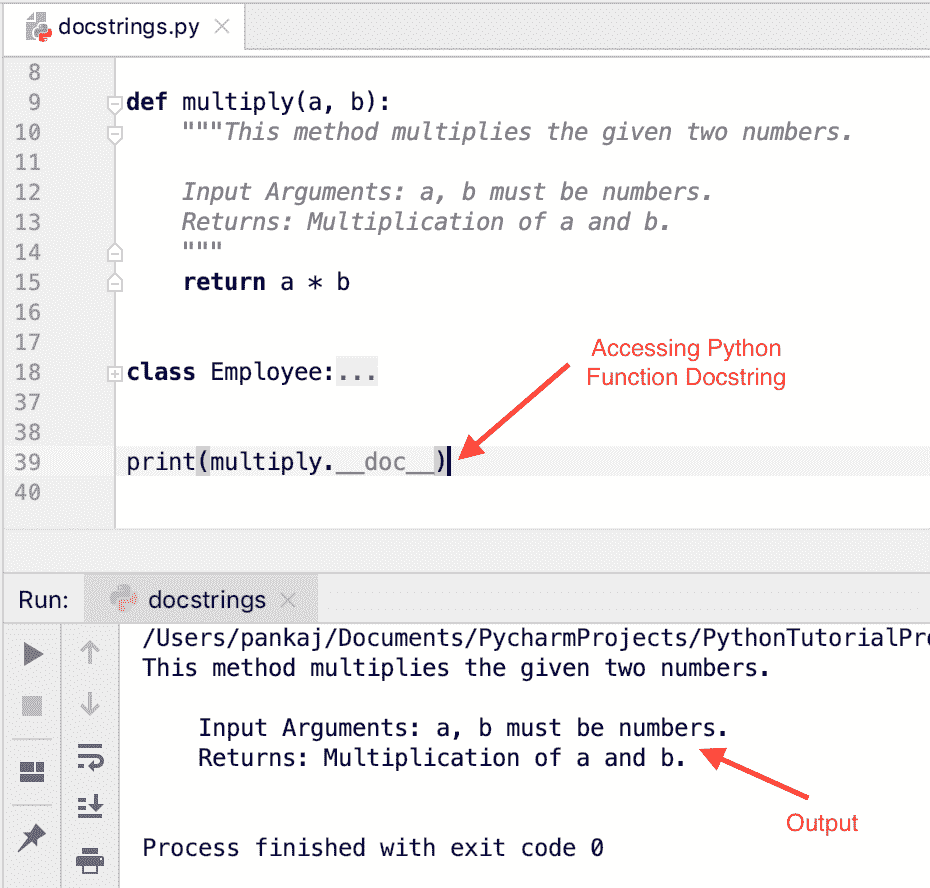
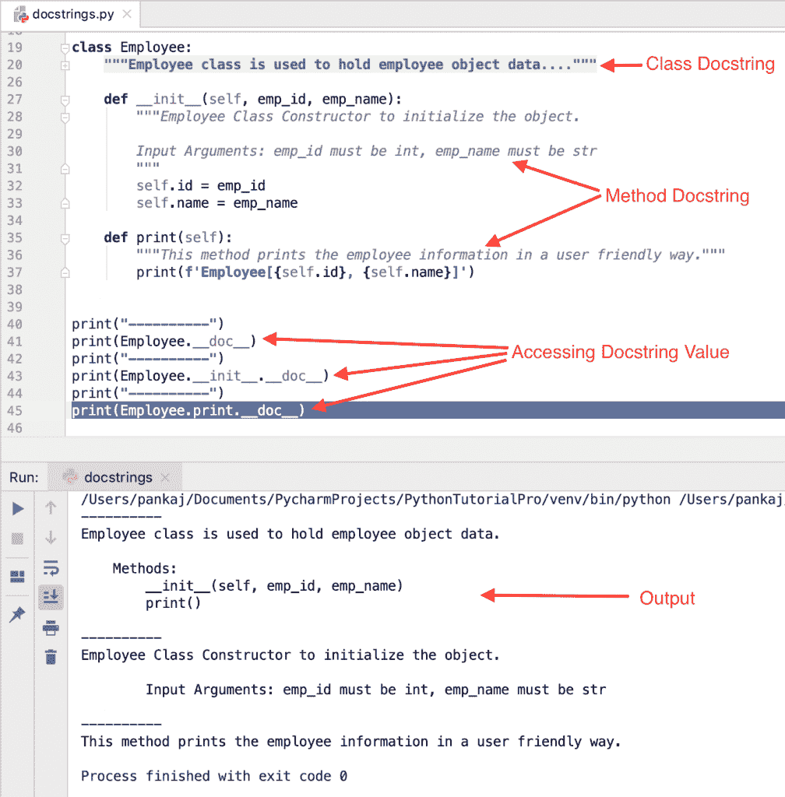
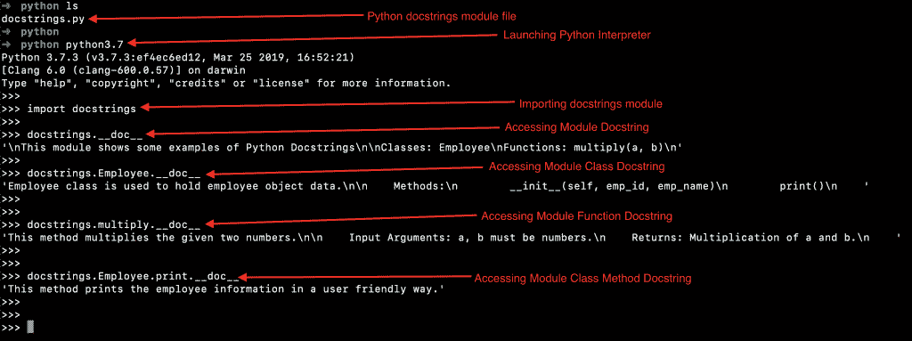

# Python 文档字符串

> 原文：<https://www.askpython.com/python/python-docstring>

Python Docstring(文档字符串)是一个字符串文字，是模块、函数、类或方法中的第一条语句。

* * *

## 如何写一个 Python Docstring？

Python docstring 由一对三重双引号(" ")包围。让我们看一些用 Python 写 docstrings 的例子。

* * *

### 1.Python 函数 Docstring 示例

```py
def multiply(a, b):
    """This method multiplies the given two numbers.

    Input Arguments: a, b must be numbers.
    Returns: Multiplication of a and b.
    """
    return a * b

```

* * *

### 2.Python 类 Docstring 示例

```py
class Employee:
    """Employee class is used to hold employee object data.

    Methods:
        __init__(self, emp_id, emp_name)
        print()
    """

    def __init__(self, emp_id, emp_name):
        """Employee Class Constructor to initialize the object.

        Input Arguments: emp_id must be int, emp_name must be str
        """
        self.id = emp_id
        self.name = emp_name

    def print(self):
        """This method prints the employee information in a user friendly way."""
        print(f'Employee[{self.id}, {self.name}]')

```

* * *

### 3.Python 模块 Docstring 示例

假设我们已经在`docstrings.py`文件中定义了上面的函数和类。每个 Python 脚本也是一个模块。我们可以将这个模块 docstring 定义为:

```py
"""
This module shows some examples of Python Docstrings

Classes: Employee
Functions: multiply(a, b)
"""

```

* * *

## 如何访问 Python Docstrings？

我们可以从一个特殊的属性 __doc__ 中访问 docstring 值。让我们看看如何访问上面定义的 docstring 值。

* * *

### 1.访问 Python 函数 Docstring

```py
print(multiply.__doc__)

```

**输出:**



Python Docstring Example

* * *

### 2.访问 Python 类和方法文档字符串

```py
print(Employee.__doc__)

print(Employee.__init__.__doc__)

print(Employee.print.__doc__)

```

**输出:**



Python Class and Methods Docstring Example

* * *

### 3.访问 Python 模块 Docstring

我们必须导入 docstrings 模块。然后我们可以使用 __doc__ 属性访问它的 Docstring 值。在导入 docstrings 模块之前，我们已经在上面注释了 print 语句，以避免执行 print()语句。

```py
$  python ls
docstrings.py
$  python 
$  python python3.7
Python 3.7.3 (v3.7.3:ef4ec6ed12, Mar 25 2019, 16:52:21) 
[Clang 6.0 (clang-600.0.57)] on darwin
Type "help", "copyright", "credits" or "license" for more information.
>>> 
>>> import docstrings
>>> 
>>> docstrings.__doc__
'\nThis module shows some examples of Python Docstrings\n\nClasses: Employee\nFunctions: multiply(a, b)\n'
>>> 
>>> docstrings.Employee.__doc__
'Employee class is used to hold employee object data.\n\n    Methods:\n        __init__(self, emp_id, emp_name)\n        print()\n    '
>>> 
>>> 
>>> docstrings.multiply.__doc__
'This method multiplies the given two numbers.\n\n    Input Arguments: a, b must be numbers.\n    Returns: Multiplication of a and b.\n    '
>>> 
>>> 
>>> docstrings.Employee.print.__doc__
'This method prints the employee information in a user friendly way.'
>>> 

```



Python Module Docstring

* * *

## Python 单行 Docstring

*   当 python docstring 在一行中定义时，它被称为单行 docstring。
*   开始引号和结束引号在同一行。
*   docstring 值前后没有空行。
*   最佳实践是以句点结束 docstring。
*   它最适合于我们不需要指定很多东西的小效用函数。
*   提供有意义的 docstring 来指定函数细节和输出。例如:

```py
def reverse_str(s):
    """Reverses the input string and returns it."""
    pass

```

* * *

## Python 多行文档字符串

*   当 docstring 值跨越多行时，它被称为多行 Docstring。
*   多行 docstring 的最佳实践是以一个摘要行开始，然后是一个空行，后面是更详细的解释。
*   摘要行可以与起始引号在同一行，也可以在下一行。
*   整个多行文档字符串的缩进与其第一行中的引号相同。

* * *

## Python Docstring 最佳实践

1.  Python 脚本的 docstring 应该指定如何使用它。当脚本在缺少参数或参数错误的情况下执行时，它应该被打印出来。
2.  Python 模块 docstring 应该列出所有的类、函数、异常和对其他模块的依赖。
3.  Python 函数 docstring 应该指定行为、输入参数、返回类型和异常。如果在调用函数时有特定的限制，应该在函数 docstring 中指定。
4.  一个类的 docstring 应该列出所有的方法和属性。如果它是从超类继承的，应该提供细节。
5.  如果一个类方法覆盖了超类方法，应该指定它。
6.  Python 是区分大小写的。因此，保持函数参数名称与函数定义中的名称完全相同。

* * *

## Python 文档字符串格式

没有与文档字符串格式相关联的规则。但是，遵循特定的风格会让你的代码看起来更好。有两种流行的 docstring 格式。

### 1\. Epytext format

这非常类似于 javadoc 风格的注释。它包含方法描述、参数、返回以及有关引发的异常的详细信息。

```py
def multiply(a, b):
    """This method multiplies the given two numbers.

   @param a: this is the first param
   @param b: this is the second param
   @return: returns after multiplying a with b
   @raise TypeError: raised when any of the params is not a number
    """

    return a * b

```

### 2.**重构文本** (reST)格式

这是新款式，在 [PEP-287](https://peps.python.org/pep-0287/) 中有推荐。Sphinx 使用这种风格来生成文档。

```py
def multiply(a, b):
    """This method multiplies the given two numbers.

   :param a: this is the first param
   :param b: this is the second param
   :return: returns after multiplying a with b
   :raise TypeError: raised when any of the params is not a number
    """

    return a * b

```

### PyCharm 文档字符串快捷方式

PyCharm IDE 自动为方法生成 reST 格式的 docstring，只需在方法声明后键入三个双引号并按 enter 键。

因为 PyCharm IDE 支持 reST 风格的 docstring 的自动生成，而且 PEP-287 也推荐这样做，所以您应该以这种格式编写 docstring。

## 为什么您应该遵循 Python Docstring 指南？

Python 文档字符串可以通过 __doc__ 属性来访问。构建一个系统来解析 docstring 并生成项目模块、类和函数的文档是非常容易的。这就是为什么您应该遵循 [PEP-257](https://peps.python.org/pep-0257/) 中列出的 docstring 指南。

* * *

## 我们可以使用 Docstring 进行多行注释吗？

我见过很多滥用 docstring 来提供多行注释的例子。Python 不支持多行注释。如果您希望注释扩展成多行，请以散列字符开始每一行。不要滥用 Python Docstrings。

## 摘要

Python docstring 提供了关于函数、类或模块的有用信息。我们可以用 __doc__ 变量访问 docstring 值。我们应该使用 reST 格式为方法编写 docstring。

## 下一步是什么？

*   [Python 中的函数](https://www.askpython.com/python/python-functions)
*   [Python 类](https://www.askpython.com/python/oops/python-classes-objects)
*   [Python 中的模块](https://www.askpython.com/python-modules/python-modules)
*   [Python 异常处理](https://www.askpython.com/python/python-exception-handling)
*   [Python 中的 OOPS](https://www.askpython.com/python/oops/object-oriented-programming-python)

## 资源

*   [PEP 287–restructured text 文档字符串格式](https://peps.python.org/pep-0287/)
*   [PEP 257–文档字符串约定](https://peps.python.org/pep-0257/)