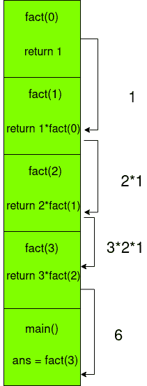

# Python 阶乘示例

> 原文：<https://www.askpython.com/python/examples/python-factorial-example>

在本文中，我们将看看如何使用不同的方法计算 Python 阶乘。

* * *

## Python 阶乘函数

Python 阶乘函数`factorial(n)`是为整数`n`定义的。这将计算从`n`到`1`的所有项的乘积。`factorial(0)`取为`1`。

所以，函数是:

```py
factorial(n) = n * (n-1) * (n-2) * ... * 1, n >= 1
factorial(n) = 1, n = 0

```

因此，**阶乘(4) = 4 * 3 * 2 * 1 = 24** 。

我们来分析一下如何用 Python 写这个数学函数。

## 使用 math.factorial()

我们可以直接使用`math`模块的阶乘函数来完成使用:

```py
import math

def factorial(x):
    return math.factorial(x)

print(factorial(5))

```

**输出**

```py
120

```

我们还会用其他方法来寻找这个函数:现在让我们用一个迭代的过程。

## 使用迭代程序

我们可以直接循环 1 到 n 的所有数字，然后直接乘以乘积。

```py
def factorial(n):
    if n == 0:
        return 1
    prod = 1
    for i in range(1, n+1):
        prod = prod * i
    return prod

if __name__ == '__main__':
    print(factorial(4))
    print(factorial(7))

```

**输出**

```py
24
5040

```

现在让我们来看看如何使用 Python 阶乘函数的递归方法。

* * *

## 使用递归过程

我们可以利用**递归**，来计算这个函数。基本上，我们把这个函数简化成一个更小的子问题。在我们计算完子问题后，我们可以将结果组合起来给出最终答案。

由于问题结构是一个递减的乘积，我们可以用以下方式对递归进行建模:

```py
factorial(n) = n * factorial(n-1), n >= 1
factorial(0) = 1, n = 0

```

最后一行是基本情况。这是递归停止的点，当递归展开时，我们可以得到最终的乘积。

我们将为此编写相应的 Python 函数:

```py
def factorial(n):
    if n == 0:
        # Base case n = 0
        return 1
    else:
        # Use the definition of factorial function
        return n * factorial(n-1)

if __name__ == '__main__':
    print(factorial(4))
    print(factorial(7))

```

**输出**

```py
24
5040

```

那似乎是正确的。让我们分析一下递归调用中实际发生了什么。

无论何时使用递归调用，都有一个**调用栈**，它持续存储程序的状态，直到到达基本情况。当递归从`n = 0`展开时，在相应的块返回一个值之后，堆栈元素最终被逐个弹出。

为了找到`fact(3)`，整个过程解释如下图。整个过程的第一部分是堆栈的构建，其中每个递归调用都堆叠在彼此之上，直到函数返回 1。

一旦函数不能再递归调用，它就开始计算阶乘，如下所示。



Recursion Stack

当函数返回时，堆栈元素从顶部一个接一个地弹出。当它最终到达`main()`栈时，函数最终完成，我们有了自己的值，出来就是`6`。

* * *

## 尾部递归调用

虽然我们的程序运行良好，但递归函数的问题是堆栈大小与输入大小一样大。

因此，如果`n`是一个非常大的数字，我们的递归堆栈可能会非常大，这可能会导致堆栈溢出！为了避免这种情况，我们将使用另一种方法来编写递归函数，称为 **[尾递归过程](https://en.wikipedia.org/wiki/Tail_call)** 。

尾部过程调用旨在计算中间结果后执行递归调用。因此，程序可以在整个进程中使用同一个堆栈，而不是增加堆栈的大小！它只需要更新。

这意味着我们的递归调用必须*总是*在末尾。这就是为什么它是一个“尾叫”。

```py
def fact_helper(accum, n):
    if n == 0:
        return accum
    return fact_helper(accum*n, n-1)

def factorial(n):
    return fact_helper(1, n)

if __name__ == '__main__':
    print(factorial(4))
    print(factorial(7))

```

由于我们不能在最后直接进行递归调用，我们用另一个帮助函数来做，它为我们做实际的计算。这个帮助器函数存储一个`accumulator`，它存储函数的当前值。

诀窍是将累加器作为参数传递给递归函数，并使用`accum*n`更新它。这样，我们将把中间状态存储在一个变量中，因此，只存储在一个堆栈帧中！

**输出**

```py
24
5040

```

你得到和以前一样的输出！现在，您还确保了程序只使用一个堆栈帧，所以它本质上等同于迭代过程！这不是很好吗？

* * *

## 结论

在本文中，我们学习了如何使用 math 模块以及通过迭代和递归以不同的方式实现阶乘函数。

## 参考

*   [维基百科关于尾部递归的文章](https://en.wikipedia.org/wiki/Tail_call)

* * *