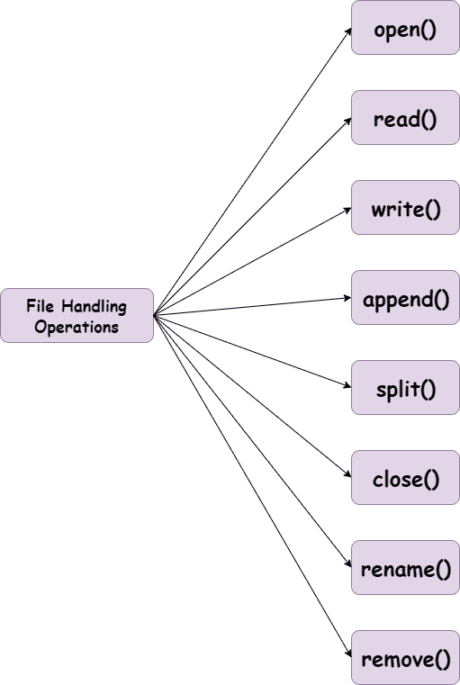
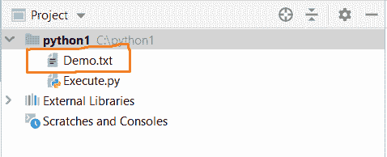
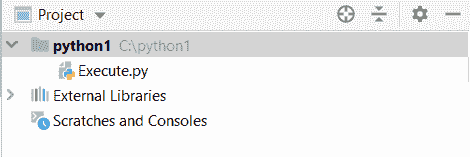

# Python 文件处理

> 原文：<https://www.askpython.com/python/python-file-handling>

## 什么是 Python 文件处理？

`**File handling**`基本上是管理文件系统上的文件。每个操作系统都有自己存储文件的方式。

Python 文件处理对于在我们的程序中处理文件很有用。我们不必担心底层操作系统及其文件系统规则和操作。



File Operations

* * *

### 1.open()函数

open()函数用于在特定模式下打开文件。

它基本上创建了一个可用于进一步操作的文件对象。

**语法:**

```py
 open(file_name, mode) 
```

**打开文件的不同模式:**

*   **r** :读取
*   **w** :写
*   **a** :追加
*   **r** +:读写

最初，我们需要创建一个文件，并将其放在与脚本相同的目录中。

***demo . txt***

```py
Welcome to the programming world!
```

***Execute_file.py***

```py
demo_file = open('Demo.txt', 'r')
# This statement will print every line in the file
for x in demo_file:
    print (x)

# close the file, very important
demo_file.close()

```

**输出:**

```py
Welcome to the programming world!
```

在这里，Execute_file.py 脚本打开 Demo.txt 文件并逐行打印全部内容。

* * *

### 2.read()函数

read()函数用于读取文件的内容。为了达到同样的目的，我们需要以读模式打开一个文件。

```py
demo_file = open("Demo.txt", "r")
print(demo_file.read())
demo_file.close()

```

**输出:**

```py
Welcome to the programming world!
```

* * *

### 3.write()函数

write()函数用于写入文件并对其进行修改。

```py
demo_file = open('Demo.txt','w')
demo_file.write("Hello Everyone!.\n")
demo_file.write("Engineering Discipline.")
demo_file.close()

```

**输出:**当我们打开 Demo.txt 文件时，可以看到这里反映的变化。

```py
Hello Everyone!.
Engineering Discipline.
```

* * *

### 4.append()函数

```py
demo_file = open('Demo.txt','a')

demo_file.write("\nStatement added to the end of the file..")
demo_file.close()

```

**输出:**

```py
Hello Everyone!.
Engineering Discipline.
Statement added to the end of the file..
```

* * *

### 5.split()函数

函数的作用是:在一个文件中分割行。它一遇到脚本中的空格就会分裂。

***demo . txt***

```py
Hello Everyone!.
Engineering Discipline.
Statement added to the end of the file..
```

***Execute_file.py***

```py
with open("Demo.txt", "r") as demo_file:
    demo_data = demo_file.readlines()
    for line in demo_data:
        result = line.split()
        print(result)

```

**输出:**

```py
['Hello', 'Everyone!.']
['Engineering', 'Discipline.']
['Statement', 'added', 'to', 'the', 'end', 'of', 'the', 'file..']
```

* * *

### 6.close()函数

`**close()**`函数用于关闭一个特定的文件，对它进行 post 操作。

写入文件后，如果我们不调用 close()方法，所有写入文件的数据都不会保存在其中。

在我们使用完文件以释放资源之后，关闭它总是一个好主意。

**语法:**

```py
file-name.close()
```

* * *

### 7.重命名()函数

操作系统模块提供了`**rename()**`方法来改变特定文件的名称。

**语法:**

```py
os.rename(current_name,new_name)
```

* * *

### 8.移除()方法

os 模块提供了`**remove()**`方法来删除作为输入给出的文件。

```py
import os
os.remove('Demo.txt')

```

***在执行 remove()方法之前..***



Before remove()

**输出:** ***执行 remove()方法后***



After remove()

* * *

## 结论

因此，在本文中，我们已经理解了 Python 中的文件操作。

* * *

## 参考

*   Python 文件处理
*   [文件操作文档](https://docs.python.org/3/tutorial/inputoutput.html)