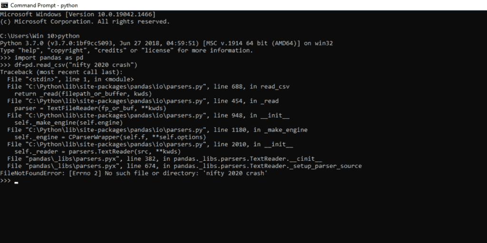
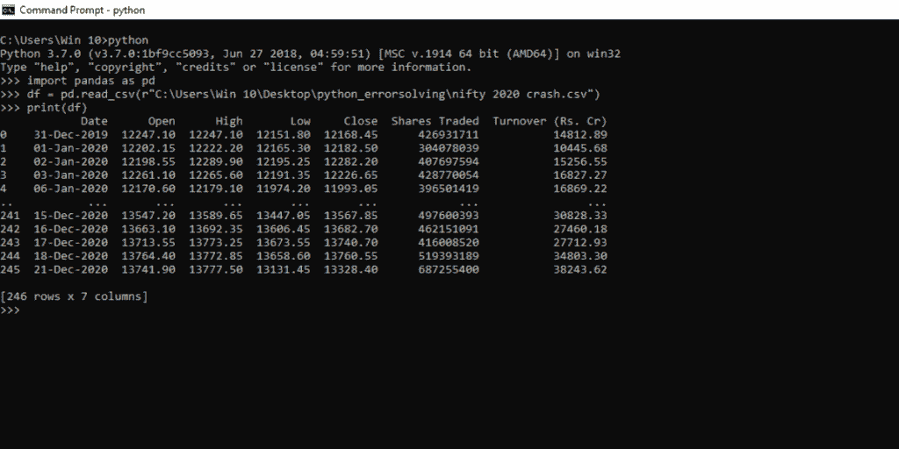
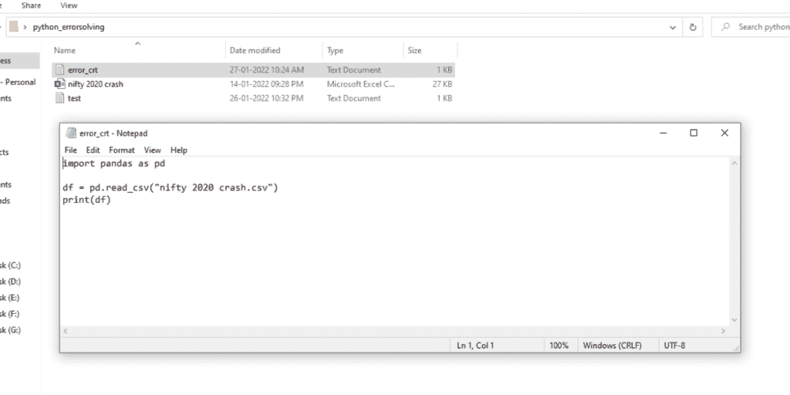
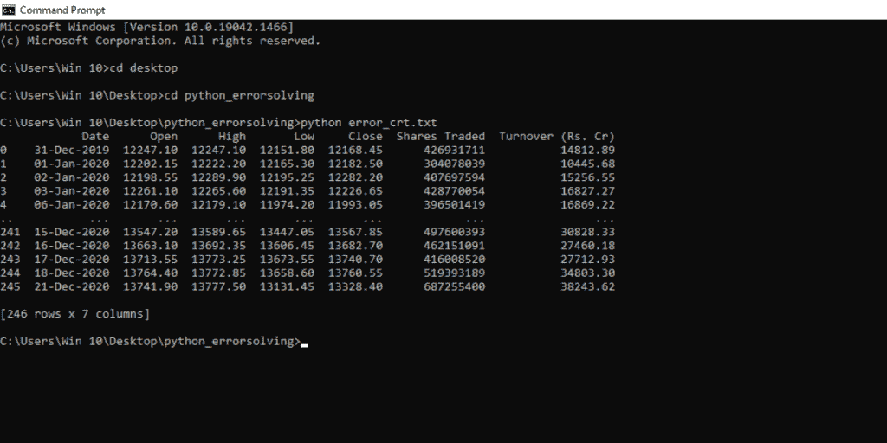
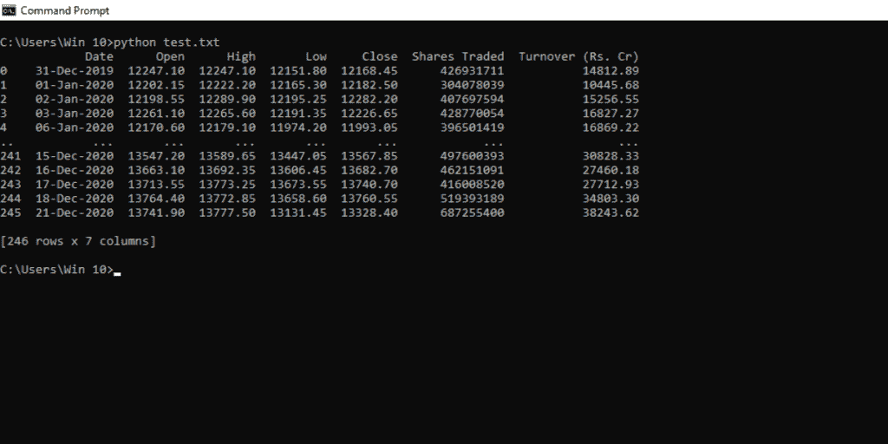
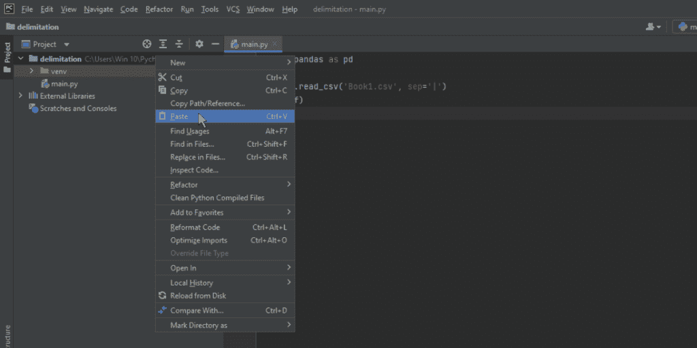
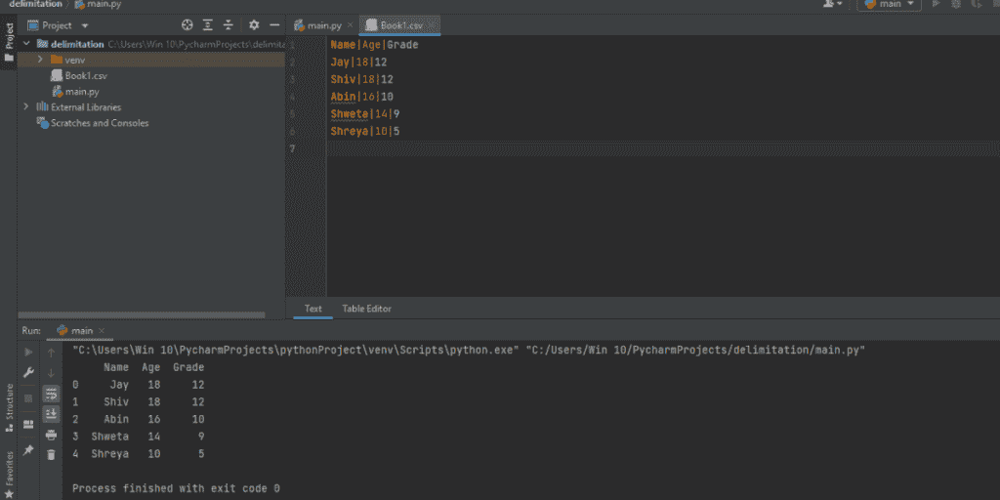

# [已解决]Python file not found error–快速指南

> 原文： [https://www.askpython.com/python/examples/python-filenotfounderror](https://www.askpython.com/python/examples/python-filenotfounderror)

在本文中，我们将解决 Python 中一个非常常见的错误—**filenotfounderror**。如果你以前使用过 Python，你也会面临这种情况，你写所有的代码，在其中保持适当的缩进，放入注释行，仔细检查错误类型，在确保所有东西都是正确的并在它的位置上之后，你运行代码并最终在编译器行中得到“filenotfounderror”。

令人沮丧，不是吗？不要担心，我们将确保涵盖所有可能的方法来解决这个问题，这样您就不会再次遇到它。

***也读:[用 Python 处理 IOErrors 完全指南](https://www.askpython.com/python/examples/handling-ioerrors)***

## What is filenotfounderror

当您试图执行一个命令，而该命令需要一个系统找不到的文件时，编译器会抛出一条系统消息。这可能是由于各种原因，如指定了错误的文件路径，文件存在于另一个目录中，或扩展名错误。我们将在本文中讨论这些要点。但是让我们首先重现我们系统中的问题。

我们将编写一个程序，将一个. csv 文件加载到 pandas 数据帧中，然后打印该数据帧。

```py
import pandas as pd

df=pd.read_csv("nifty 2020 crash")
print(df)

```



Filenotfounderror

## 如何修复 Python filenotfounderror？

当您在终端中运行 python 代码时，它会在运行终端的根目录中搜索文件。人们有一个常见的误解，就是当你运行 python 代码读取一个文件时，终端会在整个计算机中搜索那个文件，这是不正确的。

程序所需的所有文件都应该存在于终端被激活的根目录中。

这个问题可以通过两种方式解决:

### 方法 1:指定完整的文件路径

当我们运行程序时，我们在程序中声明文件名。编译器在根目录中搜索它并抛出错误。这个问题的解决方案是在代码中指定完整的文件路径。

```py
import pandas as pd

df = pd.read_csv(r"C:\Users\Win 10\Desktop\python_errorsolving\nifty 2020 crash.csv")
print(df)

```



注意:注意，在指定文件路径时，我们在写路径前加了一个 r，`pd.read_csv(r"C:\.......)`。它用于将简单字符串转换为原始字符串。如果我们在指定文件路径之前没有添加 r，系统会把那行代码当作普通的字符串输入，而不是文件路径。

### 方法 2:使用. txt 文件运行 Python 脚本

在这个方法中，我们使用了一个非常简单但有效的方法来解决这个问题。我们将代码写在一个. txt 文件中，并将其存储在我们需要的文件所在的目录中。当我们运行这个的时候。txt 文件，编译器仅在该目录中搜索该文件。这种方法不要求我们指定完整的文件路径，但是我们需要确保终端是从正确的目录运行的。

为了说明这个例子，我们在桌面上创建了一个名为‘python _ error solutioning’的目录。这个目录包含两个文件。包含 python 代码和。我们的代码需要 csv 文件。



要从终端运行这个文件，使用`cd`手动转到目录，然后使用语法`python error_crt.txt`或您的文件名运行这个文件。



如您所见，这种方法不需要我们指定完整的文件路径。当您必须处理多个文件时，这很有用，因为为每个特定文件指定完整的路径可能是一项繁琐的工作。

### 方法 filenotfounderror 的变通方法

这不是一个解决方案，而是这个问题的一个变通办法。假设您处于某种情况下，文件路径是相同的，但您必须加载连续的不同文件。在这种情况下，您可以将文件名和文件路径存储在两个不同的变量中，然后将它们连接到第三个变量中。通过这种方式，您可以将多个不同的文件组合起来，然后轻松地加载它们。

为了说明这个解决方案，我们将创建一个. txt 文件，代码如下:

```py
import pandas as pd

filename = "nifty 2020 crash.csv"
filepath = "C:\\Users\\Win 10\\Desktop\\python_errorsolving\\"
file = filepath+filename

df = pd.read_csv(file)
print(df)

```



## 使用 IDE 修复 filenotfounderror

集成开发环境是管理文件和环境变量的好方法。这有助于为您的代码创建虚拟环境，以便所需的库和环境变量不会与我们的其他项目交互。在这一节中，我们将在 PyCharm IDE 中创建一个项目，看看我们可以多么轻松地存储文件并与之交互。

为了演示这个例子，我们创建了一个包含学校记录的. csv 文件，并将其命名为“book1.csv”。要将其导入 PyCharm，请按照以下步骤操作:

**步骤 1:** 转到文件>新建项目… >给一个文件名>创建。

第二步:复制你的。csv 文件并将其粘贴到项目中。



粘贴文件后，您可以用代码直接访问该文件，而不必指定完整的路径。您可以简单地使用文件名。

```py
import pandas as pd

df = pd.read_csv('Book1.csv', sep='|')
print(df)

```

结果:



## 结论

在本文中，我们观察了系统找不到文件的不同情况。我们还研究了这些问题的不同解决方案，从手动指定路径，到使用 IDE 获得更好的结果。我希望这篇文章能解决你的问题