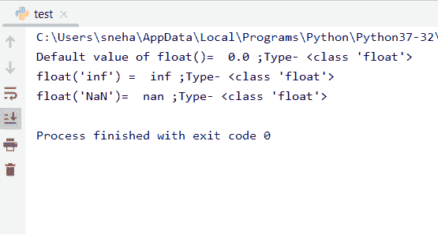

# Python float()方法

> 原文：<https://www.askpython.com/python/built-in-methods/python-float-method>

## 介绍

所有 Python 特性都与**对象**相关联。Python float 在 Python 中创建浮点对象。它是 Python 编程的基本元素之一。

此外，所有种类的对象都被分为不同的类型。python 中的一些基本原生类型是**字符串**、**整数**、**复数**以及最后的**浮点数**。

重点关注浮点类型，本地 Python `float()`方法用于创建浮点类型对象，以及将任何其他类型类型强制转换为相应的浮点类型。

因此，在本教程中，我们将讨论 Python `float()`方法做什么，以及如何在我们的代码中相应地使用它。

## Python float()基础知识

基本上，Python float()函数用于从其他类型转换一些数据，如**整数**、**字符串**等。，向**式浮动**。它还用于声明浮点类型变量。

现在让我们看看这个函数是怎样的，

```py
f = float( )

```

在这里，`f`是类型为 **float** 的新对象。我们也可以从其他类型转换过来。让我们看看如何

```py
f = float( Val )

```

这里，`Val`是某种其他类型的数据，它被类型转换为 float，然后存储在`f`变量中(float 类型)。

## Python float()方法用法

看看下面的例子。这里我们试着计算一个用户自定义长宽的矩形的面积。

```py
#taking the length and breadth of the rectangle as user inputs
len=input("Enter the length of the rectangle : ")
brdth=input("Enter the breadth of the rectangle : ")

#at this point both len and brdth are holding str values

area=float() #area declared as float() object

#len and brdth type-casted to float for * operation
area=float(len)*float(brdth)
#area is calculated
print("The area of the given rectangle is : ",area)
print("type of area= ",type(area))

```

**输出**:


float() Example

在上面的代码中，

*   首先，我们将矩形的**长度**以及**宽度**作为用户输入。默认情况下存储为字符串类型值
*   然后我们声明一个变量`area`，一个 float 类型的对象，它将在将来存储矩形的面积
*   之后，我们使用`float()`方法将字符串类型`len`和`brdth`参数显式转换为浮点类型。并进一步计算出**面积**，即**长度*宽度**，并打印出来
*   最后，我们打印区域的`type()`,不出所料，结果是**浮动**类型本身

## Python float()的各种用法

除了对象声明，`float()`方法也可以用于将其他数据类型转换为浮点类型，也可以和一些特殊的参数一起使用。让我们看看这个函数是如何根据我们传递的参数工作的。

### 1.使用 float()进行类型转换

我们已经看到，在上面的例子中，我们可以**显式地**将任何数据类型的任何变量转换成浮点类型。为了更好的理解，让我们看看这个方法是如何处理不同的数据类型的，比如字符串和整数。

```py
s=100
print("s=",s)
print("Type before : ",type(s))
s=float(s)
print("s=",s)
print("Type after : ",type(s))

```

**输出**:

```py
s= 100
Type before :  <class 'int'>
s= 100.0
Type after :  <class 'float'>

```

在这里，我们可以观察到，变量的类型从**整型**转换为**浮点型**。

之前我们在开始时看到了字符串到浮点的类型转换。在这种情况下，字符串`len`和`brdth`是数字。**如果字符串不是任何数字呢？**让我们看看，

```py
s="AskPython"
print("s=",s)
print("Type before : ",type(s))
s=float(s)
print("s=",s)
print("Type after : ",type(s))

```

**输出**:

```py
s= AskPython
Type before :  <class 'str'>
Traceback (most recent call last):
  File "C:/Users/sneha/Desktop/test.py", line 4, in <module>
    s=float(s)
ValueError: could not convert string to float: 'AskPython'

```

由此，我们可以推断出`float()`方法只能将字符串类型的值转换为浮点数。如果字符串中包含任何字符，抛出一个**值错误**。

### 2.使用带有特殊参数的 float()

如果我们将 **nothing** 、 **infinity** 或 **NaN** (不是数字)作为参数传递给`float()`方法，会发生什么？它能把它们转换成浮点数吗？让我们看看下面的例子，

```py
val1=float('inf')
val2=float('NaN')
val=float()
print("Default value of float()= ",val,";Type-",type(val))
print("float('inf') = ",val1,";Type-",type(val))
print("float('NaN')= ",val2,";Type-",type(val))

```

**输出**:



Special Parameters In Float

所以，在上面的例子中，我们可以看到，

*   不向`float()`方法传递任何东西会给我们它的默认值，实际上是**‘0.0’**，
*   对于 **inf** 或 infinity，返回值也是`inf`，但是类型转换为 **float** ，
*   同样，对于 **NaN** ，该函数返回类型为 **float** 的`nan`。

## 结论

因此，在本教程中，我们学习了 Python 中的 `float()`方法，它是如何使用的，以及它的功能是什么。对于任何进一步的问题，随时欢迎评论。

## 参考

*   [https://docs.python.org/2/tutorial/floatingpoint.html](https://docs.python.org/2/tutorial/floatingpoint.html)
*   https://www.journaldev.com/15178/python-float
*   [https://docs.python.org/2/library/stdtypes.html](https://docs.python.org/2/library/stdtypes.html)