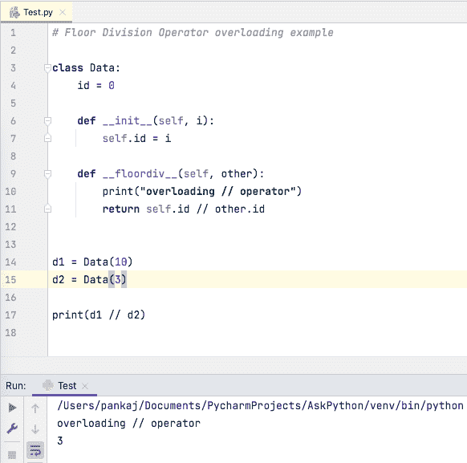

# Python //运算符–Python 中的楼层划分

> 原文：<https://www.askpython.com/python/python-floor-division-double-slash-operator>

Python //运算符也叫地板除法运算符。它是 Python 中的算术运算符之一。它适用于 Python 中的数字。

## Python //运算符

它类似于除法运算符，只是它返回除法运算的整数部分。所以，如果除法的输出是 3.999，这将返回 3。所以才叫楼分算子。

我们来看一些 Python 中的楼层划分的例子。

### 1.整数的地板除法

```py
>>> 10//3
3
>>> 10//2
5

```

### 2.用彩车分隔地板

```py
>>> 10.0//3
3.0
>>> 10//2.0
5.0
>>> 11.99//3.00
3.0

```

### 3.复数的楼层划分

复数不支持地板除法。如果我们尝试对复数使用//运算符，它将抛出 *TypeError:不能对复数取整。*

```py
>>> x = 10 + 3j
>>> type(x)
<class 'complex'>
>>> x // 3
Traceback (most recent call last):
  File "<stdin>", line 1, in <module>
TypeError: can't take floor of complex number.
>>> 

```

## 重载//运算符

我们知道 Python 支持运算符重载。如果要支持对象的//操作符，需要重写 __floordiv__(self，other)方法。让我们看一个重载地板除法运算符的简单例子。

```py
# Floor Division Operator overloading example

class Data:
    id = 0

    def __init__(self, i):
        self.id = i

    def __floordiv__(self, other):
        print("overloading // operator")
        return self.id // other.id

d1 = Data(10)
d2 = Data(3)

print(d1 // d2)

```

输出:



## 摘要

*   Python //运算符处理数字–int 和 float。
*   基数除法运算符返回除法运算的整数部分。
*   如果被除数和除数都是整数，则地板除法也将返回 int。
*   如果被除数和除数中有一个是 float，则 floor 除法将返回一个 float。
*   我们不能对复数使用//运算符。

## 下一步是什么？

*   [Python 中的运算符](https://www.askpython.com/python/python-operators)
*   [Python 中的数字](https://www.askpython.com/python/python-numbers)
*   [Python 中的函数](https://www.askpython.com/python/python-functions)
*   [Python for 循环](https://www.askpython.com/python/python-for-loop)
*   [Python 列表](https://www.askpython.com/python/list/python-list)

## 参考

*   [Python 文档](https://python-reference.readthedocs.io/en/latest/docs/operators/floor_division.html)