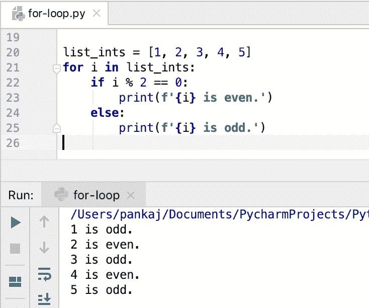

# Python for 循环

> 原文：<https://www.askpython.com/python/python-for-loop>

Python for 循环用于迭代 iterable。在 Python 中，任何逐个返回其元素以在 for 循环中迭代的对象都称为 Iterable。一些常见的可迭代的例子有[列表](https://www.askpython.com/python/list/python-list)、[元组](https://www.askpython.com/python/tuple/python-tuple)和[字符串](https://www.askpython.com/python/string/python-string-functions)。for 循环是 python 编程的核心构建块。

## 在 Python 中实现 for 循环

Python 中的 for 循环是使用 [**保留关键字**](https://www.askpython.com/python/python-keywords)–**for**实现的。针对 iterable 的每个元素执行 for 循环代码块。

## 退出循环

我们可以使用 **break 语句**来退出 for 循环。这将终止 for 循环的执行，并且不会对 iterable 的剩余元素执行代码块。当我们找到了我们要找的东西，并且不需要处理 iterable 的其他元素时，这是很有用的。

## 跳过 for 循环的当前执行

我们可以使用 **continue 语句**来跳过 for 循环的当前执行。当我们只想对 iterable 的某些特定元素执行代码时，这很有用。

## Python for loop 是迭代器？

Python 中的 for 循环不同于其他编程语言，因为它的行为更像一个**迭代器**。我们可以使用 for 循环来迭代**元组**、**列表**、**集合**，或者**字符串**。所有这些对象在 Python 中都是一个序列。我们可以让**嵌套 for 循环**来遍历一系列序列。

* * *

## Python for 循环语法

for 循环语法非常简单。它使用**[“in”运算符](https://www.askpython.com/python/python-operators)** 来迭代 iterable 中的元素。

```py
for element in sequence:
    # for statement code block

```

* * *

## for 循环流程图


For Loop Flow Diagram

* * *

## Python for 循环示例

让我们看一些带有不同类型可重复项的 for 循环的例子。

* * *

### 1.线

Python 字符串是一个字符序列。让我们看一个简单的程序来打印字符串中的索引和字符。

```py
message = "Hello"

count = 0
for character in message:
    print(f'Index:{count}, Character:{character}')
    count += 1

```

**输出:**


* * *

### 2.元组

假设我们有一组字符串。我们想把所有的元素都转换成小写。我们可以为此编写一个实用程序 [**函数**](https://www.askpython.com/python/python-functions) ，并使用 for 循环迭代元组元素。

```py
def to_lower_case(my_tuple):
    temp_list = []
    for item in my_tuple:
        temp_list.append(str(item).lower())
    return tuple(temp_list)

fruits = ("Apple", "Orange", "BANANA")
fruits_new = to_lower_case(fruits)
print(fruits_new)

```

**输出** : `('apple', 'orange', 'banana')`


**注意**:我们使用一个列表在 for 循环中添加元素，因为 Tuple 在 Python 中是不可变的。

* * *

### 3.目录

让我们来看一个例子，遍历整数列表并打印它是偶数还是奇数。

```py
list_ints = [1, 2, 3, 4, 5]
for i in list_ints:
    if i % 2 == 0:
        print(f'{i} is even.')
    else:
        print(f'{i} is odd.')

```

**输出:**



* * *

### 4.一组

下面是一个使用 for 循环打印集合元素的简单示例。

```py
set_cities = set()
set_cities.add("New York")
set_cities.add("New Delhi")
set_cities.add("Bangalore")
set_cities.add("London")
set_cities.add("Bangalore")  # duplicate item, will be removed from set

for city in set_cities:
    print(city)

```

**输出:**


**注意** : Set 在 Python 中是一个无序序列。所以每次执行程序时，输出可能会有所不同。

* * *

### 5.词典

[Python 字典](https://www.askpython.com/python/dictionary/python-dictionary-dict-tutorial)不是序列。所以我们不能直接迭代它的元素。然而，它有一个方法`items()`,返回一个类似集合的元素序列。我们可以使用这个方法迭代字典元素。

```py
my_dict = {"1": "Apple", "2": "Kiwi", "3": "Orange"}

for k, v in my_dict.items():
    print(f'Key={k}, Value={v}')

```

**输出:**


* * *

## 使用 break 语句退出 for 循环

我们可以使用 [break 语句](https://www.askpython.com/python/python-break-statement)在不迭代所有元素的情况下退出 for 循环。

假设我们有一个要处理的消息列表。如果我们遇到“退出”消息，那么处理应该停止。我们可以使用 break 语句来实现这个场景。

```py
messages = ["Hi", "Hello", "Exit", "Adios", "Hola"]

for msg in messages:
    if msg == "Exit":
        break;
    print(f'Processing {msg}')

```

**输出:**


* * *

## 带 continue 语句的 Python for 循环

有时我们想跳过序列中某些元素的处理。为此，我们可以使用一个 [continue 语句](https://www.askpython.com/python/python-continue-statement)。

```py
ints = (1, 2, 3, 4, 5, 6)

# process only odd numbers
for i in ints:
    if i % 2 == 0:
        continue
    print(f'Processing {i}')

```

**输出:**


* * *

## 带 range()函数的 Python for 循环

Python `range()`函数生成一个数字序列。我们可以使用 for 循环来执行代码块特定的次数。

让我们看看如何使用 range()函数和 for 循环来执行一个代码 5 次。

```py
for i in range(5):
    print("Processing for loop:", i)

```

**输出:**


* * *

## 带 else 语句的 Python for 循环

我们可以在 for 循环中使用 else 语句，以便在 for 循环结束时执行一些代码。

当序列处理成功完成时，它在记录或发送通知方面很有用。

```py
databases = ("MySQL", "Oracle", "PostgreSQL", "SQL Server")

for db in databases:
    print(f'Processing scripts for {db}')
else:
    print("All the databases scripts executed successfully.")

```

**输出**:


else with for Loop in Python

**注意**:如果 for 循环产生任何错误，那么 else 块代码不会被执行。

```py
databases = ("MySQL", "Oracle", "PostgreSQL", "SQL Server")

for db in databases:
    print(f'Processing scripts for {db}')
    raise TypeError
else:
    print("All the databases scripts executed successfully.")

```

**输出:**

```py
Processing scripts for MySQL
Traceback (most recent call last):
  File "/Users/pankaj/Documents/PycharmProjects/PythonTutorialPro/hello-world/for-loop.py", line 65, in <module>
    raise TypeError
TypeError

```

如果使用 break 语句终止 for 循环，则不执行 else 块。

* * *

## Python 中嵌套的 for 循环

当一个循环出现在另一个循环中时，它被称为嵌套循环。Python for 循环可以嵌套。这在迭代嵌套的可迭代对象时很有用，例如，一个列表的列表。

```py
list_tuples = [("Apple", "Banana"), ("Orange", "Kiwi", "Strawberry")]

for t_fruits in list_tuples:
    for fruit in t_fruits:
        print(fruit)

```

**输出:**


Nested for Loop In Python

* * *

## 使用 for 循环和 reversed()函数进行反向迭代

for 循环按照出现的顺序遍历序列元素。有时我们必须以相反的顺序遍历元素。我们可以在 for 循环中使用 reversed()函数来实现这一点。

```py
numbers = (1, 2, 3, 4, 5)

for n in reversed(numbers):
    print(n)

```

输出:

```py
5
4
3
2
1

```

* * *

## for 循环变量泄漏到全局范围

通常，在本地命名空间内部定义的变量在外部是不可访问的。一旦代码块完成了它的执行，本地命名空间就和它的所有变量一起被销毁。但是，对于 for 循环来说却不是这样。

for 循环中定义的变量在全局范围内。我们甚至可以在 for 循环中访问和更改全局名称空间变量值。让我们用一个简单的代码片段来检查这种行为。

```py
global_var = "global"
for c in range(1,3):
    x = 10
    global_var = "for variable"

print(c)  # variable is defined in the for loop
print(x)  # variable is defined in the for loop
print(global_var)  # global variable

```


Python for Loop Global Variables

**推荐** : [Python 命名空间](https://www.askpython.com/python/python-namespace-variable-scope-resolution-legb)

* * *

## 摘要

Python for 循环作为迭代器工作。我们可以用它来迭代可迭代的元素。我们可以嵌套 for 循环来迭代一个可迭代对象。还有一些额外的功能——range()和 reversed()使它更加强大。

## 下一步是什么？

*   [Python 中的循环](https://www.askpython.com/python/python-loops-in-python)
*   [Python 内置函数](https://www.askpython.com/python/built-in-methods/python-built-in-functions-brief-overview)
*   [Python while 循环](https://www.askpython.com/python/python-while-loop)
*   [Python 可迭代 vs 迭代器](https://www.askpython.com/python/iterable-vs-iterator)

* * *

## 参考资料:

*   [Python.org 作声明](https://docs.python.org/3/tutorial/controlflow.html#for-statements)