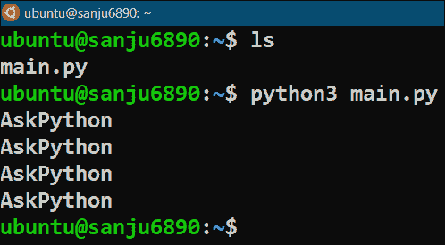

# python fork()–如何使用 fork()方法创建子流程？

> 原文：<https://www.askpython.com/python-modules/python-fork>

在本文中，我们将讨论 Python fork()方法，该方法允许我们使用调用它的进程来创建子进程。让我们看看

## 什么是系统调用？

一个 ***系统调用*** 用于访问内核模式。它是一种程序与操作系统交互并请求其服务来执行特定任务的方式。

因此，所有系统调用都在内核(特权)模式下执行，当执行完成时，控制权返回到用户模式。有时系统调用也被简称为 ***syscall*** 。

在现代计算机系统中，一般有两种操作模式——*用户模式*和*内核模式*。

所有的用户程序和进程都运行在用户模式，它们不能直接访问内核模式。这样做是为了保护操作系统不被任何用户程序修改或更改。

任何用户程序如果需要执行特权工作，都需要操作系统的支持，只有通过 ***系统调用*** 才能获得。它是通过 API(应用程序接口)向用户程序和进程提供操作系统的各种服务的系统调用。

## **Python fork()是什么？**

有多个系统调用来管理操作系统提供的不同类型的服务。此外，对于不同的操作系统，这些也是不同的。

系统调用大致分为五大类:

1.  文件相关的系统调用
2.  设备相关系统调用
3.  **过程相关系统调用**
4.  **信息相关系统调用**
5.  与通信相关的系统调用

所以，Python **`fork()`** 就是一个流程相关或流程控制系统调用的例子。这是一种用于创建调用它的流程的*子流程*的方法，就像原始(调用)流程的克隆一样。使用`fork()`语句进行系统调用的进程被称为*父进程*。

## **导入操作系统模块**

为了在 Python 中使用和实现`fork()`系统调用，我们需要 Python 的[模块。Python 中的这个 os 模块允许我们使用各种依赖于操作系统的功能。它允许用户程序访问运行 Python 的操作系统功能。](https://www.askpython.com/python-modules/python-os-module-10-must-know-functions)

我们不需要安装`os`模块，因为它属于 Python 的标准实用程序模块，并且在我们的系统中安装 Python 时就已经安装了。

它被导入到程序中，如下所示:

```py
import os

```

## **Python fork()的工作原理**

以下是`fork()`方法/语句的关键属性:

*   当它在任何程序中被调用时，它不带参数。
*   如果成功创建了子进程，那么父进程和子进程都将执行下一条语句/指令，然后执行`fork()`语句。
*   子进程数=***2^N–1***；其中 *N* =主程序内部使用的`fork()`语句的数量。

**在执行 Python fork()语句时，它返回三种类型的整数值:**

1.  如果子进程创建成功，零 ( **0** )返回给子进程。
2.  如果子进程创建成功，则向父进程返回一个**正** ( **+ve** )值。这个正值通常是 **PID** ，即新创建的子进程的^(******) *进程 ID* 。
3.  如果由于某种原因在创建子进程时出现错误，则向父进程返回一个负的 ( **-ve** )值。

**进程 ID** 通常被称为 **PID** 是与计算机系统中存在的每个进程相关联的唯一标识符。可以使用另一个系统调用 ***`getpid()`*** 来访问任何进程的进程 ID，这是信息相关系统调用的一个示例。`getpid()`语句返回调用它的进程的进程 ID。

它在程序中的调用如下:

```py
os.fork()

```

## **用 Python 中的 fork()方法创建子进程**

**例 1:**

```py
# Importing os module
import os

# Creating child processes using fork() method
os.fork()
os.fork()

# This will be executed by both parent & child processes
print("AskPython")

```

**输出:**



上面的 python 程序产生了正确的输出，因为程序中使用了两个`fork()`语句。因此，`print()`语句被三个子进程执行了四次(3 + 1)三次( **2² -1 = 3** )，被父进程执行了一次。

**例 2:**

```py
# Importing os module
import os

# Creating a child process using fork() method
val = os.fork()

# Testing the values returned by fork() method
if val == 0:
    pid = os.getpid()
    print(f"Hi I am Child Process and my PID is {pid}.")
elif val > 0:
    pid = os.getpid()
    print(f"Hi I am Parent Process and my PID is {pid} and PID {val} is my Child Process.")
else:
    print("Sorry!! Child Process creation has failed...")

```

**输出:**


上面的 python 程序产生了正确的输出，并清楚地展示了由`fork()`语句返回的值。

## **结论**

在本教程中，我们学习了什么是系统调用，什么是 Python `fork()`方法，它的属性，以及如何使用 Python 中的`fork()`方法创建子进程。

**注意:** `fork()`方法/系统调用仅适用于 Linux/Unix 操作系统。如果您尝试在 Windows 系统上运行任何调用`fork()`方法的 Python 程序，将会产生以下错误:

