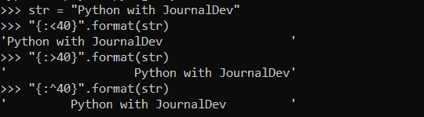

# Python format()函数

> 原文：<https://www.askpython.com/python/string/python-format-function>

你好！在本文中，我们将关注使用 **Python format()函数**格式化字符串和值。

## Python format()函数入门

Python format()函数是一个内置的字符串函数，用于字符串的**格式化。**

Python `format() function`根据**位置**格式化字符串。因此，用户可以使用 format()函数改变字符串在输出中的位置。

**语法:**

```py
"{}".format(value)

```

*   这些花括号充当了一个格式化程序，当函数被调用时，它们被替换为放置在定义位置的字符串。
*   `value`:该参数可以是字符串，也可以是数字，甚至可以是浮点整数。它表示输出中要由格式化程序替换的值。

**举例:**

```py
s1 = 'Python'
s2 = 'with'
s4 = 'JournalDev'

s3 = "{} {} {}".format(s1, s2, s4)
print(s3)

```

**输出:**

```py
Python with JournalDev

```

* * *

## 使用 Python 格式()进行索引格式化

format()函数还用于在**用户定义的位置**格式化字符串，也就是说，我们可以通过指定花括号内的**索引值**来更改要放入输出中的字符串或值的位置。

**举例:**

```py
s1 = 'Python'
s2 = 'with'
s4 = 'Data Science'

res = "{2} {1} {0}".format(s1, s2, s4)
print(res)

```

在上面的代码片段中，format(s1，s2，s4)在内部将它们的索引值指定为 0，1，2，以此类推，指定给传递给函数的值。

也就是说，s1 被分配给索引 0，s2 被分配给索引 1，s4 被分配给索引 2。

因此，通过在{}中传递字符串的索引值，我们可以通过索引值改变字符串的位置。

**输出:**

```py
Data Science with Python

```

* * *

## 向 format()函数中的参数传递值

使用 Python format()函数，我们可以**给我们希望在函数本身的**参数列表**中显示的变量**赋值。

**语法:**

```py
"{var1}".format(var1='value')

```

**举例:**

```py
res = "{s4} {s2} {s1}".format(s1 = 'Python',s2 = 'with',s4 = 'Data Science')
print(res)

```

**输出:**

```py
Data Science with Python

```

* * *

## 用 Python format()函数填充格式化字符串

还可以使用 format()函数根据**对齐方式**和**填充方式**对字符串进行格式化。

**语法:**

```py
#left padding
"{:>number}".format(value)
#right padding
"{:<number}".format(value)
#centre padding
"{:^number}".format(value)

```

通过传递一个特定的数字，它充当字符串周围要填充的字符数。

**举例:**



**Padding using format() function**

* * *

## 将 dict 作为参数传递给 Python format()函数

[Python 字典](https://www.askpython.com/python/dictionary/python-dictionary-dict-tutorial)也可以传递给 format()函数作为要格式化的值。

**语法:**

```py
"{key}".format(**dict)

```

分别将**键**传递给 **{}** 和使用 format()函数**用键的值**替换键。

因为我们将 dict 键作为参数传递，为了用它们的值替换键，我们需要解包字典。于是，`Python "**" operator`被用来**解包字典**。

**举例:**

```py
dict1 = {"Python":"A","Java":"B","Cpp":"D"}
res = "{Python} {Cpp}".format(**dict1)
print(res)

```

**输出:**

```py
A D

```

* * *

## 将复数作为参数传递给 format()函数

Python format()函数可用于从一个**复数**中访问**实数**和**虚数**值。

**语法:**

```py
"{0.real},{0.imag}".format(complex_number)

```

**举例:**

```py
num = 20-3j
res = "Real-part:{0.real}, Imaginary-part:{0.imag}".format(num)
print(res)

```

**输出:**

```py
Real-part:20.0, Imaginary-part:-3.0

```

* * *

## Python format()函数使用逗号作为分隔符值

Python format()函数使我们能够使用`"," as a separator`来分隔数值。

**语法**:

```py
"{:,}".format(number)

```

分隔符，即“，”被添加在三位数字之后，其方式适用于数字系统中的**千位。**

**举例:**

```py
num = 10000000000
res = "{:,}".format(num)
print(res)

```

**输出:**

```py
10,000,000,000

```

* * *

## 使用 format()函数格式化数字

Python format()函数也具有格式化数字的特性。

除了格式化数值，format()函数还可以用来根据不同的数制来表示数值，如**二进制**、**八进制**、**十六进制**等。

**语法:**

```py
#Hexadecimal representation
"{0:x}".format(value)
#Octal representation
"{0:o}".format(value)
#Decimal representation
"{0:d}".format(value)
#Binary representation
"{0:b}".format(value)

```

**例 1:**

```py
num = 10
binary = "{0:b}".format(num)
print("Binary representation:", binary)
hexadecimal = "{0:x}".format(num)
print("Hexadecimal representation:", hexadecimal)
octal = "{0:o}".format(num)
print("Octal Decimal representation:", octal)
decimal = "{0:d}".format(num)
print("Decimal representation:", decimal)

```

**输出**:

```py
Binary representation: 1010
Hexadecimal representation: a
Octal Decimal representation: 12
Decimal representation: 10

```

* * *

## 结论

因此，在本文中，我们研究了 Python format()函数的工作方式，以及该函数在字符串、数字等方面的各种用法。

要了解更多关于字符串格式化的信息，我强烈建议读者学习一下 [Python f-string](https://www.askpython.com/python/string/python-f-string?_thumbnail_id=4606) 。

* * *

## 参考

*   Python format()函数— JournalDev