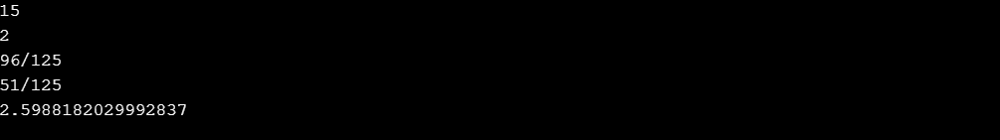

# Python 分数模块

> 原文：<https://www.askpython.com/python-modules/python-fractions-module>

Python 分数模块使用户能够以高效的方式管理分数相关的计算。这个模块使我们能够从整数、浮点数、小数和字符串中创建分数。

这个分数模块支持有理数算术运算。

* * *

## 分数基础模块

**1。导入分数模块**:

```py
from fractions import Fraction

```

**2。实例化分数类**:

有许多方法可以实例化 fraction 类。以下是实例化 fraction 类的一些方法:

*   传递分子和分母
*   用 float 实例化
*   用小数实例化
*   用字符串实例化

**示例:通过传递分子和分母**进行实例化

```py
from fractions import Fraction
Fraction(1, 2)

```

**示例:用 float 实例化**

```py
from fractions import Fraction
Fraction(2.5)

```

**举例:用小数实例化**

```py
from fractions import Fraction
from decimal import Decimal
Fraction(Decimal('1.1'))

```

**示例:实例化字符串**

```py
from fractions import Fraction
Fraction('9/16')

```

* * *

## 创建分数

```py
import fractions

for num, decimal in [(1, 2), (3, 6), (30, 7)]:
    result = fractions.Fraction(num, decimal)
    print('{}/{} = {}'.format(num, decimal, result))

```

**输出:**

```py
1/2 = 1/2
3/6 = 1/2
30/7 = 30/7

```

* * *

## 对分数执行算术运算

下面的例子解释了分数的不同数学运算。

```py
from fractions import Fraction 

print(Fraction(100, 10) + Fraction(25, 5)) 

print(Fraction(18, 5) / Fraction(18, 10)) 

print(Fraction(18, 15) * Fraction(16, 25)) 

print(Fraction(17, 25) * Fraction(15, 25)) 

print(Fraction(12, 5) ** Fraction(12, 11)) 

```

**输出:**



*Output-Arithmetic Operations On Fractions*

* * *

## 分数实例

分数实例是从一对整数、有理数或字符串构建的分数。分数是**可变的**和**不可变的**，所以它们的值一旦被创建就不能被改变。

**类分数。分数(分子=0，分母=1) :** 它要求分子和分母都是**数。**一个分数值=(分子/分母)作为输出返回，缺省值为 0。如果分母= 0，则产生零除法误差。

**举例:**

```py
from fractions import Fraction 

print(Fraction(10, 35)) 

print(Fraction(10, 13)) 

print(Fraction()) # default value

```

**输出:**

```py
2/7
10/13
0

```

* * *

## 将数学和分数结合起来

数学模块的功能可以与分数表示混合使用。下面的例子描述了一个这样的表示。

```py
import math
from fractions import Fraction

print("Square root: {}".format(math.sqrt(Fraction(21, 4))))

print("Floored to: {}".format(math.floor(Fraction(4100, 1100))))

print("Sined Fraction: {}".format(Fraction(math.sin(math.pi/2))))

```

**输出:**

```py
Square root: 2.29128784747792
Floored to: 3
Sined Fraction: 1

```

* * *

## 四舍五入分数

有可能根据用户想要的分母的位数来舍入分数。

**举例:**

```py
import fractions

result = fractions.Fraction('21/8')
print('Rounded without limit : {}'.format(round(result)))

print('Rounded to 2 digits : {}'.format(round(result, 2)))

```

**输出:**

```py
Rounded without limit : 3
Rounded to 2 digits : 131/50

```

* * *

## 结论

我们已经理解并实现了 Python 中分数模块的功能。

* * *

## 参考

*   Python 分数
*   [Python 分数模块文档](https://docs.python.org/3/library/fractions.html)