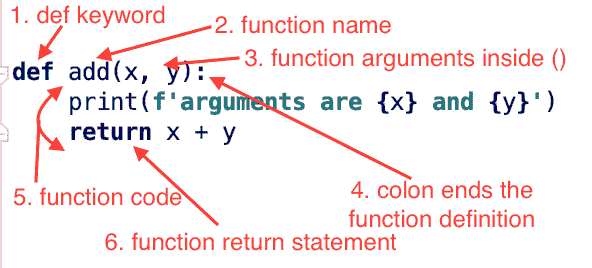

# Python 函数

> 原文：<https://www.askpython.com/python/python-functions>

Python 中的函数是带有名称的代码块。我们可以通过名字调用一个函数，函数块中的代码将被执行。我们不能用 [**保留关键字**](https://www.askpython.com/python/python-keywords) 作为函数名。函数名必须遵循 [**Python 标识符**](https://www.askpython.com/python/python-identifiers-rules-best-practices) 的定义规则。

## 功能参数

我们可以将一些数据传递给函数进行操作，它们被称为函数参数。函数参数由逗号分隔。一个函数中可以有任意数量的参数。

## 从函数返回数据

函数可以向调用程序返回数据。与其他流行的编程语言不同，Python 函数定义不指定返回类型。

* * *

## 使用 def 关键字在 Python 中定义函数

我们可以使用 def 关键字在 Python 中定义一个函数。让我们看几个 Python 中函数的例子。

```py
def hello():
    print('Hello World')

def add(x, y):
    print(f'arguments are {x} and {y}')
    return x + y

```

基于上面的例子，我们可以这样定义一个函数结构。

```py
def function_name(arguments):
    # code statements

```



Python Function Structure

* * *

## 在 Python 中调用函数

我们可以通过函数的名字来调用它。如果函数接受参数，我们必须在调用函数时传递它们。

```py
hello()
sum = add(10, 5)
print(f'sum is {sum}')

```

我们正在调用自己定义的 hello()和 add()函数。我们还调用了 print()函数，它是 Python 中的内置函数之一。

* * *

## Python 函数类型

Python 中有两种类型的函数。

1.  **内置函数**:Python 语言提供的函数如 [print()](https://www.askpython.com/python/built-in-methods/python-print-function) ，len()， [str()](https://www.askpython.com/python/built-in-methods/python-str-function) 等。
2.  **自定义函数**:我们在 Python 程序中定义的函数。

* * *

## Python 函数默认参数

Python 允许函数参数使用默认值。如果调用者没有传递参数，则使用默认值。

```py
def hello(year=2019):
    print(f'Hello World {year}')

hello(2020)  # function parameter is passed
hello()  # function parameter is not passed, so default value will be used

```

**输出:**

```py
Hello World 2020
Hello World 2019

```

* * *

## 函数中的多个 return 语句

一个函数可以有多个 return 语句。但是，当到达其中一个 return 语句时，函数执行终止，值返回给调用者。

```py
def odd_even_checker(i):
    if i % 2 == 0:
        return 'even'
    else:
        return 'odd'

print(odd_even_checker(20))
print(odd_even_checker(15))

```

* * *

## 使用 yield 关键字逐个返回多个值

Python 函数可以逐个返回多个值。它是使用 [yield 关键字](https://www.askpython.com/python/python-yield-examples)实现的。当您希望函数返回大量值并处理它们时，这很有用。我们可以使用 yield 语句将返回值分成多个块。这种功能也被称为**发生器功能**。

```py
def return_odd_ints(i):
    x = 1
    while x <= i:
        yield x
        x += 2

output = return_odd_ints(10)
for out in output:
    print(out)

```

**输出:**

```py
1
3
5
7
9

```

* * *

## Python 函数中的变量参数

Python 允许在函数定义中使用三种类型的参数。

1.  **形式参数**:到目前为止我们在例子中看到的形式参数。
2.  **可变数量的非关键字参数**:例如 def add(*args)
3.  **可变数量的关键字参数或命名参数**:例如 def add(**kwargs)

Python 中变量参数的一些要点如下:

*   参数顺序应该是形式参数，*args 和**kwargs。
*   使用 args 和 kwargs 这样的变量参数名称并不是强制性的。然而，最好的做法是使用它们来提高代码的可读性。
*   args 类型是[元组](https://www.askpython.com/python/tuple/python-tuple)。所以我们可以传递一个元组来映射*args 变量。
*   kwargs 的类型是 [dict](https://www.askpython.com/python/dictionary/python-dictionary-dict-tutorial) 。所以我们可以传递一个字典来映射**kwargs 变量。

下面是一个在函数中使用变量参数的简单例子。

```py
def add(x, y, *args, **kwargs):
    sum = x + y
    for a in args:
        sum += a

    for k, v in kwargs.items():
        sum += v
    return sum

total = add(1, 2, *(3, 4), **{"k1": 5, "k2": 6})
print(total)  # 21

```

* * *

## Python 中的递归函数

当一个函数调用它自己时，它被称为递归函数。这种情况在编程中被称为递归。

使用递归时应该非常小心，因为函数可能永远不会终止，并进入无限循环。下面是一个使用递归打印斐波那契数列的简单例子。

```py
def fibonacci_numbers_at_index(count):
    if count <= 1:
        return count
    else:
        return fibonacci_numbers_at_index(count - 1) + fibonacci_numbers_at_index(count - 2)

count = 5
i = 1
while i <= count:
    print(fibonacci_numbers_at_index(i))
    i += 1

```

了解递归是很好的，但是大多数时候你在编程中并不需要它。您可以使用 for-loop 或 while-loop 执行相同的操作。

* * *

## 函数的数据类型

Python 函数是“函数”类的实例。我们可以使用 [type()函数](https://www.askpython.com/python/built-in-methods/python-type-function)来检查这一点。

```py
def foo():
    pass

print(type(foo))

```

**输出** : <类‘功能’>

* * *

## Python 中的函数与方法

*   Python 函数是定义它的 python 脚本文件的一部分，而方法是在类定义中定义的。
*   如果函数在同一个模块中，我们可以直接调用它。如果函数是在不同的模块中定义的，我们可以导入模块，然后直接调用函数。我们需要一个类或该类的一个对象来调用这些方法。
*   Python 函数可以访问所有全局变量，而 [Python 类](https://www.askpython.com/python/oops/python-classes-objects)方法可以访问全局变量以及类属性和函数。
*   Python 函数的数据类型是“函数”，而 Python 方法的数据类型是“方法”。

让我们看一个 Python 中函数和方法的简单例子。

```py
class Data:
    def foo(self):
        print('foo method')

def foo():
    print('foo function')

# calling a function
foo()

# calling a method
d = Data()
d.foo()

# checking data types
print(type(foo))
print(type(d.foo))

```

**输出:**

```py
foo function
foo method
<class 'function'>
<class 'method'>

```

* * *

## Python 函数的优势

*   代码可重用性，因为我们可以多次调用同一个函数
*   模块化代码，因为我们可以为不同的任务定义不同的功能
*   提高代码的可维护性
*   抽象，因为调用者不需要知道函数的实现

* * *

## Python 中的匿名函数

匿名函数没有名字。我们可以使用 [lambda 关键字](https://www.askpython.com/python/python-lambda-anonymous-function)在 Python 中定义一个匿名函数。

```py
def square(x):
    return x * x

f_square = lambda x: x * x

print(square(10))  # 100
print(f_square(10))  # 100

```

* * *

## 结论

函数是编程语言的重要组成部分。使用 def 关键字定义 Python 函数。在一个 Python 函数中，我们可以有可变数量的参数。Python 也支持匿名函数。它们可以返回单个值，也可以一个接一个地产生多个值。

## 下一步是什么？

*   [Python 中的循环](https://www.askpython.com/python/python-loops-in-python)
*   [Python 初学者课程](https://www.askpython.com/python-course-for-beginners)
*   [Python 中的列表](https://www.askpython.com/python/list/python-list)
*   [Python 中的 OOPS](https://www.askpython.com/python/oops/object-oriented-programming-python)
*   [Python 主函数](https://www.askpython.com/python/python-main-function)

## 资源

*   [递归维基百科](https://en.wikipedia.org/wiki/Recursion_(computer_science))
*   [Python.org 文件](https://docs.python.org/3/tutorial/controlflow.html#defining-functions)