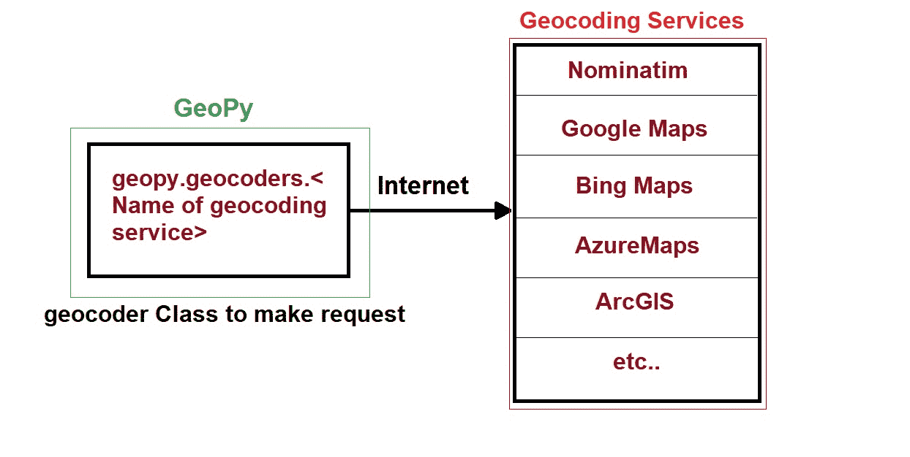
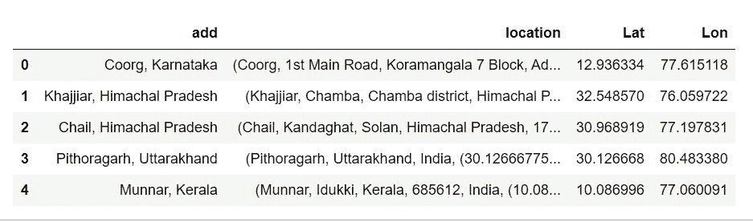

# Python Geopy 用于查找地址的地理编码

> 原文：<https://www.askpython.com/python/python-geopy-to-find-geocode-of-an-address>

地球表面的每个点都可以用它的纬度和经度值来表示。

根据[维基百科](https://en.wikipedia.org/wiki/Geocoding)，“地理编码是将邮政地址描述转换为地球表面位置(以数字坐标表示的空间)的计算过程。”

如果简单放在一起，将文本地址表示为其在地球表面对应的经纬度的过程称为**地理编码**。

在本文中，我们将使用 Python 的 GeoPy 库检索地址的地理编码。

## 地质公园

GeoPy 不是一个地理编码服务，而只是几个流行的地理编码 web 服务的 python 客户端。它使用第三方地理编码器和其他数据源来查找地址的地理编码。

下图给出了 GeoPy 功能的一些概念。



Geopy

如上图所示，地理编码由多种不同的服务提供。这些服务提供 API，GeoPy 库在单个包中提供这些 API 的实现。有关 geopy 实现的地理编码服务提供商的完整列表，您可以参考[本文档](https://geopy.readthedocs.io/en/latest/#geocoders)。

需要考虑的一些要点:

*   地理编码服务要么是付费的，要么是免费的，因此在选择服务之前，请仔细阅读其使用条款、配额、价格、地理数据库等。
*   geopy 不对您的计算机和地理编码服务之间的任何网络问题负责。

了解了 GeoPy 的功能后，现在让我们看看如何使用它来检索地址的地理编码。

## 地理编码服务

有许多可用的地理编码服务，但我真的很喜欢 GeocodeAPI。它们有多个端点，可以从地址获取经纬度并进行反向地理编码。它们的高级特性之一是地址自动完成 API。

它们甚至可以从部分地址返回完整的地址。此外，他们每天提供 10，000 个免费请求，如果您刚刚开始构建您的应用程序，这是非常好的。你可以从他们的定价页面了解更多详情。

## 使用 GeoPy 进行地理编码

每个地理定位服务，即 nomim，在`geopy.geocoders`中都有自己的类，链接到服务的 API。地理编码器至少有一个`geocode`方法，用于从提供的字符串(我们想要进行地理编码的地址)中查找坐标。

这个类还有一个`reverse`方法的实现，与 geocode 方法相反。这里我们需要提供地球表面上一个点的坐标，该方法返回与所提供的纬度和经度相关联的地址。

### 1.查找地址的地理编码

在本教程中，我们将使用 nomim 地理编码服务。

```py
#Importing the Nominatim geocoder class 
from geopy.geocoders import Nominatim

#address we need to geocode
loc = 'Taj Mahal, Agra, Uttar Pradesh 282001'

#making an instance of Nominatim class
geolocator = Nominatim(user_agent="my_request")

#applying geocode method to get the location
location = geolocator.geocode(loc)

#printing address and coordinates
print(location.address)
print((location.latitude, location.longitude))

```

```py
Output:
Taj Mahal, Taj Mahal Internal Path, Taj Ganj, Agra, Uttar Pradesh, 282001, India
(27.1750123, 78.04209683661315)
```

使用上面的代码，我们找到了印度阿格拉泰姬陵的坐标。

Nominatim 类有一个`geocode`方法，它接受一个地址字符串，并从服务提供商的数据库中返回它的坐标。使用 geocode 方法返回的对象有一个返回完整地址的`address`方法，一个检索该地址的纬度和经度的`latitude`，`londitude`方法。

Nominatim geocoder 类接受`user_agent`作为输入参数，作为向 geocoder API 发送请求的头。

### 2.使用 GeoPy 和 Pandas 数据框架

`RateLimiter`类充当了 geocoder 类的包装器，如果我们必须处理许多请求，我们可以用它来延迟向服务器发出请求的时间。

在发出多个请求时，需要考虑向地理编码服务提供商发出的请求的数量，否则会引发错误。

现在让我们把它应用到一个熊猫数据帧上，这个数据帧有印度一些美丽的自然景点的地址。

```py
#Importing the required modules
import pandas as pd
from geopy.geocoders import Nominatim
from geopy.extra.rate_limiter import RateLimiter

#Creating a dataframe with address of locations we want to reterive
locat = ['Coorg, Karnataka' , 'Khajjiar, Himachal Pradesh',\
         'Chail, Himachal Pradesh' , 'Pithoragarh, Uttarakhand','Munnar, Kerala']
df = pd.DataFrame({'add': locat})

#Creating an instance of Nominatim Class
geolocator = Nominatim(user_agent="my_request")

#applying the rate limiter wrapper
geocode = RateLimiter(geolocator.geocode, min_delay_seconds=1)

#Applying the method to pandas DataFrame
df['location'] = df['add'].apply(geocode)
df['Lat'] = df['location'].apply(lambda x: x.latitude if x else None)
df['Lon'] = df['location'].apply(lambda x: x.longitude if x else None)

df

```



DataFrame With Coordinates

`RateLimiter`类需要一个`geocoder`类对象和`min_delay_seconds`作为输入参数。此方法以指定的时间延迟向地理编码服务的服务器发出请求。如果没有找到字符串的位置，它会自动返回 None。

和熊猫一起。我们可以将包装器应用到数据帧上的指定列。

## 结论

在本文中，我们了解了什么是地理编码，以及 python 的 GeoPy 库如何为我们提供地理编码服务 API 的简单实现。我们还对一个文本格式的地址进行了地理编码，以获得其纬度和经度坐标，并将该方法应用于一个包含一列地址的熊猫数据帧。

快乐学习！