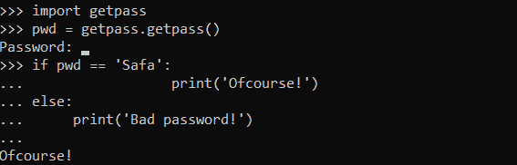

# Python getpass 模块

> 原文：<https://www.askpython.com/python-modules/python-getpass-module>

Python `**getpass**`模块能够提示用户输入密码，而不在屏幕上显示。因此，它将定制用户的体验。

它提供了一种从命令提示符获取密码的安全且独立的方法。

## Python getpass 模块示例

**导入:**

```py
import getpass
```

**语法:**

```py
getpass.getpass([prompt[, stream]])
```

**简单的例子:**

```py
import getpass

try:
    pass_word = getpass.getpass()
except Exception as E:
    print('There is an Error : ', E)
else:
    print('Password fetched from command prompt :', pass_word)

```

**输出:**

```py
Password: Safa
Password fetched from command prompt : Safa
```

* * *

### 1.不带提示的 getpass 模块


Getpass Module

* * *

### 2.带有自定义提示的 getpass 模块

```py
import getpass

place = getpass.getpass(prompt = 'Which is your favorite place to go?')
if place == 'Satara':
    print('Ofcourse!')
else:
    print('Where is that?')

```

**输出:**

```py
Which is your favorite place to go?
Ofcourse!
```



Getpass Module With Custom Prompt

* * *

### 3.其他流的 getpass 模块

```py
import getpass
import sys

pass_word = getpass.getpass(stream=sys.stderr)
print('Entered password:', pass_word)

```

**输出:**

```py
Password:
Entered password: Safa
```


Getpass Module With Other Stream

* * *

### 4.getpass(参数)函数

`**getpass(argument)**`函数使我们能够在命令提示符下打印提示字符串。

如果省略该参数，它将打印“Password:”。

```py
import getpass

user = getpass.getuser()

pass_word = getpass.getpass("User's password %s: " % user)

print(user, pass_word)

```

**输出:**

```py
User's password HP:
HP safa
```

* * *

### 5.getuser()函数

`**getuser()**`函数基本返回用户/系统对应的登录名。

```py
getpass.getuser()

```

**输出:**

```py
HP
```

* * *

## 结论

因此，在本文中，我们研究并实现了 Python 中的 getpass 模块。

* * *

## 参考

*   Python getpass 模块
*   [getpass 文档](https://docs.python.org/3.8/library/getpass.html)