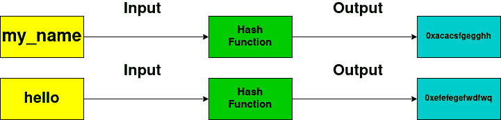

# Python hashlib 模块

> 原文：<https://www.askpython.com/python-modules/python-hashlib-module>

Python **hashlib** 模块是一个用于轻松散列消息的接口。它包含许多方法，可以处理加密格式的任何原始消息的散列。

这个模块的核心目的是在一个字符串上使用一个哈希函数，并对它进行加密，使它很难被解密。

通常，加密字符串足够长，以至于几乎不可能恢复原始字符串。

下面的框图显示了我们如何在我们的应用程序中安全地存储密码！



Hash Function

请注意，哈希函数确保哈希输出的长度保持不变，并且远大于输入字符串的长度。所以，这使得使用暴力破解这样的散列变得非常困难。

介绍完这个概念后，现在让我们来看看如何使用这个模块！

* * *

## Python hashlib

我们需要导入这个模块，它直接来自 Python 安装。

```py
import hashlib

```

有不同的散列算法可用，通过这些算法我们可以加密我们的字符串。让我们看看有哪些可用的。

```py
import hashlib

print(hashlib.algorithms_available)
print(hashlib.algorithms_guaranteed)

```

`algorithms_available`属性打印系统中使用的每个算法，包括其他程序，如`ssh`和`OpenSSL`。

`algorithms_guaranteed`属性列出了模块中的所有算法。

所以对于我(Linux 系统)来说，我的输出看起来是这样的。如果您使用的是 Windows/macOS，您的输出可能会略有不同。

```py
{'whirlpool', 'sha3-224', 'sha3-256', 'sha512-224', 'sha3-384', 'sha384', 'shake256', 'sha1', 'md5-sha1', 'md5', 'md4', 'mdc2', 'blake2b512', 'blake2s256', 'sha3_512', 'sha512-256', 'blake2s', 'ripemd160', 'sha3_384', 'shake128', 'shake_128', 'blake2b', 'sha512', 'sha3_224', 'shake_256', 'sha256', 'sha3_256', 'sha3-512', 'sha224', 'sm3'}
{'blake2b', 'md5', 'sha512', 'blake2s', 'sha3_224', 'shake_256', 'sha256', 'sha3_256', 'sha384', 'sha3_384', 'sha224', 'sha1', 'shake_128', 'sha3_512'}

```

现在让我们继续加密字符串！

* * *

## 使用 Python hashlib 加密字符串

我们不能直接将字符串传递给哈希函数。这是因为它只接受一个字节列表，所以我们必须[把我们的字符串转换成一个**字节的字符串**](https://www.askpython.com/python/string/python-string-functions) ，然后只传入一个哈希函数。

对于本文，我们将使用 **[SHA-256](https://en.bitcoinwiki.org/wiki/SHA-256)** 算法，它给出 256 位的散列。

```py
import hashlib
# Initialize the empty message using SHA-256
message = hashlib.sha256()

# Update the message using byte strings
message.update(b'Hello there,')
message.update(b'how are you?')

# Print the message digest
print(message.digest())

```

**输出**

```py
b',\xe1\xff7\xe7\xa0\xe7\xb2\xb4\xf9E!\xf2\xd9\xb8;\xdf\x7f\x10\xa8\x1ad1\xc0\x7f=\xbb\xb1\xf7\xeb7\xcf'

```

我们使用`message.digest()`从消息对象中获取散列字符串。

对于非字节字符串，`message.update()`方法不能使用**而不是**，所以如果你没有直接传递它，你需要使用`string.encode()`对它进行编码。

```py
import hashlib

def hash_string(input):
    byte_input = input.encode()
    hash_object = hashlib.sha256(byte_input)
    return hash_object

def update_hash(hash_object, input_str):
    # Adds the string to the hash string
    hash_object.update(input_str.encode())

hash_object = hash_string('Hello from AskPython')

# Print the encrypted message
print(hash_object.hexdigest())

# Update the hash message
update_hash(hash_object, 'hello, how are you?')

# Print the encrypted message
print('After updating:', hash_object.hexdigest())

new_str = 'Hello from AskPythonhello, how are you?'
print(hash_string(new_str).hexdigest() == hash_object.hexdigest())

```

**输出**

```py
e0a59a3889b1db4cc27f4fcc03353bf1db55114add1112f95532794fd392b202
After updating: 32f9cffab10b7bfef72892d5059de865914319a05bdf394b18d7b068fd806a0a
True

```

我们已经成功地将我们的字符串传递到 hash 函数中以获得一个加密的 hash，并相应地更新它！

您现在可以将其扩展到不同的哈希算法，这些算法在[文档](https://docs.python.org/3/library/hashlib.html)中给出。在不久的将来，我们将向您展示一步一步的过程来实现一个好的散列函数，使用这个模块作为构建块。收听更多更新！

* * *

## 结论

在本文中，我们学习了 Python `hashlib`模块，使用不同的散列函数加密字符串。

## 参考

*   [Python Hashlib 模块文档](https://docs.python.org/3/library/hashlib.html)
*   hashlib 上的 JournalDev 文章

* * *