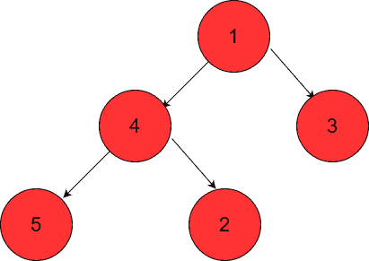
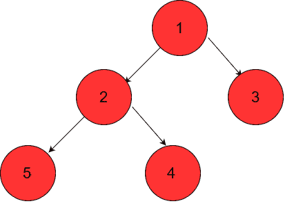

# Python heapq 模块:使用 heapq 在 Python 中构建优先级队列

> 原文：<https://www.askpython.com/python-modules/python-heapq-module>

大家好！在今天的文章中，我们将学习如何使用 Python heapq 模块。

这个模块为我们提供了一种快速简单的方法来为您的应用程序构建任何类型的优先级队列。

为了更好地了解这个模块，让我们仔细看看。

## 作为最小堆的优先级队列

优先级队列是这样一种队列，其中的元素具有另一个称为优先级的参数。基于元素的优先级，这些元素首先被推出/弹出队列。

该模块利用二进制最小堆来构建优先级队列。

这种堆队列数据结构的主要特性是总是首先弹出最小的元素！

此外，一旦任何元素被推/弹出，相同类型的结构被保持。

这种数据结构有大量的应用，包括排序。

让我们了解一下现在如何使用这个模块。

## 了解 Python heapq 模块

这个模块是标准库的一部分，所以没有必要使用 [pip](https://www.askpython.com/python-modules/python-pip) 单独安装它。

要导入 heapq 模块，我们可以执行以下操作:

```py
import heapq

```

在`heapq`模块中，我们主要需要 3 种方法来构建和操作我们的优先级队列:

*   `heappush(heap, item)` - >将`item`推到`heap`上，保持最小堆属性。
*   `heappop(heap)` - >弹出并返回堆中最小的项目。如果堆是空的，我们将得到一个`IndexError` [异常](https://www.askpython.com/python/python-exception-handling)。
*   `heapify(iterable)` - >将 iterable(列表等)转换为最小堆。这将就地修改可迭代的

让我们举一个简单的例子，从一个普通的整数列表构建优先级队列。

```py
import heapq

a = [1, 4, 3, 5, 2]

print("List =", a)

# Convert the iterable (list) into a min-heap in-place
heapq.heapify(a)

print("Min Heap =", a)

```

**输出**

```py
List = [1, 4, 3, 5, 2]
Min Heap = [1, 2, 3, 5, 4]

```

如您所见，`heapify()`方法就地修改了列表，并将其转换为最小堆。

要观察它为什么是一个最小堆，只需画出这两个列表的树形表示。



Old List – Tree Representation

对于来自列表的最小堆表示，对于具有索引`i`的节点，其子节点具有索引`2*i`和`2*i+1`。

对于最小堆，父堆必须小于它的两个子堆！



Min Heap Flow

如您所见，第二个列表确实遵循了我们的 min-heap 属性！因此，我们已经验证了`heapify()`方法给了我们正确的最小堆。

我们现在将向/从我们的堆中推进和弹出。

```py
import heapq

a = [1, 4, 3, 5, 2]

print("List =", a)

# Convert the iterable (list) into a min-heap in-place
heapq.heapify(a)

print("Min Heap =", a)

# Use heappush
heapq.heappush(a, 10)

print("After heappush(), Min Heap =", a)

# Use array indexing to get the smallest element
print(f"Smallest element in the heap queue = {a[0]}")

# Use heappop() and return the popped element
popped_element = heapq.heappop(a)

print(f"Popped element = {popped_element}, Min Heap = {a}")

```

**输出**

```py
List = [1, 4, 3, 5, 2]
Min Heap = [1, 2, 3, 5, 4]
After heappush(), Min Heap = [1, 2, 3, 5, 4, 10]
Smallest element in the heap queue = 1
Popped element = 1, Min Heap = [2, 4, 3, 5, 10]

```

如您所见，我们能够轻松地在这个堆队列上执行我们想要的操作！现在让我们看看如何使用这个最小堆来使用 heapsort 对我们的列表进行排序。

```py
import heapq

def heapsort(iterable):
    h = []
    for value in iterable:
        # Push the elements onto the heap
        heapq.heappush(h, value)
    # Keep popping the smallest elements and appending them to our sorted list
    return [heapq.heappop(h) for i in range(len(h))]

sorted_list = heapsort([1, 3, 5, 7, 9, 2, 4, 6, 8, 0])
print(sorted_list)

```

**输出**

```py
[0, 1, 2, 3, 4, 5, 6, 7, 8, 9]

```

太好了！事实上，我们已经使用堆队列属性对列表进行了排序！

* * *

## 结论

在本文中，我们学习了如何使用 Python heapq 模块，并了解了如何使用 min-heap 属性对无序列表进行排序。

## 参考

*   heapq 模块上的 [Python 文档](https://docs.python.org/3/library/heapq.html)

* * *