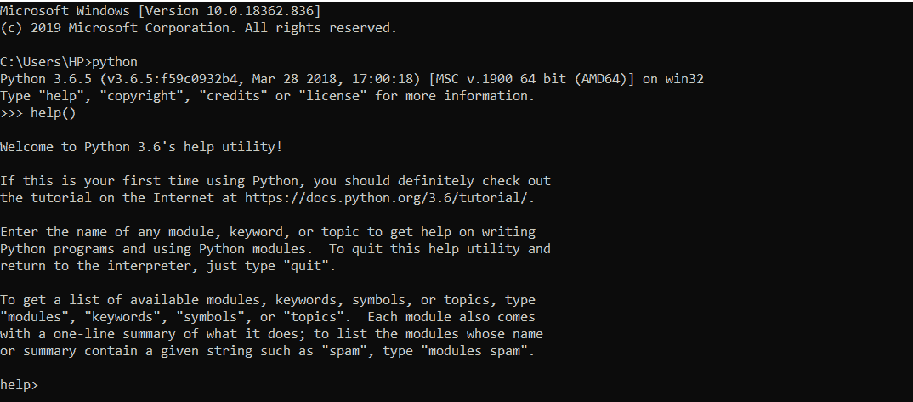
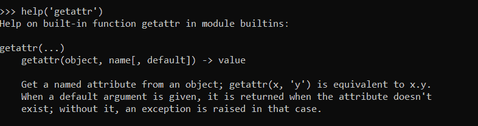
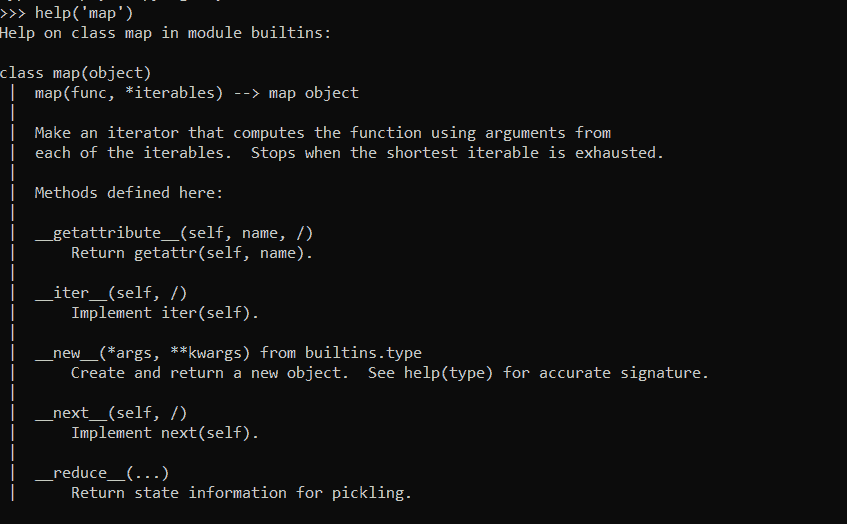
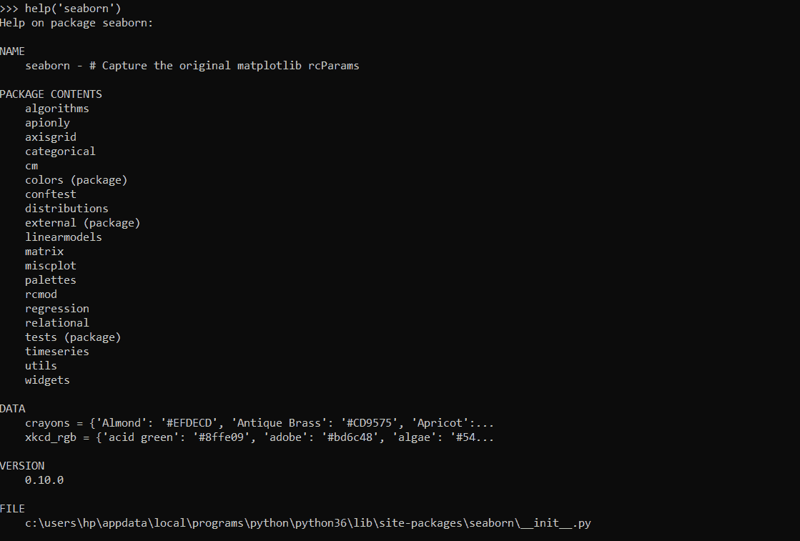
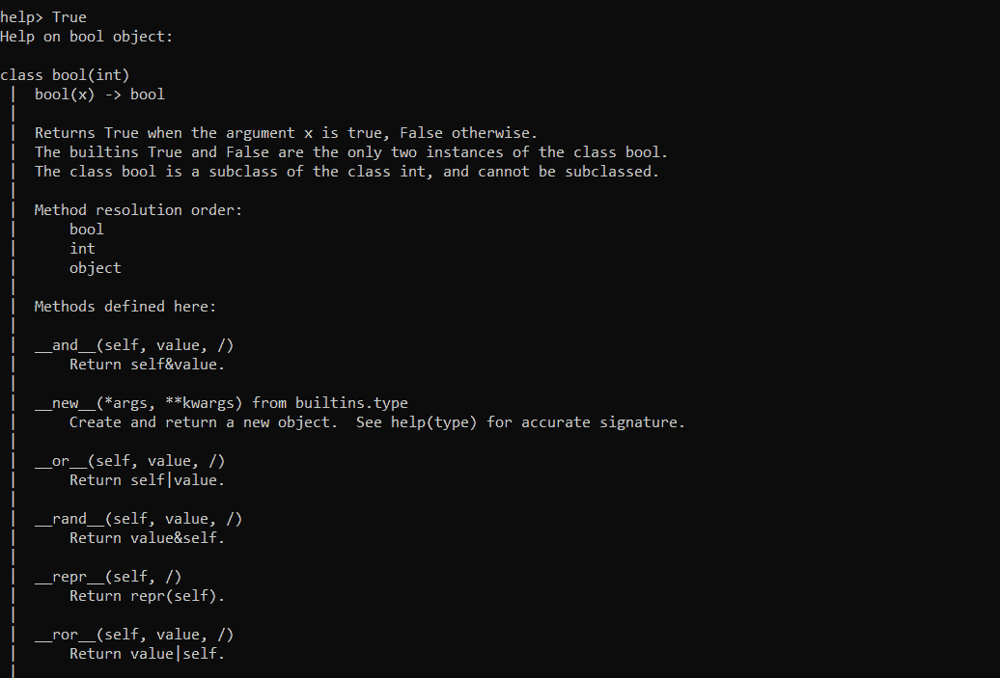
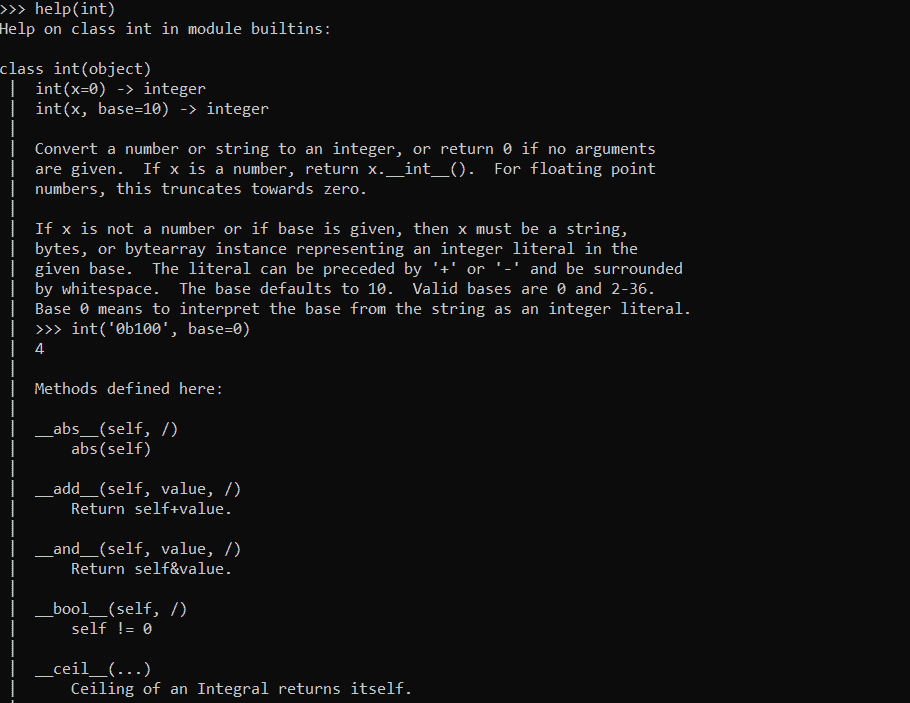

# Python help()方法

> 原文：<https://www.askpython.com/python/built-in-methods/python-help-method>

嘿，伙计们！在本文中，我们将关注 Python 中一个重要的解释性函数— **Python help()函数**。

* * *

## 需要 help()方法

在用特定的编程语言编码时，了解框架语言的基本文档对我们来说是非常重要的。这就是 help()函数发挥作用的时候了。

这个函数为我们提供了 [Python](https://www.askpython.com/python) 语言的基本文档。它为我们提供了与特定方法或类相关的方法和实例的信息。

help()方法与关键字、类、函数和模块一起工作，帮助我们分别获得基本术语、实例和与之相关的工作。

通常`help() method`与 **Python 解释器**一起使用，以获得作为参数传递给它的 Python 对象的底层细节。

* * *

## Python help()方法的工作原理

如上所述，help()方法提供关于传递给它的 Python 对象的信息。

如果在没有任何参数的情况下提及 `help() function`，它将启动解释器控制台，在这里我们可以提及任何**模块**、**对象**、**类**等到 ***利用文档*** 大致相同。

**举例:**

```py
help()

```

**输出:**



**help() function**

* * *

### 带类的 Python help()函数

帮助功能可以提供定制或预定义的参数来使用。我们可以创建一个定制的类，并将其传递给 help()函数，以检查该函数提供的文档。

**举例:**

```py
class Info:
    lang = "Python"
    name = "JournalDev"
obj = Info()
help(Info)

```

我们已经创建了一个用户定义的类，并将其传递给 help()函数。help()函数返回了类“Info”的必要文档。

**输出:**

```py
Help on class Info in module __main__:

class Info(builtins.object)
 |  Data descriptors defined here:
 |  
 |  __dict__
 |      dictionary for instance variables (if defined)
 |  
 |  __weakref__
 |      list of weak references to the object (if defined)
 |  
 |  ----------------------------------------------------------------------
 |  Data and other attributes defined here:
 |  
 |  lang = 'Python'
 |  
 |  name = 'JournalDev'

```

* * *

### 带函数的 Python help()函数

help()函数帮助我们访问语法、参数列表以及使用下面的命令传递给它的任何函数的描述。

**语法:**

```py
help('function-name')

```

**例 1:**

```py
help('getattr')

```

**输出:**



**help() With Function getattr()**

**例 2:**

```py
help('map')

```

**输出:**



**help() With Function map()**

* * *

### 带模块的 Python help()函数

我们可以使用 help()函数获得关于模块的信息。当一个模块被传递给 help()函数时，它提供关于版本、文件位置、模块内容以及相关数据的文档。

**语法:**

```py
help('module-name')

```

**举例:**

```py
help('seaborn')

```

**输出:**



**Help on Module Seaborn**

* * *

### 带有关键字的 help()函数

在将 Python 关键字作为参数传递给 help()函数时，该函数根据关键字的类、与其相关联的方法等返回文档。

**语法:**

```py
help('keyword-name')

```

**例 1:**

```py
help(True)

```

**输出:**



**help() function With Keyword True**

**例 2:**

```py
help(int)

```

**输出:**



**help() Function With Keyword int**

* * *

## 结论

这个话题到此结束。我们已经了解了 help()函数的需求和工作方式。我希望所有的读者都清楚这个概念。

如果你有任何疑问，请不吝赐教。

* * *

## 参考

*   help()方法— JournalDev
*   [关于 help()方法的文档](https://docs.python.org/3/library/functions.html#help)