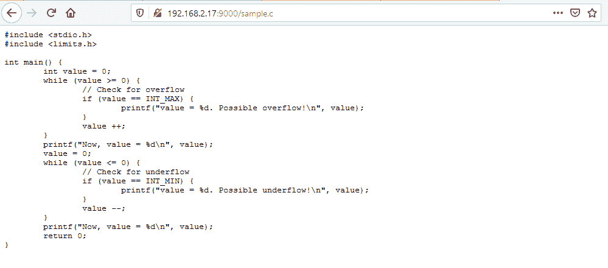

# 使用 Python HttpServer 作为简单的 HTTP 服务器

> 原文：<https://www.askpython.com/python-modules/python-httpserver>

大家好！在今天的文章中，我们将看看如何使用 Python HttpServer。

这个模块是在您的网络上启动本地 Http 服务器的一个非常快速简单的方法。

此前，在 Python 2.7 中，这个模块被称为`HttpServer`。但是在 Python3 中，这个模块已经合并到了`http.server`模块中。

让我们开始吧，运行我们自己的 Http 服务器！

* * *

## 导入 Python httpserver 模块

这个模块是标准库的一部分，所以没有必要安装它！

要导入这个模块，只需使用下面的语句:

```py
import http.server

```

现在您已经准备好运行服务器了。现在让我们编写一些代码来服务这些文件。

## 运行我们的 Http 服务器

如果您只是想与其他用户共享您的文件和目录，您可以使用 Python 直接运行服务器。

转到您希望共享的任何目录，并从那里运行服务器，使用:

```py
python -m http.server 9000

```

这里，我们在端口 9000 启动本地 Http 服务器。

## 连接到 Http 服务器

现在，要连接到本地服务器，您必须执行以下步骤:

1.  转到服务器，使用 Windows 上的`arp -a`或 Linux 上的`ip -a | grep inet`找到服务器 IP 地址。
2.  从远程客户端，只需在浏览器上输入`http://IP_ADDRESS:9000/`就能看到神奇之处！

**输出**


Http Server Basic

请注意，您可以查看服务器文件，甚至可以将其下载到客户机上！



Python Http Server File

* * *

## 运行提供自定义 index.html 文件的 Python HttpServer

虽然默认服务器便于直接共享文件，但您可以通过运行单独的文件来自定义服务器的行为。

例如，我们将运行一个定制的 Http 服务器，它使用`http.server`和`socketserver`进行 TCP 通信。

MyHttpRequestHandler 调用 do_GET()方法来服务请求。要为请求提供定制文件，我们可以通过简单地定义另一个返回不同值的 do_GET()方法来覆盖函数。

```py
# server.py
import http.server # Our http server handler for http requests
import socketserver # Establish the TCP Socket connections

PORT = 9000

class MyHttpRequestHandler(http.server.SimpleHTTPRequestHandler):
    def do_GET(self):
        self.path = 'index.html'
        return http.server.SimpleHTTPRequestHandler.do_GET(self)

Handler = MyHttpRequestHandler

with socketserver.TCPServer(("", PORT), Handler) as httpd:
    print("Http Server Serving at port", PORT)
    httpd.serve_forever()

```

如果您将此称为`server.py`，您可以使用以下命令运行 http 服务器:

```py
python server.py

```


Custom Homepage for Python http server

因为我们定义了自定义的 do_GET()函数，所以我们可以使用我们的服务器(在本例中是 index.html)来提供一个主页 HTML 文件。另外，如果服务器正在您的系统上运行，您可以使用`localhost:<portnumber>`直接访问服务器，而不是使用 IP。

* * *

## 结论

在本文中，我们学习了如何使用`http.server`模块在 Python 中建立一个简单的 Http 服务器。我们还学习了如何定义 do_GET()方法，以便在向服务器发出请求时提供定制文件。

## 参考

*   Http 服务器上的 [Python 文档](https://docs.python.org/3/library/http.server.html)

* * *