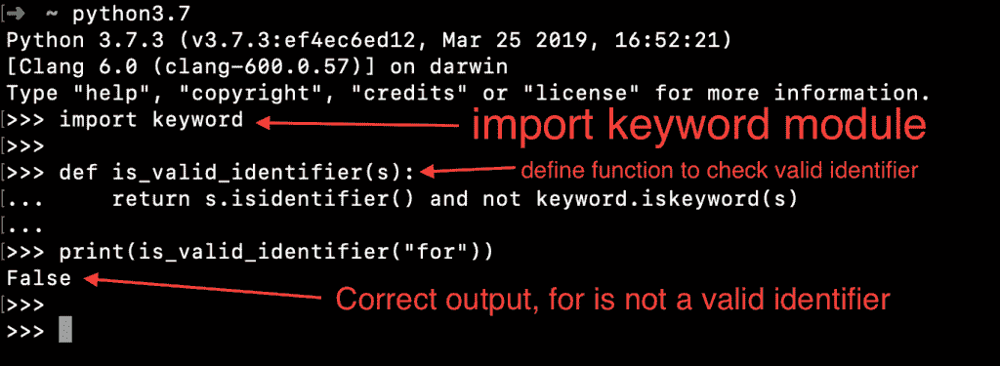

# Python 标识符–规则、示例、最佳实践

> 原文：<https://www.askpython.com/python/python-identifiers-rules-best-practices>

Python 标识符是用户定义的名称。它们用于指定变量、函数、类、模块等的名称。

* * *

## 创建 Python 标识符的规则

创建 python 标识符必须遵循一些规则。

*   不能使用保留的 [**关键字**](https://www.askpython.com/python/python-keywords) 作为标识符名称。如果你尝试，它会抛出**语法错误**。
*   Python 标识符可以包含小写字母(a-z)、大写字母(A-Z)、数字(0-9)和下划线(_)。
*   标识符名称不能以数字开头。例如，10test 将是一个无效的标识符。
*   Python 标识符不能只包含数字。例如，888 可能是无效的标识符。
*   Python 标识符名称可以以下划线开头。所以,_test 是一个有效的标识符。
*   标识符名称的长度没有限制。但是，不要试图保留一个超长的标识符，这只会伤害你作为程序员的信誉。
*   Python 标识符名称区分大小写。所以，“abc”和“ABC”是两个不同的标识符。为了程序的一致性，最好使用小写的标识符。

* * *

## Python 有效标识符示例

让我们看一些 Python 中有效标识符的例子。

*   **ab10c** :仅包含字母和数字
*   **abc_DE** :包含所有有效字符
*   令人惊讶的是，下划线是一个有效的标识符
*   **_abc** :标识符可以以下划线开头

* * *

## Python 无效标识符示例

*   **99** :标识符不能只有数字
*   **9abc** :标识符不能以数字开头
*   **x+y** :唯一允许的特殊字符是下划线
*   的**:保留关键字**

* * *

## 如何测试一个字符串是否是有效的标识符？

我们可以使用字符串`isidentifier()`函数来检查标识符名称是否有效。但是，这种方法不考虑保留的关键字。所以，我们可以使用这个函数和`keyword.iskeyword()`来检查名字是否有效。

```py
print("abc".isidentifier())  # True
print("99a".isidentifier())  # False
print("_".isidentifier())  # True
print("for".isidentifier())  # True - wrong output

```

我们知道“for”是一个保留关键字。所以它不是一个有效的标识符。让我们定义一个函数来测试标识符名称是否有效。

```py
def is_valid_identifier(s):
    return s.isidentifier() and not keyword.iskeyword(s)

print(is_valid_identifier("for"))  # False

```



Python Identifiers

* * *

## Python 标识符命名最佳实践

*   类名应该以大写字母开头。比如`Person`、`Employee`等。
*   如果类名有多个单词，每个单词的第一个字符使用大写。比如`EmployeeData`、`StringUtils`等。
*   变量、函数和模块名应该用小写字母。比如`collections`、`foo()`等。
*   如果变量、函数和模块名有多个单词，那么用下划线将它们分开。比如`is_empty()`、`employee_object`等。
*   对于私有变量，可以用下划线开始它们的名字。
*   避免使用下划线作为标识符名称的第一个和最后一个字符。它由 python 内置类型使用。
*   如果标识符以两个下划线开始和结束，那么这意味着标识符是一个语言定义的特殊名称，比如 __init__。因此，您应该避免在标识符名称的开头和结尾使用两个下划线。
*   保持标识符名称有意义，以阐明其意图。比如 phone_number，is _ 大写等。
*   如果一个函数返回一个布尔值，它的名字最好以“is”开头。比如`isidentifier`、`iskeyword`等。
*   标识符名称的长度没有限制。但是，保持它的短小精悍。例如，**_ employee _ object _ first _ name**可以更好地命名为 **emp_first_name** 。

* * *

## 摘要

Python 中的标识符是用户定义的名称。它们用于定义 python 程序中的实体。我们应该使用专有名词来暗示标识符的用法。遵循规则来“**保持简单而有意义**”。

## 下一步是什么？

*   [Python 语句](https://www.askpython.com/python/python-statements)
*   [Python 数据类型](https://www.askpython.com/python/python-data-types)
*   [Python 函数](https://www.askpython.com/python/python-functions)
*   [Python 包](https://www.askpython.com/python/python-packages)
*   [Python 中的循环](https://www.askpython.com/python/python-loops-in-python)

## 参考资料:

*   [Python.org 文档](https://docs.python.org/3/reference/lexical_analysis.html#identifiers)