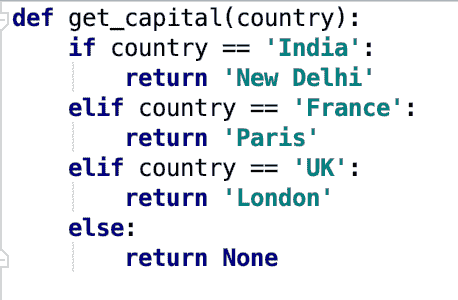
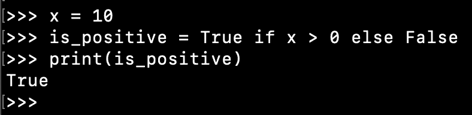

# Python if else elif 语句

> 原文：<https://www.askpython.com/python/python-if-else-elif-statement>

*   Python if-elif-else 语句用于编写条件流代码。
*   语句的顺序是 if…elif…else。
*   “elif”是“else if”语句的缩写。缩短是为了减少过多的 [**缩进**](https://www.askpython.com/python/python-indentation) 。
*   else 和 elif 语句是可选的。
*   可以有多个 elif 语句。
*   一个 if 语句只能有一个 else 块。
*   if、else、elif 是 Python 中的 **[保留关键字。](https://www.askpython.com/python/python-keywords)**
*   Python 不像其他语言那样有 switch-case 语句。if-else 条件足以在 Python 脚本中实现控制流。
*   我们可以在 Python 中嵌套 if-else 块。
*   Python 三元运算允许我们在一行中编写一个 if-else 语句。当 if-else 条件很简单并且我们想要减少代码长度时，这很有用。

* * *

## Python if else 语法

Python 中 if-else 语句的一般语法是:

```py
if condition:
    # code
elif condition:
    # code
... # multiple elif statements
else:
    # default code

```

1.  每个 if-elif 语句后面都有一个条件。
2.  如果条件评估为**真**，则执行该块中的代码。
3.  一旦执行了任何块中的代码，控制流就会移出 if-elif-else 块。
4.  如果没有一个条件为真，则执行 else 块代码。

* * *

## Python if-elif-else 示例

假设我们有一个 [**函数**](https://www.askpython.com/python/python-functions) ，它接受一个国家名称并返回其首都。我们可以使用 if-else 条件来实现这个逻辑。

```py
def get_capital(country):
    if country == 'India':
        return 'New Delhi'
    elif country == 'France':
        return 'Paris'
    elif country == 'UK':
        return 'London'
    else:
        return None

```



Python if else elif Example

前面我们提到 elif 语句是可选的。让我们看另一个简单的例子，我们没有 elif 语句。

```py
def is_positive(num):
    if num >= 0:
        return 'Positive'
    else:
        return 'Negative'

```

甚至 else 块也是可选的。让我们看另一个例子，我们只有如果条件。

```py
def process_string(s):
    if type(s) is not str:
        print('not string')
        return
    # code to process the input string

```

如果你想知道空的 **[返回语句](https://www.askpython.com/python/python-return-statement)** 是怎么回事，它会向调用者返回 **None** 。

* * *

## Python if-else 在一行中

假设我们有这样一个简单的 if-else 条件:

```py
x = 10

if x > 0:
    is_positive = True
else:
    is_positive = False

```

我们可以使用 Python 三元运算在一行中移动完整的 if-else 块。

三元运算的语法是:

```py
value_true if condition else value_false

```

让我们用一行代码重写上面的 if-else 块。

```py
is_positive = True if x > 0 else False

```



Python if else One Line

* * *

## 嵌套 if-else 条件

我们可以有多个嵌套的 if-else 条件。请小心缩进，否则可能会出现意想不到的结果。

让我们看一个长示例，它包含多个 if-else-elif 条件，并嵌套创建了一个智能数字处理脚本。

```py
# accepting user input
x = input('Please enter an integer:\n')

# convert str to int
x = int(x)

print(f'You entered {x}')

if x > 0:
    print("It's a positive number")
    if x % 2 == 0:
        print("It's also an even number")
        if x >= 10:
            print("The number has multiple digits")
    else:
        print("It's an odd number")
elif x == 0:
    print("Lovely choice, 0 is the master of all digits.")
else:
    print("It's a negative number")
    if x % 3 == 0:
        print("This number is divided by 3")
    if x % 2 == 0:
        print("And it's an even number")
    else:
        print("And it's an odd number")

```

以下是该代码多次迭代的示例输出。

```py
Please enter an integer:
10
You entered 10
It's a positive number
It's also an even number
The number has multiple digits

Please enter an integer:
0
You entered 0
Lovely choice, 0 is the master of all digits.

Please enter an integer:
-10
You entered -10
It's a negative number
And it's an even number

```

* * *

## 结论

Python if-else 条件允许我们在程序中编写条件逻辑。语法简单易用。我们可以使用三元运算将简单的 if-else 条件转换成一行。当您有多个嵌套的 if-else 条件时，请小心缩进。