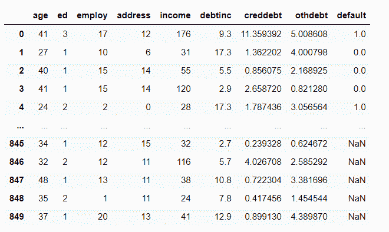
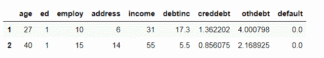
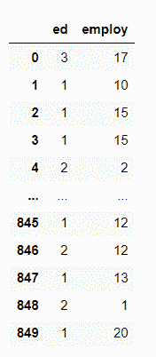

# Python iloc()函数–您需要知道的一切！

> 原文：<https://www.askpython.com/python/built-in-methods/python-iloc-function>

大家好！在本文中，我们将重点关注 **Python iloc()函数**的工作原理。所以，让我们开始吧！

* * *

## Python iloc()函数的工作原理

Python 为我们提供了各种模块和函数来处理数据。Pandas 模块为我们提供了更多的功能来处理大量的行和列的数据集。

`Python iloc() function`使我们能够选择数据集的特定单元格，也就是说，它帮助我们从数据框或数据集的一组值中选择属于特定行或列的值。

使用 iloc()函数，我们可以使用分配给它的索引值来检索属于行和列的特定值。

记住，iloc()函数只接受**整型值作为要访问和显示的值的索引**值。

**语法:**

```py
dataframe.iloc[]

```

如上所述，我们不能传递布尔值作为检索记录的索引。必须向其传递整数值。

* * *

## Python iloc()函数的示例

在本例中，我们试图访问数据集每一列的第三个索引的所有数据值，如图所示。

**数据集–**以下示例中使用的数据集



**Dataset**

**例 1:**

我们将使用 [read_csv()函数](https://www.askpython.com/python-modules/python-csv-module)将数据集从 csv 拉入一个变量。

```py
import pandas as pd
import numpy as np
import os
data = pd.read_csv("bank-loan.csv") # dataset
print(data.iloc[3])

```

**输出:**

```py
age          41.00000
ed            1.00000
employ       15.00000
address      14.00000
income      120.00000
debtinc       2.90000
creddebt      2.65872
othdebt       0.82128
default       0.00000
Name: 3, dtype: float64

```

现在，我们已经尝试访问第 1 行和第 2 行的数据值，相当于数据集的每一列，如下所示

**例 2:**

```py
import pandas as pd
import numpy as np
import os
data = pd.read_csv("bank-loan.csv") # dataset
data.iloc[1:3]

```

函数`iloc[1:3]`将包括从 1 到 3，但不包括索引 3。

**输出:**



**Python iloc() Example 2**

这里，我们已经访问了列 1 和列 2 的所有数据值，如下所示

**语法:**

```py
dataframe.iloc[:,start_col:end_col]

```

**例 3:**

```py
import pandas as pd
import numpy as np
import os
data = pd.read_csv("bank-loan.csv") # dataset
data.iloc[:,1:3]

```

**输出:**



**Python iloc() Example 3**

* * *

## 摘要

因此，在本文中，我们已经了解了 Python iloc()函数的功能。

*   它可用于根据数据集的索引值提取记录。
*   使用索引的概念作为 iloc()函数的参数，可以提取多条记录。
*   iloc()函数仅将整数索引视为参数。

* * *

## 结论

到此，我们就结束了这个话题。如果你有任何问题，欢迎在下面评论。

在那之前，请保持关注并继续学习！！