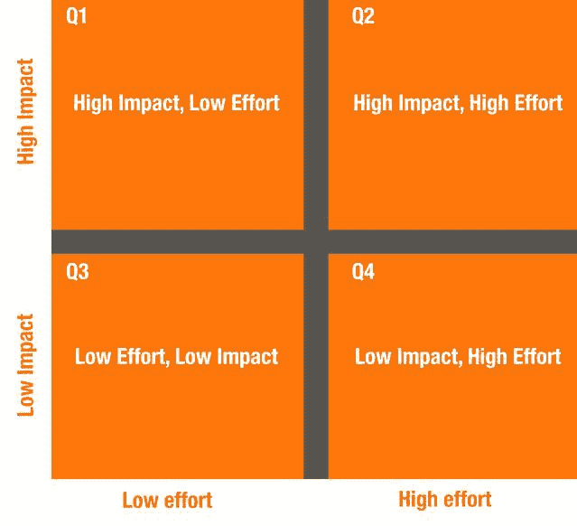
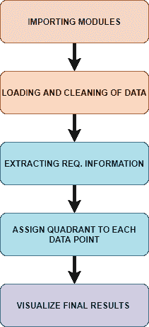
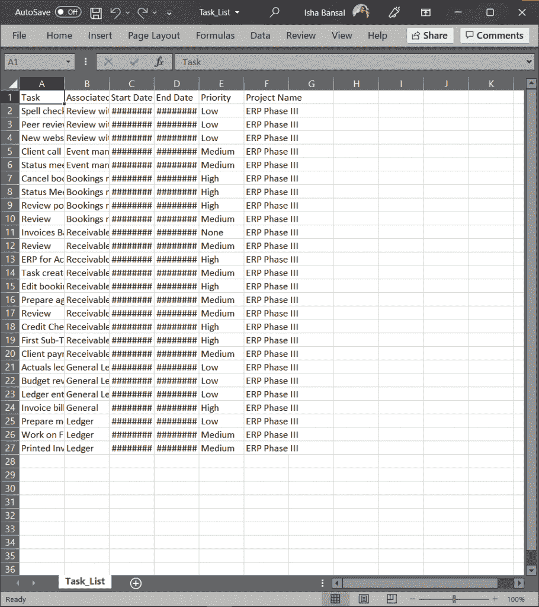
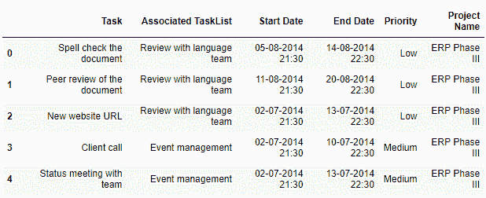
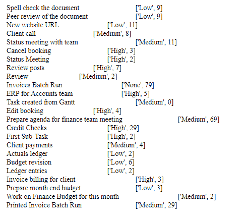
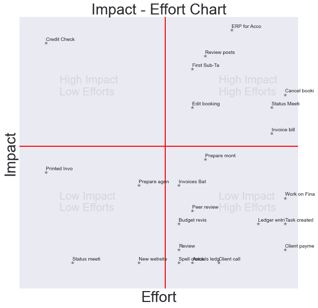

# Python:影响效果图

> 原文：<https://www.askpython.com/python/python-impact-effort-chart>

嘿伙计们！在本教程结束时，您将最终学会如何使用 Python 编程语言实现影响效果图。我们将首先从理解什么是影响效果图以及它们为什么重要开始。

* * *

## **影响介绍-工作图**

让我们快速了解一下影响效果图实际上是什么。在此基础上，用 python 创建一个代码来实现影响效果图。

注意:这是一个复杂的过程，需要专业技术知识。如果你正在寻找一个更简单的解决方案，使用一个[客户反馈管理工具](https://userwell.com/)来执行这些计算和可视化，没有任何麻烦。

### 什么是影响-效果图？

***影响-努力决策图*** 是一种工具，可以帮助团队确定要关注哪些方面的改进。该图表可以帮助人们根据任务的效果和达到每个目标所需的工作量对质量改进“待办事项”列表进行分类。



Effort Impact Chart Demo

高效可以归结为尽可能有效地管理你的时间。你可以过滤掉不相关的杂务，通过影响与努力分析来运行你的所有任务，将你的注意力集中在你每天的关键目标上。当您收到客户对您产品的反馈并希望创建任务来提高产品质量时，这非常有用。市场上有许多客户反馈管理软件，我个人使用过的其中一个是 [UserWell](https://userwell.com/) ，它为 B2B 公司解决了所有与反馈相关的挑战。

### **影响效果图的重要性**

影响效果图有很多好处。其中一些列举如下:

1.  有助于优化有限的时间和资源
2.  为日常待办事项列表甚至复杂的战略计划提供了视觉效果
3.  根据对实现目标最有帮助的内容，帮助确定任务的优先顺序
4.  帮助协调目标和优先事项

现在我们已经知道了什么是影响效果图，让我们转到相同的代码实现。

* * *

## **实施影响效果图**

为了实施该图表，我们将遵循一些步骤。下图中列出了这些步骤。



ImpactEffortChart Implementation

### **步骤 1–导入模块/库**

就像任何其他程序一样，第一步是将所有必要的模块/库导入到我们的代码中。对于这个实现，我们只需要两个模块，即 pandas 和 matplotlib。

```py
import pandas as pd
import matplotlib.pyplot as plt

```

我希望你对他们两个都很熟悉。如果没有，那么看看下面提到的教程:

1.  [Python 熊猫模块教程](https://www.askpython.com/python-modules/pandas/python-pandas-module-tutorial)
2.  [Python Matplotlib 教程](https://www.askpython.com/python-modules/matplotlib/python-matplotlib)

### **步骤 2–加载和清理数据**

下一步是将定制的或随机的数据集加载到我们的程序中。下面显示了所用数据的快照。



TaskList Snap ImpactMatrix

在本教程中，我们将利用包含许多任务的数据集，包括每个任务的开始和结束日期以及优先级。有一些额外的属性，但我们不需要它们。

在加载的同时，我们需要确保删除`nan`值(如果有的话)。相同的代码如下所示。

```py
data = pd.read_csv("Task_List.csv")
data =data.dropna()
data.head()

```



ImpactEffortChart Loaded Data

### **步骤 3–从数据中提取所需信息**

下一步是从数据中获取必要的信息。为了实现这一目标，我们将编写一本字典，其中包含每项任务的优先级和分配天数。

我假设优先级定义了任务将产生的影响，而工作将由任务的天数决定。

这里的一个主要任务是计算每个任务的天数。为了达到同样的目的，我们需要`datetime`模块并得到`date`函数。

我们从分割每个任务的开始和结束日期并提取日期开始，创建两个`date`对象。最后，我们找出两者之间的差异，并根据差异返回天数。

同样的代码实现如下所示。如果你不知道 datetime 模块是如何工作的，可以看看这个教程。

```py
from datetime import date
def get_time (start,end):
    start = (start.split()[0]).split('-')
    end = (end.split()[0]).split('-')
    start = date(int(start[2]), int(start[1]),int(start[0]))
    end = date(int(end[2]),int(end[1]),int(end[0]))
    diff = end - start
    return diff.days

```

现在我们有了计算天数的功能，也就是说，我们为每项任务所拥有的时间。我们将继续创建字典，它将存储相同的内容以及列表中每个任务的优先级。

```py
all_tasks = data['Task']
final_data = {}
for i in range(len(all_tasks)):
    l = list()
    # priority
    l.append(data['Priority'][i])
    # get_no_days
    l.append(get_time(data['Start Date'][i],data['End Date'][i]))
    final_data[all_tasks[i]] = l

```

最终的字典具有如下所示形式的值。



Extracted Data ImpactEffortChart

### **第 4 步——给每项任务分配一个象限**

现在，下一个任务是在我们将在下一阶段绘制的图中给每个任务分配一个象限。

象限是根据某些规则和假设定义的，如下表所示。

| **象限号** | **象限名称** | **天数** | **优先级** |
| one | 高影响力–低投入 | >10 | 高的 |
| Two | 高影响–高努力 | <10 | 高的 |
| three | 低影响–低工作量 | >10 | 低/中 |
| four | 低影响–高努力 | <10 | 低/中 |

为了给每个任务分配坐标点，我们需要一个特定的范围，以便使用`random`模块分配随机坐标。如果你不知道随机模块，在这里查看[这个](https://www.askpython.com/python-modules/python-random-module-generate-random-numbers-sequences)教程！

我们将确保我们的图保持在 22×22 的 x 和 y 值，因此我们将在[1，20]的范围内分配随机(x，y)值，以获得清晰的图。这些值是根据上面提到的表格分配的。

```py
import random
first,second,third,fourth = 0,0,0,0
plot_data = {}
for i in final_data:

    # 1st Quadrant
    if(final_data[i][0] == 'High' and final_data[i][1] > 10):
        first+=1
        x = random.randint(1,10)
        y = random.randint(12,20)
        while((x,y) in plot_data.values()):
            x = random.randint(1,10)
            y = random.randint(12,20)
        plot_data[i] = (x,y)

    #2nd Quadrant
    elif(final_data[i][0] == 'High' and final_data[i][1] < 10):
        second+=1
        x = random.randint(12,20)
        y = random.randint(12,20)
        while((x,y) in plot_data.values()):
            x = random.randint(12,20)
            y = random.randint(12,20)
        plot_data[i] = (x,y)

    # 3rd Quadrant
    elif((final_data[i][0] == 'Low' and final_data[i][1] > 10) or (final_data[i][0]=='Medium' and final_data[i][1]>10)):
        third+=1
        x = random.randint(1,10)
        y = random.randint(1,10)
        while((x,y) in plot_data.values()):
            x = random.randint(1,10)
            y = random.randint(1,10)
        plot_data[i] = (x,y)

    else:
        fourth+=1
        x = random.randint(12,20)
        y = random.randint(1,10)
        while((x,y) in plot_data.values()):
            x = random.randint(12,20)
            y = random.randint(1,10)
        plot_data[i] = (x,y)

print("Quadrant 1 - High Impact but Low Efforts -" , first)
print("Quadrant 2 - High Impact and High Efforts -", second)
print("Quadrant 3 - Low Impact and Low Efforts -", third)
print("Quadrant 4 - Low Impact and High Efforts -", fourth)

```

运行上面的代码片段后，我们可以看到分配给每个象限的任务数量，如下所示。

```py
Quadrant 1 - High Impact but Low Efforts - 1
Quadrant 2 - High Impact and High Efforts - 7
Quadrant 3 - Low Impact and Low Efforts - 4
Quadrant 4 - Low Impact and High Efforts - 12

```

### **第 5 步——可视化最终结果**

为了可视化最终结果，我们需要在单独的变量下有 x 和 y 坐标值，为了有注释，我们还需要标签。

为了避免情节中的长文本并获得清晰明了的情节，我们将只绘制字符串的前 12 个字符。

```py
all_x = [plot_data[i][0] for i in plot_data]
all_y = [plot_data[i][1] for i in plot_data]
all_labels = [i[:12] for i in plot_data]

```

可视化部分非常简单，可以用一个基本的散点图来完成，以后还可以添加注释。除此之外，我们将添加文本以定义象限。

```py
plt.style.use('seaborn')
plt.figure(figsize=(10,10))
plt.xlim((0,21))
plt.ylim((0,21))
plt.plot([11,11],[0,21], linewidth=2, color='red')
plt.plot([0,21],[11,11], linewidth=2, color='red' )
plt.scatter(all_x,all_y,marker='*')

plt.text(3,6, 'Low Impact \nLow Efforts', fontsize = 22,alpha = 0.1)
plt.text(3,15, 'High Impact \nLow Efforts', fontsize = 22,alpha = 0.1)
plt.text(15,15, 'High Impact \nHigh Efforts', fontsize = 22,alpha = 0.1)
plt.text(15,6, 'Low Impact \nHigh Efforts', fontsize = 22,alpha = 0.1)

plt.xticks([])
plt.yticks([])
for i in range(len(all_x)):
    plt.annotate(all_labels[i], (all_x[i], all_y[i] + 0.2))

plt.title('Impact - Effort Chart',fontsize=30)
plt.xlabel('Effort',fontsize=30)
plt.ylabel('Impact',fontsize=30)
#plt.axis('off')
plt.show()

```

以下教程将有助于理解上述代码的某些部分:

1.  [Python Matplotlib 教程](https://www.askpython.com/python-modules/matplotlib/python-matplotlib)
2.  [3 个 Matplotlib 绘图技巧使绘图有效](https://www.askpython.com/python-modules/matplotlib/matplotlib-plotting-tips)
3.  [Seaborn 散点图——终极指南](https://www.journaldev.com/39381/seaborn-scatter-plot)



Final Impact Effort Chart

* * *

## **结论**

恭喜你！您刚刚学习了影响效果图，以及如何使用 Python 编程语言从头开始手动实现。😇

喜欢这个教程吗？无论如何，我建议你看一下下面提到的教程:

1.  [如何用 Python 绘制和自定义饼状图？](https://www.askpython.com/python/plot-customize-pie-chart-in-python)
2.  [Python 中的误差线介绍](https://www.askpython.com/python/examples/error-bars-in-python)
3.  [使用 Python 中的 diagrams 模块绘制架构图](https://www.askpython.com/python-modules/diagrams-module)
4.  [如何用 Python 绘制树形图？](https://www.askpython.com/python/examples/plot-a-treemap-in-python)

感谢您抽出时间！希望你学到了新的东西！！😄

* * *