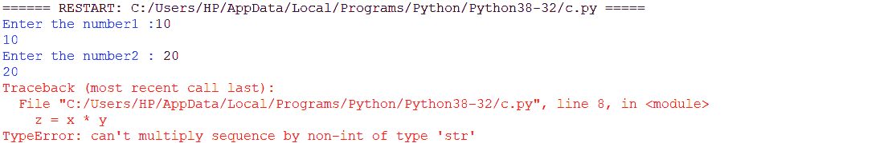

# Python 输入()函数

> 原文：<https://www.askpython.com/python/built-in-methods/python-input-function>

开发人员/程序员经常需要接受用户的输入来进一步处理应用程序。

Python 提供了一个内置的方法来接受用户的输入。

**Python input()函数**接受用户的输入。Python 的`**builtins.py**`包含了 Python input()函数。

**语法:**

```py
input(prompt)
```

在 input()函数中，提示是可选的。提示基本上是一个字符串，即在输入前显示的消息。

无论哪个字符串作为参数放在输入函数中，都会在输出屏幕上打印出来。

* * *

## 1.Python input()函数的工作原理

*   一旦解释器遇到 input()函数，它就暂停/停止程序执行，直到用户向程序提供输入。

*   用户输入的输入被自动转换成一个[字符串](https://www.askpython.com/python/string/python-string-functions)。无论用户输入的是整数还是浮点类型的数据，input()函数都会将其转换为字符串。

*   因此，需要在程序中使用*类型转换将其显式转换为另一种数据类型。*

* * *

## *2.示例 Python input()函数的基本工作原理*

```py
*x = input () 
print("The entered value is:", x)* 
```

***输出:***

```py
*`10
The entered value is: 10`*
```

* * *

## *3.将字符串作为参数的 Python input()函数*

```py
*name = input('Enter your name: ')
print("Name of the candidate is:", name)* 
```

***输出:***

```py
*`Enter your name: Safa Mulani
Name of the candidate is: Safa Mulani`*
```

* * *

## *4.通过接受用户的输入将两个数相乘*

```py
*x = input()

y = input()

z = x * y
print("Result is: ", z)* 
```

***输出:***

*

***Python input() Function**** 

*上面的代码片段导致了一个错误，因为 python input()函数将来自用户的输入转换为一个字符串。因此，为了将它转换成整数，我们需要显式地对用户提供的输入进行类型转换。*

```py
*x = input("Enter the number1: ")

y = input("Enter the number2: ")

z = int(x) * int(y)
print("Result is: ", z)* 
```

***输出:***

```py
*`Enter the number1: 10
Enter the number2: 20
Result is:  200`*
```

* * *

## *结论*

*因此，在本文中，我们已经了解了 Python input()函数的工作原理。*

* * *

## *参考*

*   *Python 输入()函数*
*   *[输入()功能文档](https://docs.python.org/3/library/functions.html#input)*