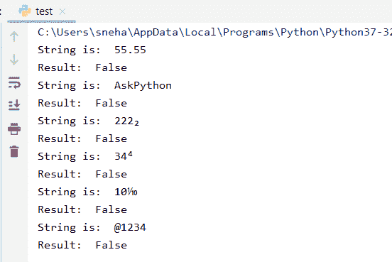

# Python 的 isdecimal()方法

> 原文：<https://www.askpython.com/python/built-in-methods/python-isdecimal-method>

## 介绍

在本教程中，我们将介绍 python isdecimal()方法。如果用户想检查一个给定的字符串是否包含一个数字，或者更确切地说，是否包含一个十进制数字，该怎么办？当用户需要将字符串转换为任何其他数字类型，如整数或浮点数等时，就会出现这种情况..

作为这个问题的解决方案， **Python** 自带一个内置的检查方法，`isdecimal()`。让我们深入研究这种方法，从而理解这种方法是如何工作的，并据此加以运用。

## Python isdecimal()方法基础

一般来说，Python `isdecimal()`方法直接检查指定字符串中的所有字符是否都是**十进制**字符。如果是，则该方法返回`true`，否则，返回`false`。

### Python isdecimal()方法的语法

让我们看看 Python `isdecimal()`方法的语法，然后我们可以使用这个方法。

```py
status = str.isdecimal( )

```

这里:

*   `str`是我们要检查其是否仅由十进制字符组成的字符串
*   `status`存储由`isdecimal()`方法返回的值。对于所有十进制字符，**为真**，否则，**为假**。

**注意**:在这里，状态只有真或假，因此状态的类型是`bool`。

## isdecimal()方法的基本示例

这里有一个小例子，解释了如何在 **Python** 中对字符串使用`isdecimal()`方法。

```py
string1="1010"
print("String is: ",string1)
print("Result: ",string1.isdecimal())

string2="a10101"
print("String is: ",string2)
print("Result: ",string2.isdecimal())

```

**输出**:

```py
String is:  1010
Result:  True
String is:  a10101
Result:  False

```

这里:

*   **字符串 1** 全部由十进制字符组成。因此，`string1.isdecimal()`语句返回一个`True`结果
*   鉴于，**字符串 2** 中有一个字符**‘a’**。由于**字符串 2** 并不全由十进制字符组成，所以在这种情况下，结果是`False`。

**注意**:Python 中的`isdecimal()`方法不会将分数、下标、上标或任何其他 **Unicode** 实现的字符视为十进制或数字字符。因此，对于字符串中出现的任何数字字符，该方法返回`False`。

## Python 是如何工作的

下面的代码片段说明了 Python 中用于字符串的`isdecimal()`方法是如何工作的，以及它返回什么。

```py
# . is not considered as decimal character
string1="55.55"
print("String is: ",string1)
print("Result: ",string1.isdecimal())

#Pure character string
string2="AskPython"
print("String is: ",string2)
print("Result: ",string2.isdecimal())

#U+2082 unicode for subscript 2
string3="222\u2082"
print("String is: ",string3)
print("Result: ",string3.isdecimal())

#U+2074 unicode for superscript 4
string4="34\u2074"
print("String is: ",string4)
print("Result: ",string4.isdecimal())

#U+2152unicode for 1/10 fraction
string5="10\u2152"
print("String is: ",string5)
print("Result: ",string5.isdecimal())

#@ not considered as decimal character
string6="@1234"
print("String is: ",string6)
print("Result: ",string6.isdecimal())

```

**输出**:



isdecimal() Example Output

在上面的代码中:

*   对于**字符串 1** ，`isdecimal()`方法返回一个`false`值，因为点(**)。**)出现在数字之间的字符。该方法认为它不是十进制字符
*   同样对于**字符串 2** ，该字符串完全或纯粹由字符组成，因此该方法返回一个`false`结果
*   对于所有的**琴弦**、**琴弦 3** 、**琴弦 4** 和**琴弦 5** 。`isdecimal()`方法返回`false`,因为它们都包含对应于非数字字符的 Unicode 值
*   最后，对于**字符串 6** ，该方法也返回一个`false`，因为该字符串包含“ **@** ”字符，这也是一个非十进制字符。

## 结论

因此，在本教程中，我们学习了 **Python** 中的内置字符串`isdecimal()`方法，它是如何使用以及如何工作的。如有任何问题，欢迎在下面评论。

## 参考

*   https://www.journaldev.com/24032/python-string-isdecimal
*   [https://stack overflow . com/questions/22789392/str-is decimal-and-str-is digit-difference-example](https://stackoverflow.com/questions/22789392/str-isdecimal-and-str-isdigit-difference-example)
*   [https://stack overflow . com/questions/47113787/difference-between-isnumeric-and-is decimal-in-python/47113836](https://stackoverflow.com/questions/47113787/difference-between-isnumeric-and-isdecimal-in-python/47113836)