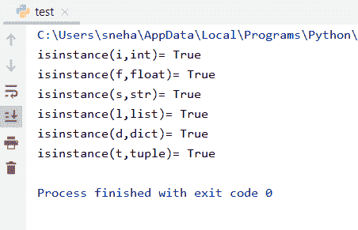
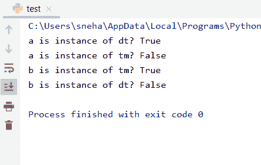

# Python isinstance()方法

> 原文：<https://www.askpython.com/python/built-in-methods/python-isinstance>

## 介绍

在本教程中，我们将学习 Python isinstance()方法。用户可能会遇到一些情况，需要判断一个对象是否是一个特定类的实例，主要是在 **[继承](https://www.askpython.com/python/oops/inheritance-in-python)** 中。Python 提供了一个内置的方法做同样的检查，名为`isinstance()`。

让我们开始理解这个方法。

## Python isinstance()基础知识

顾名思义，Python `isinstance()`方法是一个内置方法，它检查一个对象是否是任何特定类的**实例**。现在，让我们看看使用`isinstance()`方法的语法，

**语法**，

```py
isinstance( object_name , class_name)

```

这里，

*   是我们需要检查它是否是某个类的实例的对象，
*   `class_name`是我们需要检查对象所属的类，
*   如果 object_name 是 class_name 的实例，则`isinstance()`方法返回 **true** ，否则返回 **false** 。

## Python isinstance()的示例

所以，现在我们已经完成了 Python `isinstance()`方法的基本定义和语法。让我们看一些例子来更好地理解这个方法是如何工作的。

### 1.在 Python 中使用 isinstance()和本机类

现在，让我们看看当我们对 python 中的本机类使用`isinstance()`方法时会发生什么，如 **int** 、 **float** 、 **str** 、 **list** 、 **dict** 和 **tuple** 。

```py
i=10
f=55.55
s="AskPython"
l=[1,2,3,4,5]
d={0:"n", 1:"y"}
t=(1,2,3,4)
print("isinstance(i,int)=",isinstance(i,int))
print("isinstance(f,int)=",isinstance(f,float))
print("isinstance(s,int)=",isinstance(s,str))
print("isinstance(l,int)=",isinstance(l,list))
print("isinstance(d,int)=",isinstance(d,dict))
print("isinstance(t,int)=",isinstance(t,tuple))

```

**输出**:



Python isinstance() for Native classes

让我们理解这里发生了什么:

*   首先，我们已经用一些值初始化了不同类型的变量
*   之后，我们检查它们是否是相应类的实例。正如预期的那样，对于所有的检查，我们都得到正输出，也就是说， **true** 。

### 2.对用户定义的类使用 isinstance()

现在让我们创建一些类和它们的实例来检查我们是否得到了想要的输出，以及 isinstance 方法在这种情况下是如何工作的。

```py
class dt:
    dd=10
    mm=2
    yyyy=2002

class tm:
    hr=12
    min=56
    sec=34
#instance creation
a=dt()
b=tm()

#check is a is instance of dt class
print("a is instance of dt?",isinstance(a,dt))
#check is a is instance of tm class
print("a is instance of tm?",isinstance(a,tm))
#check is b is instance of tm class
print("b is instance of tm?",isinstance(b,tm))
#check is b is instance of dt class
print("b is instance of dt?",isinstance(b,dt))

```

**输出**:



Example With User-Defined Classes

在这段代码中:

*   我们创建了两个分别代表日期和时间的类`dt`和`tm`
*   完成之后，我们创建两个类的两个对象，分别命名为 **a** 和 **b**
*   然后我们检查对象 **a** 和 **b** 是否是`dt`和`tm`类的实例。使用不同的组合，我们试图解释如果对象不是指定类的实例会发生什么
*   正如我们所看到的，我们的代码确认 a 和 b 分别是类 **dt** 和 **tm** 的实例。
*   但是当我们试图检查 a 和 b 是否分别是 tm 和 dt 类的实例时，方法`instance()`返回 **false** 。也就是相反。

### 3.对多个类使用 isinstance()

Python `isinstance()`方法还提供了一种方法，如果我们想检查一个对象是否是某个给定类中某个类的实例。

在这种情况下，我们需要传递一个必需类的**元组**。如果对象是任何类的实例，该方法将返回`true`，否则返回`false`。

```py
class dt:
    dd=10
    mm=2
    yyyy=2002

class tm:
    hr=12
    min=56
    sec=34
#instance creation
a=dt()
b=tm()

#check is a is instance of dt or tm class
print("a is instance of dt or tm?",isinstance(a,(dt,tm)))
#check is b is instance of dt or tm class
print("b is instance of dt or tm?",isinstance(b,(dt,tm)))

```

**输出**:

```py
a is instance of dt or tm? True
b is instance of dt or tm? True

```

在这里，我们使用与我们在前面的例子中使用的相同的类 **dt** 和 **tm** 。但是在这种情况下，我们将两个类的元组传递给`isinstance()`方法。

由于 **a** 和 **b** 是我们传递的元组中任何一个类的实例，我们可以在两个输出中看到`true`。

## 结论

因此，在本教程中，我们将学习 Python `isinstance()`方法及其用法和工作原理。希望本教程有助于理解实例的概念。

## 参考

*   https://www.journaldev.com/22932/python-isinstance