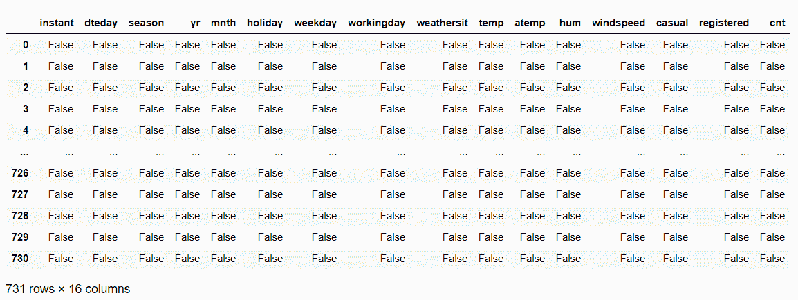
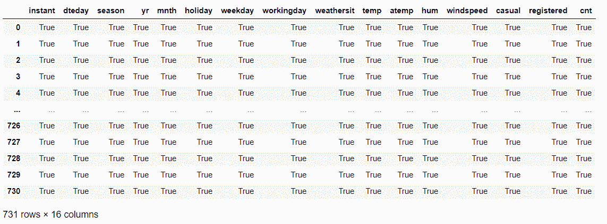

# 熊猫的 Python isna()和 notna()函数

> 原文：<https://www.askpython.com/python-modules/pandas/python-isna-notna-functions>

读者朋友们，你们好！在本文中，我们将详细关注 **Python isna()和 Python notna()函数**。所以，让我们开始吧！

在数据科学和机器学习领域，数据分析和[预处理](https://www.askpython.com/python/examples/standardize-data-in-python)起着非常重要的作用。在整个数据预处理过程中，[缺失值分析](https://www.askpython.com/python/examples/python-data-cleaning-numpy-pandas)是开发的关键一步。缺失值分析是指从源数据中检测和移除缺失值或 NA 值的过程。

同样，有许多方法可以检测数据集中是否存在缺失值。今天，我们将了解两个易于使用的函数来检测缺失值的存在

1.  **Python isna()函数**
2.  **Python notna()函数**

在本主题的课程中，我们将使用自行车租赁预测数据集。你可以在这里找到数据集[！现在，让我们在下面的部分中逐一查看它们。](https://github.com/Safa1615/BIKE-RENTAL-COUNT/blob/master/day.csv)

* * *

## 1。Python isna()函数

使用 Python isna()函数，我们可以轻松检测到空值或 na 值的存在，即数据集中缺失的值。它是一个布尔函数，查找丢失的值，并在检测到丢失值时返回 TRUE。

看看下面的语法！

```py
dataframe.isna()

```

**举例:**

在本例中，我们使用了 isna()函数来检查是否存在缺失值。因为数据没有丢失值，所以返回 FALSE。

```py
import pandas
import os
#Changing the current working directory
os.chdir("D:/Ediwsor_Project - Bike_Rental_Count")
BIKE = pandas.read_csv("day.csv")
BIKE.isna()

```

**输出:**



**Python isna() function**

* * *

## 2.Python notna()函数

利用 Python notna()函数，我们可以很容易地挑出不占缺失值或 na 值的数据。notna()函数返回 TRUE，如果数据没有丢失值，则返回 FALSE(如果遇到 na 值)。

**语法:**

```py
dataframe.notna()

```

**举例:**

如上所述，数据集没有 NA 值。因此，notna()函数返回 TRUE。

```py
import pandas
import os
#Changing the current working directory
os.chdir("D:/Ediwsor_Project - Bike_Rental_Count")
BIKE = pandas.read_csv("day.csv")
BIKE.notna()

```

**输出:**



**Python notna() function**

* * *

## 结论

如果你遇到任何问题，请随时在下面评论。总的来说，使用 Python isna()和 notna()函数，我们可以快速检查缺失值的存在，特别是对于大型数据集。我们可以很容易地计划必要的补救措施来处理缺失的价值观。

更多与 Python 编程相关的帖子，请继续关注我们。在那之前，学习愉快！！🙂